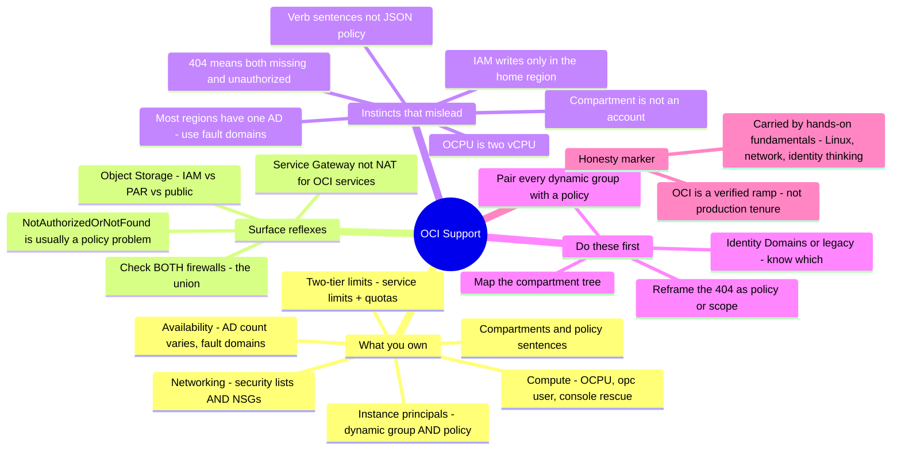

# OCI Support — the operator's transition guide

> 🌐 **Languages:** English (default) · [中文](../../docs/zh/platforms/oci/support.md)

---

> [`operations.md`](operations.md) covers the **cadence** of running your own Oracle Cloud
> Infrastructure. This is the other half: **OCI support as a break-fix craft** — the tickets
> that actually recur, exactly where you look, and **where a strong sysadmin coming from
> another lane (AWS, Azure, GCP, or on-prem) gets tripped by the deliberate choices the
> youngest hyperscaler made differently.** Honesty marker up front: this whole note is
> **🧗 ramp** — mapped from the AWS/Azure/GCP model, doc-checked against Oracle's own pages,
> and drilled in a runnable [lab](#lab--a-compartment-is-not-an-account--runnable) — carried
> by ✋ transferable fundamentals (Linux, networking, DNS/TLS, identity thinking), not by
> production tenure on OCI.

OCI's own [platform note](README.md) states the headline in one line: *compartments are OCI's
blast-radius unit … and its IAM policy language reads like sentences.* That is the whole
reason this page exists. An admin who "already knows cloud" ramps onto OCI fast, then trips on
exactly the places Oracle — building later, with hindsight — chose differently: **compartments
instead of an account/subscription/project per isolation**, an **IAM policy language made of
verbs, not JSON**, a **404 that means "or you're not allowed to see it"**, an **`OCPU` that is
two `vCPU`s**, **regions that may have only one availability domain**, and **two firewalls
(security lists *and* NSGs) that both apply at once**. This note names the responsibilities, the
recurring tickets and their diagnostic surface, and the handful of places a confident
cross-lane reflex misfires — flagging the AWS/Azure/GCP contrast explicitly, because that's
where most readers are coming from.

## What supporting OCI makes you responsible for

Mapped onto the [seven surfaces](../../00-the-operating-model.md), in roughly the order tickets arrive:

| Surface | What you're on the hook for |
| --- | --- |
| **Identity — compartments + policy sentences** | The **compartment tree** (the isolation/blast-radius unit, *inside one tenancy*), **groups** / **dynamic groups**, and **policies written as sentences** — `Allow group G to <verb> <resource-type> in compartment C`. The verb hierarchy **`inspect ⊂ read ⊂ use ⊂ manage`**, policy **inheritance down the tree**, the **home region** for all IAM writes, and whether the tenancy is on **Identity Domains** or legacy IAM. |
| **Workload identity** | **Instance principals** / resource principals (no keys on the box) — which need **two** halves: a **dynamic group** whose rule matches the instances, *and* a **policy** granting that dynamic group. |
| **Networking** | "Why can't X reach Y?" — **security lists** (subnet-level) **and** **NSGs** (VNIC-level), which *both* apply; route tables; **Internet Gateway** / **NAT Gateway** / **Service Gateway** (private reach to OCI services) / **DRG**; public-vs-private IP; stateless-rule return traffic. |
| **Compute** | Instances (VM **and** bare metal), **flexible shapes** (dial `OCPU` + memory), the **`opc`** user + SSH key injected **at launch**, **instance/serial console** rescue, `OCPU` = 2 `vCPU` sizing. |
| **Availability design** | **AD count varies (1 or 3 per region)**; within an AD, **3 fault domains** for anti-affinity. HA = spread across ADs where they exist, else across FDs. |
| **Storage & data** | **Object Storage** access via **IAM vs pre-authenticated request (PAR) vs public bucket**; buckets in the tenancy namespace; Autonomous DB / DB systems (wallet). |
| **Provisioning** | **Resource Manager** (managed Terraform — OCI stores the state), Cloud Shell, the `oci` CLI. |
| **Governance & limits** | **Two tiers**: Oracle-set **service limits** (per tenancy/region) *and* your own **compartment quotas**. **OCID** as the unambiguous handle for every resource. |
| **Cost** | Universal Credits, Cost Analysis, **budgets** — but **cheap/free egress** (10 TB/mo free) means far less of the AWS egress panic. |
| **Observability** | **Audit** (who-did-what across API calls, 90d default / 365d max), **Logging**, **Monitoring**, **Search**. |
| **Escalate to Oracle** | Service-limit increases and many issues route through **My Oracle Support / Open Support Request**. |

## The common tickets — and where you look

OCI break-fix is pattern-recognition across the Console (with its ever-present **compartment
picker** and **region switcher**), the **`oci` CLI**, and the **Audit** log. The reflex to
build: *"which surface answers this — and what is it deliberately not telling me?"*

**Identity — `NotAuthorizedOrNotFound` (HTTP 404), the number-one ticket.** OCI returns the
**same 404** for *both* "the resource doesn't exist" *and* "you're not authorized to see it" —
a deliberate information-non-disclosure choice, so a caller can't probe what exists. In
practice **"not found" usually means "no policy grants you access"** (or you're in the wrong
compartment or region). Root causes, in order: no policy grants the action; **wrong
compartment**; **verb too weak** (`read` where `manage` is needed); a **dynamic-group rule that
doesn't match** the instance; an **IAM write attempted outside the home region**; or
**Identity-Domains-vs-legacy** confusion (a missing `<domain>/` qualifier — `Default/` is
assumed when omitted). *Where you look:* the **Policies** page, `oci iam policy list`, the
**compartment picker**, the dynamic-group matching rules, and confirm you're targeting the
**home region**. Read the 404 as a policy/scope problem first, a missing resource second.

**Networking — "can't reach my instance."** Hold the OCI shape in your head: **two** filter
mechanisms apply at once — the subnet's **security list(s)** *and* every **NSG** the VNIC
belongs to — and the effective rule set is the **union** (if *either* allows the traffic, it's
permitted; combining them only ever loosens). So the cause is almost always a **missing allow**,
not a deny. Rules can be **stateful or stateless**, and a **stateless** rule needs the return
path allowed explicitly. Then the usual suspects: **no Internet/NAT Gateway**, a **route table
missing a rule** to the gateway, **no public IP** on the VNIC. *Where you look:* VCN **route
tables**, **security lists**, **NSGs**, and **VNIC details** — check *both* firewall surfaces,
because an allow in one is enough and a block in one is not.

**Workload identity — "my instance principal is denied."** Two halves, and the missing one is
usually the policy. A **dynamic group** with a matching rule but **no policy grants nothing**;
a policy against a dynamic group whose **rule doesn't match** the instance (wrong compartment
OCID / tag) also grants nothing. This is a top source of the `NotAuthorizedOrNotFound` above.
*Where you look:* the dynamic-group **matching rules**, and the **policy** naming that
dynamic-group as subject.

**Compute — "I can't SSH in."** You log in as **`opc`**, not root, and the SSH **public key is
injected at launch** — there's no console password reset. Recover a lost/broken key via the
**instance (serial) console connection**, **Run Command** (via the Oracle Cloud Agent, runs as
root without SSH), or the boot-volume-rescue shuffle. Size with **`OCPU` = 2 `vCPU`** in mind —
a "4 OCPU" shape is ~an 8-vCPU box elsewhere.

**Storage — Object Storage 403.** Distinguish the three access paths: **IAM** (needs a policy),
**PAR** (a temporary signed URL — breaks when it expires *or* when its creator loses access),
and **public bucket** (`ObjectRead` / `ObjectReadWithoutList`; default is `NoPublicAccess`). A
403 means the *path you used* isn't actually granted for that caller. Oracle recommends **PARs
over public buckets**; a private instance should reach Object Storage over a **Service Gateway**,
not a NAT gateway.

**Governance — "You have reached your service limit."** Two tiers. If it's the Oracle-set
**service limit** (per tenancy/region), request an increase via **Open Support Request**. If
it's a **compartment quota** you set, adjust the quota policy — quotas *subdivide* and can't
exceed the tenancy limit. Check both **before** a large deploy.

**Cost.** Usually mild — **egress is 10 TB/mo free then cheap**, so the AWS "egress will
bankrupt me" panic mostly doesn't apply. Still set **budgets** and watch idle flex-shape
OCPU/memory and orphaned block/boot volumes.

## The experience gap — what a strong sysadmin's instincts get wrong

The gap between someone who's supported OCI and someone who hasn't isn't the Console — it's a
set of load-bearing assumptions, carried in from AWS, Azure, GCP, or on-prem, that are **wrong
here**, each with its failure mode.

- **Compartments are the isolation unit — not an account/subscription/project.** The reflex
  "spin up a new account (AWS) / subscription (Azure) / project (GCP) to isolate a workload" is
  wrong: OCI isolates with **compartments inside one tenancy**. They form a **tree** (up to 6
  deep), are **global** (a compartment spans every subscribed region), the resource can be
  **moved** between them, and — the load-bearing part — the compartment is the **primary policy
  scope and security boundary**. The [lab](#lab--a-compartment-is-not-an-account--runnable)
  proves this.
- **IAM policy is verb-sentences, not JSON / RBAC / bindings.** There is **no JSON policy
  document** (AWS), **no role assignment at a scope** (Azure), **no role binding** (GCP). You
  write `Allow group G to <verb> <resource-type> in compartment C`, where the four verbs are the
  **cumulative aggregations `inspect ⊂ read ⊂ use ⊂ manage`** (`use` can act on existing
  resources but generally **not create/delete**; `manage` is everything). Policies attach to a
  compartment/tenancy and **inherit down the tree**. Your JSON-policy / role-assignment muscle
  memory doesn't transfer — the *least-privilege thinking* does.
- **A 404 doesn't mean "gone."** OCI returns **`NotAuthorizedOrNotFound` (404) for both** a
  missing resource and a lack of authorization — on purpose. The AWS/Azure `403`-means-denied /
  `404`-means-missing split is gone; here "not found" is *most often a policy/compartment/region
  problem*. Chasing a "deleted" resource that's really just invisible-to-you is the classic
  time sink.
- **IAM is global but written only in the home region.** Users, groups, dynamic groups,
  **policies**, and compartments are **mastered in the tenancy's home region** and replicated
  read-only elsewhere; you can **only create/update them there**, and changes take **minutes** to
  propagate. "IAM is global, I'll edit it from whatever region I'm in" bites multi-region admins.
- **`OCPU` ≠ `vCPU` — every sizing/cost comparison is off by 2×.** **1 OCPU = one physical core
  = 2 vCPUs** on x86. Match an 8-vCPU EC2 box with **4 OCPUs**, not 8; a cost comparison that
  treats them as equal is wrong by double.
- **Availability-domain count varies — the "3 AZs everywhere" reflex breaks.** **Most OCI
  regions have only ONE availability domain.** "Spread replicas across 3 ADs for HA" *fails* in a
  single-AD region. The correct in-AD primitive is the **fault domain** — each AD has **3**,
  giving hardware anti-affinity. "3 AZs" → in most OCI regions becomes "**3 fault domains**." (AWS
  has no real fault-domain analog.)
- **Two firewalls apply at once.** **Security lists** (subnet-level) **and** **NSGs**
  (VNIC-level) *both* govern a VNIC, and the effective rule set is the **union**. Unlike AWS
  (security group on the ENI only), an allow in *either* place is enough — so when traffic is
  unexpectedly permitted, you must inspect **both**. Rules can also be **stateless** (allow the
  return path yourself).
- **Service Gateway, not a NAT gateway, for OCI services.** To let a **private** instance reach
  Object Storage (and other OCI services) privately, you add a **Service Gateway** — traffic
  rides Oracle's backbone, never the internet, and incurs **no egress**. Reflexively bolting on a
  NAT gateway "so it can reach storage" is the wrong (and costlier) move.
- **A dynamic group with no policy does nothing.** The instance-principal story has **two**
  required halves — the dynamic-group *rule* and the *policy* that names it. Creating the dynamic
  group is only half the job; the missing policy is the classic "no keys, and no access either."
- **Capacity has two tiers.** Oracle-set **service limits** *and* self-service **compartment
  quotas** (which can't exceed the limit). A deploy can fail on *either* — AWS/Azure give you
  only the provider-set tier.
- **Everything has an OCID.** Resources are referenced by a long **`ocid1.<type>.<realm>…`**
  identifier — in policies, CLI, Terraform, and support tickets. Grab the **OCID**, not the
  display name, when debugging or escalating.
- **Identity Domains vs legacy IAM — know which one this tenancy is.** OCI merged IDCS into IAM
  as **identity domains**; a tenancy may be on either model, and it changes *where users/groups/
  policies live* and the policy qualifier (`<domain>/<group>`; `Default/` assumed). Following the
  wrong model's docs wastes hours — determine it before reasoning about identity at all.
- **Egress is cheap — a rare place OCI is *easier*.** 10 TB/mo free then low cost; the
  contortions AWS admins adopt purely to dodge the egress meter are mostly unnecessary here.

## What transfers, what doesn't

| Transfers strongly | Transfers with caveats | Don't bring it |
| --- | --- | --- |
| Linux / guest-OS depth — OCI compute is just VMs & bare metal | Identity & least-privilege *thinking* — maps to verbs + compartment scoping | Account/subscription/project-per-isolation — OCI uses **compartments** in one tenancy |
| DNS, TLS/certs, TCP/IP, CIDR — a VCN is VPC-shaped | Firewall/ACL reasoning — but **two** surfaces (security list **and** NSG), unioned, sometimes stateless | JSON-policy / RBAC-assignment / role-binding reflexes — OCI is **verb sentences** |
| Structured troubleshooting — OCI errors are specific (`NotAuthorizedOrNotFound`, service-limit) | Hierarchy/inheritance intuition — policies inherit **down** the compartment tree | "`403` = denied, `404` = missing" — OCI returns **404 for both** |
| Scripting & IaC (`oci` CLI, Terraform / Resource Manager) | "vCPU is the CPU unit" — design in **OCPU** (= 2 vCPU) | "3 AZs everywhere" — most regions have **1 AD**; use **fault domains** |
| Log reading — Audit ≈ CloudTrail, plus Logging/Monitoring | Workload-identity concept — instance principals, but **dynamic group + policy** both required | "Security lives on one firewall object" — **both** security lists **and** NSGs apply |
| Change discipline (IaC, state, rollback) | "IAM is global, edit anywhere" — writes only in the **home region** | "Add a NAT gateway to reach storage" — use a **Service Gateway** |
| Cost awareness | "Egress will bankrupt me" — mostly false on OCI | Assuming one quota tier — there are **two** (service limits + compartment quotas) |

## First week / first 90 days

**First week.**
1. **Map the compartment tree first** — learn the hierarchy and which compartment holds what,
   and internalize the **verb model (`inspect/read/use/manage`)** *before granting anything.*
2. **Determine the identity model** — is this tenancy on **Identity Domains** or legacy IAM? It
   changes where users/groups/policies live and the policy qualifier. Get this wrong and every
   doc you follow is the wrong doc.
3. **Find and note the home region** — do all IAM create/update there, and expect a few minutes
   of propagation before you test elsewhere.
4. **Reframe `NotAuthorizedOrNotFound`** as *usually a policy / wrong-compartment / wrong-region*
   problem, not "the resource is gone."

**First 30 days.**
5. **Before designing HA, check your region's AD count** — single-AD → design across **3 fault
   domains**, not "3 AZs."
6. **Internalize `OCPU` = 2 `vCPU`** before sizing or quoting cost.
7. **When debugging reachability, always check *both*** the subnet's security lists **and** every
   NSG on the VNIC — the effective policy is the union, and rules may be stateless.
8. **Pair every dynamic group with a policy** — a dynamic group alone grants nothing.

**First 90 days.**
9. **Stand up a Service Gateway** for private OCI-service access (Object Storage, etc.) instead of
   reaching for a NAT/Internet gateway.
10. **Check *both* capacity tiers ahead of a large build** — Oracle **service limits** *and*
    **compartment quotas**.
11. **Reference resources by OCID** in policies, tickets, and automation — unambiguous where
    display names aren't.
12. **Lean on cheap egress** — don't inherit AWS egress-panic architecture; design for latency and
    locality, not for the egress bill.

## The AI-assisted ramp (OCI flavor)

- **Translate from what you know — and demand the deltas:** *"I know AWS IAM and VPCs — map OCI
  compartments, the verb-based policy language, security-lists-vs-NSGs, and instance principals
  onto them, and flag only the real differences."* OCI rewards translate-then-verify because so
  much is a renamed analog — but **compartments-as-security-boundary, the verb hierarchy, the
  404-for-both, and single-AD regions have no clean AWS mapping**, so verify those to death.
- **Let it draft `oci` CLI / Terraform; you own least-privilege by hand.** AI is strong here — and
  it will also **write a JSON IAM policy that doesn't exist on OCI**, **invent verbs or
  resource-types**, **forget the home-region constraint**, **suggest a NAT gateway where a
  Service Gateway belongs**, and **propose a policy scoped to the whole tenancy** when you asked
  for one compartment. Check against the docs, and run it in a throwaway compartment. Same
  verify-to-death discipline — see [`ai-workflow/`](../../ai-workflow/) and the
  [operations loop](operations.md).

## Honest boundaries

This note is **🧗 ramp, and it says so** — mapped from the AWS/Azure/GCP model, checked against
Oracle's own documentation, and drilled in a runnable [lab](#lab--a-compartment-is-not-an-account--runnable),
**not** run in production. What carries it is real: **✋ transferable fundamentals** — Linux and
guest-OS depth, networking, DNS/TLS, and identity/least-privilege *thinking* (the same line
[`identity-iam.md`](../../cross-cutting/identity-iam.md) and the [self-host](../self-host/)-adjacent
Linux depth draw). The OCI-specific mechanics above — compartments, the verb-policy language,
security-lists-vs-NSGs, instance principals, fault domains, the two-tier limits — are mapped and
doc-verified, not tenure. Deeper production OCI (large multi-compartment estates, OKE platform
engineering, FastConnect/DRG topologies, Autonomous DB operations at scale) is still ahead; the
annotation says so plainly and never bluffs. OCI's honesty marker across this repo is a single,
consistent **🧗 ramp** — see the [platform note](README.md).

## Field kit — real tools & references

Pointers below were each verified to exist on GitHub, grouped by use. OCI's OSS ecosystem is
materially smaller than AWS/Azure — this is the honest, non-padded set, and where a category is
genuinely thin it says so.

**IAM / policy & the "what do we even have" baseline:**
- [`oracle/oci-cli`](https://github.com/oracle/oci-cli) · [`oracle/oci-python-sdk`](https://github.com/oracle/oci-python-sdk) — the primary check/fix surface; the SDK's [`examples/showoci`](https://github.com/oracle/oci-python-sdk/tree/master/examples/showoci) is the de-facto tenancy inventory/cost/config reporter (start any support job here).
- [`NetSPI/oci-lexer-parser`](https://github.com/NetSPI/oci-lexer-parser) — parses OCI policy statements and dynamic-group rules into JSON; the closest thing to a policy analyzer for spotting over-broad or ineffective statements. *(small but purpose-built.)*
- [`oci-landing-zones/terraform-oci-modules-iam`](https://github.com/oci-landing-zones/terraform-oci-modules-iam) — CIS-aligned IAM modules (compartments, groups, policies, dynamic groups) — a correct-structure reference to diff a messy tenancy against.

**Networking, IaC & topology:**
- [`oracle/terraform-provider-oci`](https://github.com/oracle/terraform-provider-oci) — the IaC backbone; its issue tracker is a de-facto troubleshooting KB (e.g. the `NotAuthorizedOrNotFound` threads).
- [`oracle/oci-designer-toolkit`](https://github.com/oracle/oci-designer-toolkit) (OKIT) — visual VCN/architecture designer; the practical stand-in for the network-reachability tool OCI's ecosystem lacks.
- [`oci-landing-zones/terraform-oci-modules-networking`](https://github.com/oci-landing-zones/terraform-oci-modules-networking) — CIS-aligned VCN/subnet/security-list/NSG modules.
- [`oracle-devrel/cd3-automation-toolkit`](https://github.com/oracle-devrel/cd3-automation-toolkit) — **exports an existing tenancy** to Excel + Terraform — excellent for reverse-engineering and documenting an inherited estate.

**Posture, audit & cost (multi-cloud tools with a verified OCI provider):**
- [`prowler-cloud/prowler`](https://github.com/prowler-cloud/prowler) (`oraclecloud` provider) · [`nccgroup/ScoutSuite`](https://github.com/nccgroup/ScoutSuite) (`oci` provider) — run OCI security/compliance checks and an offline posture report; both double as "what's misconfigured across this tenancy."
- [`oci-landing-zones/oci-cis-landingzone-quickstart`](https://github.com/oci-landing-zones/oci-cis-landingzone-quickstart) — the canonical CIS OCI Foundations landing zone; the secure-baseline to diff against.
- [`turbot/steampipe-plugin-oci`](https://github.com/turbot/steampipe-plugin-oci) — query OCI with SQL ("show me every public bucket / open NSG") without writing SDK code; [`steampipe-mod-oci-thrifty`](https://github.com/turbot/steampipe-mod-oci-thrifty) flags idle/wasted resources.
- [`cloud-custodian/cloud-custodian`](https://github.com/cloud-custodian/cloud-custodian) (`c7n_oci`) — YAML rules for cost + governance across OCI.
- [`hitrov/oci-arm-host-capacity`](https://github.com/hitrov/oci-arm-host-capacity) — *(archived)* the reference workaround for the infamous Always-Free ARM "Out of host capacity" error — still the most-linked answer to OCI's single most-asked support pain.

**Curated list & the authoritative docs to bookmark over any blog** — the best-maintained
[`neitsab/awesome-oracle-cloud-free-tier`](https://github.com/neitsab/awesome-oracle-cloud-free-tier),
and **Oracle's own docs**:
[Policy syntax](https://docs.oracle.com/en-us/iaas/Content/Identity/Concepts/policysyntax.htm) ·
[Verbs (inspect/read/use/manage)](https://docs.oracle.com/iaas/Content/Identity/policyreference/policyreference_topic-Verbs.htm) ·
[Managing regions (home region)](https://docs.oracle.com/en-us/iaas/Content/Identity/Tasks/managingregions.htm) ·
[Security rules (SL + NSG union)](https://docs.oracle.com/en-us/iaas/Content/Network/Concepts/securityrules.htm) ·
[Service Gateway](https://docs.oracle.com/en-us/iaas/Content/Network/Tasks/servicegateway.htm).
*(Currency: **IDCS is now "identity domains"** merged into IAM — a tenancy may be on either model;
**egress pricing** is the one volatile fact (10 TB/mo free is the documented baseline; verify the
live pricing page). Confirm against current docs.)*

## Lab — a compartment is not an account ✅ runnable

**Prove OCI's signature access lessons by hand.** A pure-local, stdlib-only drill that models
OCI IAM: a user with **no policy** gets **`NotAuthorizedOrNotFound` (a 404, not a 403)** — the
resource is *invisible*, not "denied"; a **`read` policy** grants get/list but **not** delete
(the **`inspect ⊂ read ⊂ use ⊂ manage`** hierarchy); a **`use` policy** can act on an existing
instance but **can't create** one; a **`manage`** policy does everything and subsumes the lower
verbs; a policy attached to a **parent compartment inherits down** to a child; and a policy
scoped to one compartment **does nothing in a sibling** — scope is the boundary.

```bash
python3 platforms/oci/labs/a-compartment-is-not-an-account/verb_and_compartment_drill.py
```

Exit `0` means every lesson held (it doubles as a CI check). See
[`labs/a-compartment-is-not-an-account/`](labs/a-compartment-is-not-an-account/).

## The chapter on one screen


