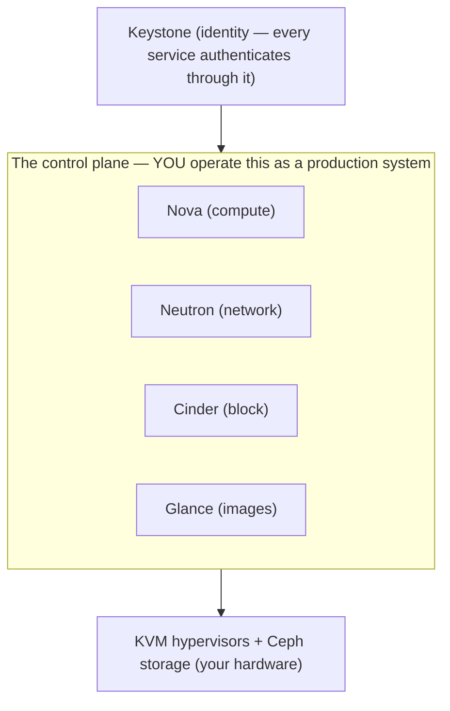

# OpenStack — building your own cloud

> Same four-part template as [AWS](../aws/): **what it is → the admin skill map → the
> AI-assisted ramp → labs.** The honesty marker is **🧗 ramp** — understood
> architecturally and adjacent to real KVM/Proxmox experience, not run in production.
> OpenStack is the one platform in this repo where *you build the cloud*, and that
> single fact shapes everything about operating it.

## 1. What OpenStack is

OpenStack is an open-source toolkit for building an AWS-like cloud **on your own
hardware** — the private/sovereign cloud that some large organizations and telcos run
instead of, or alongside, the public clouds. Where AWS hands you a finished cloud,
OpenStack hands you the *components* and makes you assemble and operate them. That's
the appeal (total control, no vendor, your data centre) and the cost: **the control
plane is now a production system you own** ([`the-stack/01`](../../the-stack/01-physical.md)'s
recurring warning — the same shape as self-running Kubernetes or Ceph).

Mapped onto the [seven surfaces](../../00-the-operating-model.md) — and notice each
surface is a named *project* you deploy and run:

| Surface | OpenStack's word(s) for it | The one-liner |
| --- | --- | --- |
| **Identity & access** | **Keystone** | The auth/authz service — tokens, projects (tenants), roles; the front door. |
| **Compute** | **Nova** (usually over **KVM**) | Schedules and runs VMs on your hypervisors; flavors are the size menu. |
| **Networking** | **Neutron** | Tenant networks (usually VXLAN overlays), routers, floating IPs, security groups. |
| **Storage** | **Cinder** (block), **Swift** (object), **Glance** (images) | Block volumes, object store, and the image catalog — often **Ceph** underneath all three. |
| **Provisioning & config** | **Heat** (orchestration), cloud-init, **Ironic** (bare metal) | Declarative stacks; cloud-init for first boot; Ironic serves bare metal like a cloud. |
| **Observability** | **Ceilometer / Gnocchi / Aodh** (+ Prometheus/Grafana) | Telemetry and alarms — plus the same open-source stack everyone converges on. |
| **Security & compliance** | Keystone, security groups, **Barbican** (secrets) | Least privilege and secrets, on infrastructure you also secure physically. |

The one thing to carry away: **OpenStack is KVM you may already know, wrapped in a
cloud control plane you now have to run.** Its API going down is an outage you own —
on top of every hardware duty of self-hosting.

## 2. The admin skill map

The concrete, checkable list in **[`skills-map.md`](skills-map.md)**. The headline
capabilities:

- **The component model** — what Keystone / Nova / Neutron / Cinder / Glance each do,
  and how a `server create` request flows through them.
- **Projects, flavors, and quotas** — the multi-tenant model and how you carve
  capacity.
- **Neutron networking** — tenant networks, routers, floating IPs, security groups —
  the component operators most often name as what pages them.
- **Storage via Ceph** — Cinder/Glance/Swift on Ceph, and the fact that **Ceph is its
  own platform to operate** (health, rebalancing, placement groups).
- **The control-plane reality** — a wedged message queue or database stops the API
  while running VMs keep humming; knowing that failure mode *before* it teaches you.
- **Driving it from code** — the `openstack` CLI, the SDK, Heat/Terraform — the same
  three moves ([operating model](../../00-the-operating-model.md)) as any cloud.

## 3. The AI-assisted path to competence

The method — going from "knows KVM + the operating model" to "can reason about
operating OpenStack" — is in **[`ai-ramp.md`](ai-ramp.md)**. In one paragraph:

OpenStack is a strong case for the ramp method *and* a strong case for its limits.
The concepts translate cleanly — *"I know KVM, VLANs, Ceph-style storage, and IAM;
map Nova/Neutron/Cinder/Keystone onto what I know"* — and AI compresses that mapping
to minutes. But the hard-won knowledge of OpenStack is **operational** (what breaks in
the control plane, how to debug Neutron at 3 a.m.), and that comes from running it,
not reading about it. AI ramps you to *competent-to-reason*; production competence on
this platform is the part it can't hand you — which is exactly why the honest marker
below is 🧗.

## 4. Labs

A **three-lab CLI arc** (Keystone identity + inventory → Neutron network + Nova
instance → the control-plane failure drill) is in **[`labs/`](labs/)** with real
`openstack` commands. It's built on **DevStack** (a
single-node all-in-one OpenStack) in a VM, create a project + flavor + tenant network,
launch an instance with cloud-init, and — the real lesson — deliberately wedge a
control-plane service and watch running instances survive while the API goes down.
DevStack is the honest way to meet OpenStack's plumbing without a data centre.

## Honest boundaries

🧗 **honest ramp — clearly labeled.** OpenStack is **understood architecturally**
(Nova/Neutron/Cinder/Glance/Keystone over KVM, the control-plane-as-product reality)
and sits *adjacent* to real ✋ ground — **KVM** and **Proxmox VE** run hands-on in lab
and internal environments, including GPU passthrough ([`the-stack/01`](../../the-stack/01-physical.md)).
So the *hypervisor* underneath is ✋; the OpenStack *control plane* is the 🧗 ramp,
not claimed as production operations. The control-plane-as-product warning that runs
through this module isn't theory — it comes from real platform-operations experience
(vSphere estate, fleet infrastructure) applied to OpenStack's design. The claim is a
sound architectural grasp plus a verifiable ramp, honest that production OpenStack ops
is the part that only comes from running it.
