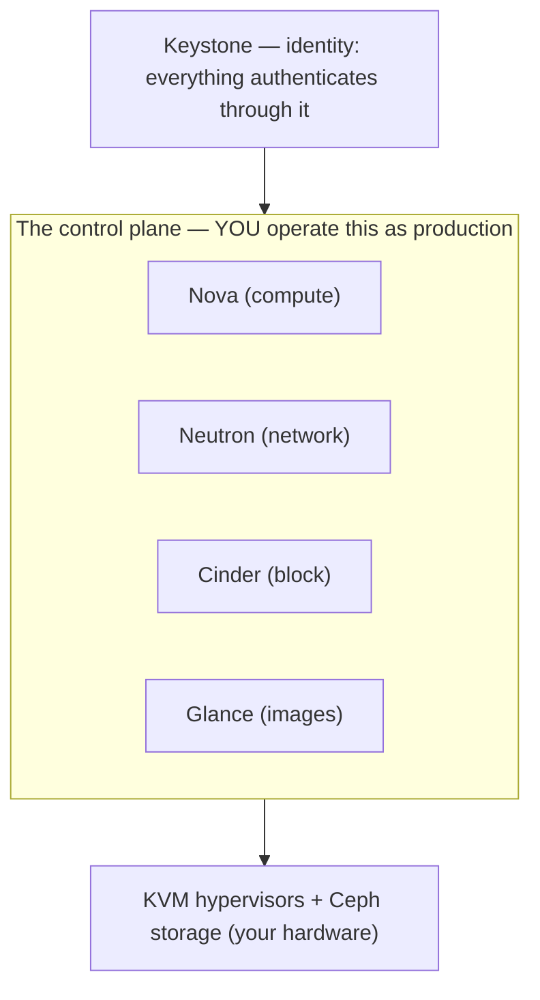
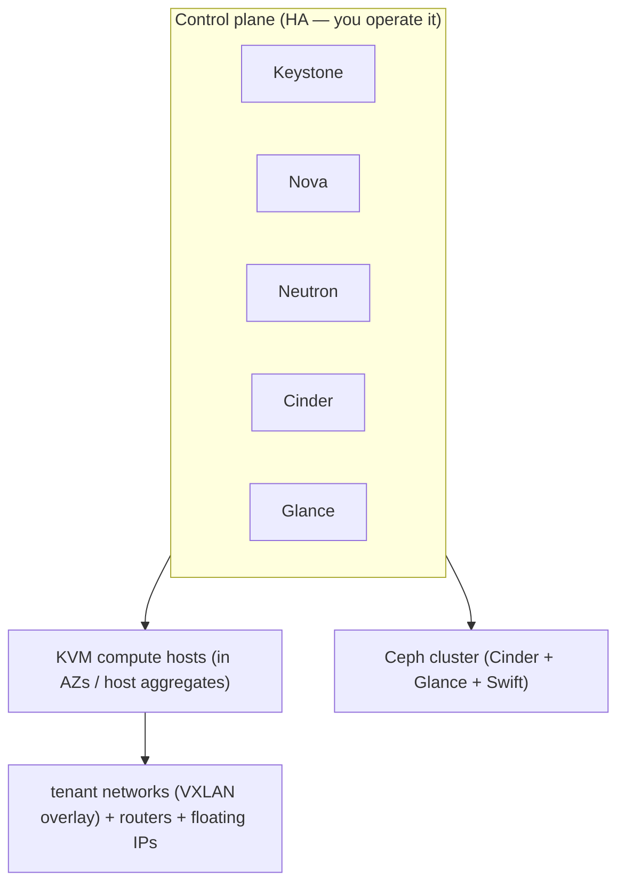

# OpenStack — Understanding the Architecture

> The [README](README.md) mapped OpenStack onto the seven surfaces — *what the
> components are.* This note is the layer up: *how OpenStack is structured*, and the
> one fact that shapes everything — **you assembled this cloud, so its control plane
> is a production system you operate.** That single truth is the whole architecture.

Where AWS hands you a finished cloud, OpenStack hands you the components and makes you
run them. Understanding the structure is understanding how the pieces connect *and*
what it costs to keep them running.

## 1. The component architecture — how a request flows

OpenStack is a set of named services, each owning one surface, talking to each other
through **Keystone**:

A `server create` walks the whole plane: **Keystone** authenticates you, **Nova**
schedules the VM, pulls its image from **Glance**, attaches a **Cinder** volume, and
wires it onto a **Neutron** network — all landing on **KVM** hosts over (usually)
**Ceph** storage. Learn that flow and "where did my instance fail to launch?" has a
place to start ([`the-stack/05`](../../the-stack/05-platform-services.md)).

## 2. The control-plane-as-product reality — the defining fact

This is the architectural truth that separates OpenStack from every managed cloud:

- **The control plane is a production system you own.** Its API going down is *your*
  outage — on top of every hardware duty of [self-hosting](../self-host/). A wedged
  message queue or a stuck database stops the API while the already-running VMs hum
  along untouched (a failure mode worth internalizing *before* it teaches you).
- It's the same warning as self-run [Kubernetes](../../cross-cutting/kubernetes.md) and
  [Ceph](../../the-stack/04-storage.md), and [the-stack/01](../../the-stack/01-physical.md)'s
  OpenStack note: **this needs a platform *team*, not an admin.** The appeal (total
  control, your data center, no vendor) and the cost (you run the cloud) are the same
  fact.

## 3. Tenancy — projects and domains

OpenStack's multi-tenancy, the [blast-radius](../../the-stack/01-physical.md) model:

- A **project** (tenant) is the isolation and quota unit — resources belong to a
  project, and quotas cap what each can consume. The analog of an AWS account / OCI
  compartment.
- **Domains** group projects and users for larger organizations. **Keystone** roles
  bind users to projects — the [least-privilege](../../cross-cutting/identity-iam.md)
  discipline, OpenStack's word for it.

## 4. Placement — regions, AZs, host aggregates

How you steer *where* a VM lands ([`the-stack/01`](../../the-stack/01-physical.md)):

- **Regions** are fully independent deployments; **availability zones** partition
  compute within a region for failure isolation; **host aggregates** group hosts by
  capability (e.g. GPU hosts, SSD hosts) so the Nova scheduler can place workloads on
  the right hardware.
- Placement is your job here in a way it isn't on a managed cloud — you own the
  scheduler's inputs, not just the request.

## The shared-responsibility line — all of it, twice over

There is no provider: you run the **control plane** *and* the **hardware** underneath
([`the-stack/07`](../../the-stack/07-security.md)). It's [self-hosting](../self-host/)
plus a cloud API you also operate — the most-yours shared-responsibility line in the
repo, which is exactly why the control-plane warning matters so much.

## A reference architecture — how the surfaces compose

Every surface: **identity** (Keystone), **compute** (Nova over KVM), **networking**
(Neutron overlays), **storage** (Ceph under Cinder/Glance/Swift), and the control plane
you keep alive — the [skill map](skills-map.md) doing one job.

## Honest boundaries

🧗 **ramp — clearly labeled.** OpenStack is **understood architecturally** (the
component flow, the control-plane-as-product reality, the tenancy and placement models)
and sits *adjacent* to real ✋ ground: **KVM** and **Proxmox VE** run hands-on in lab
and internal environments (incl. GPU passthrough — [`the-stack/01`](../../the-stack/01-physical.md)).
So the **hypervisor** underneath (KVM) is ✋; the **OpenStack control plane** is the 🧗
ramp, not claimed as production operations. The control-plane-as-product warning that
defines this architecture isn't theory — it comes from real platform-operations
experience ([vSphere](../vsphere/) estate, [fleet](../self-host/) infrastructure)
applied to OpenStack's design. The claim: a sound architectural grasp plus a verifiable
ramp, honest that production OpenStack ops is the part that only comes from running it.
