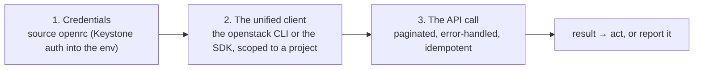
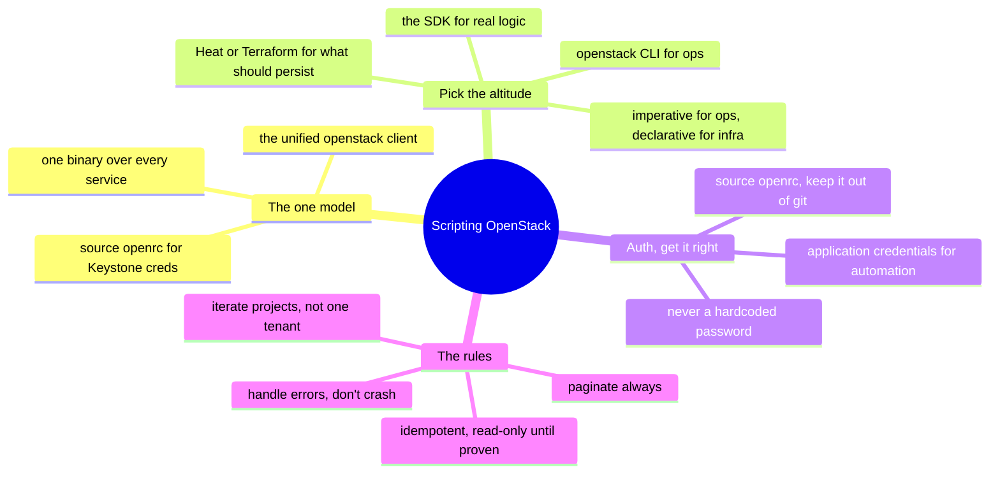

# OpenStack — Scripting the API (managing & operating from code)

> [`architecture`](architecture.md) is how OpenStack is structured; [`operations`](operations.md)
> is what running it looks like. This note is the *how*: **driving OpenStack from
> code** — the [operating-model](../../00-the-operating-model.md) move #3, through the
> one unified `openstack` client that fronts every service. The GUI (Horizon) is for
> looking; the CLI is for operating.

Everything in OpenStack is an API call, and the **unified `openstack` CLI** is the
everyday way to drive all of it — one binary over Keystone, Nova, Neutron, Cinder,
Glance, and the rest. A [scripting](../../foundations/) background turns straight into
OpenStack operations here; the three moves, in one client.

## The one model: `(credentials) → (client) → (API call)`

Get those three right — **Keystone credentials in the env**, the **project-scoped
client**, and a **safe API call** — and you operate the whole cloud from one terminal.

## The tooling ladder — pick the altitude

| Tool | What it is | Reach for it when |
| --- | --- | --- |
| **`openstack` CLI** | the unified client over every service | one-offs, checks, tenant operations, glue |
| **the SDK** (openstacksdk, Python) | the API as a library | real logic and tooling |
| **Heat** | OpenStack-native declarative orchestration | reproducible stacks the OpenStack way |
| **Terraform (openstack provider)** | *declarative*, cross-cloud | the standing infra, in the same tool as other clouds |

Same dividing line: **the CLI and SDK are imperative** (ops); **Heat and Terraform are
declarative** (the standing infra — [`iac`](../../cross-cutting/iac-and-config.md)).

## Authentication — source the credentials, don't hardcode them

- **`source openrc`** — the standard pattern: an RC file exports Keystone credentials
  (auth URL, project, username, and a password or token) into your environment, and the
  CLI/SDK read them from there. Keep the RC file out of git.
- **Application credentials** — a scoped, revocable credential for automation, better
  than embedding a user password; the OpenStack answer to "no long-lived user secret in
  a script" ([`identity`](../../cross-cutting/identity-iam.md)).
- **Never** hardcode a password in a `.py`/`.sh` — the same rule the whole repo repeats.

## The rules that separate a working script from a footgun

The [foundations](../../foundations/) discipline, OpenStack-specific:

- **Paginate — always.** `openstack ... list` can truncate on large clouds; know the
  pagination flags and the SDK's iteration.
- **Iterate projects.** Resources live per project; `--all-projects` (as admin) or a
  loop over projects is how you see the whole cloud, not one tenant's slice.
- **Handle errors per resource** — one project you can't reach shouldn't abort the run.
- **Be idempotent for mutations** — check-then-act, safe to re-run — the same rule
  [Heat/Terraform](../../cross-cutting/iac-and-config.md) enforce structurally.
- **Read-only until proven** — develop against `list`/`show`; add
  `create`/`delete`/`set` only once the logic is proven, behind a dry run.

## Two shapes of automation script

- **The read/audit script** — inventory across projects, a compliance check (public
  security-group rules, unencrypted volumes), a quota/capacity report. Read-only, safe,
  run often — the [inventory lab](labs/) is exactly this (`openstack ... list`).
- **The remediation / orchestration script** — *acts*: reap orphaned resources,
  rebalance quotas, stand up a tenant network + instance. Mutating, so it carries the
  full discipline — application credential, dry-run first, idempotent, logged.

## How AI assists writing the automation

- **Great for the skeleton and CLI lookup** — *"the `openstack` commands to create a
  project, a network with a router, and launch an instance"* — the shape in seconds,
  *if* you verify the commands exist.
- **Where AI burns you (verify hardest):** it **invents `openstack` subcommands and
  options**, and — worst here — it **mixes OpenStack releases and API microversions**
  confidently (the project moves across releases and AI blends eras). It also
  **understates the control-plane burden**, happily scripting *use* while staying quiet
  about *running* the platform. Verify against your deployment's release, and run
  read-only against a sandbox project (or DevStack) first.

## Honest boundaries

✋ **where it transfers, 🧗 where it's OpenStack.** The scripting-and-automation
*discipline* is hands-on — Python/Bash, paginated/idempotent/error-handled automation,
read-only-first ([`foundations/`](../../foundations/)) — and it transfers onto the
`openstack` client. **KVM** underneath is ✋. But the OpenStack-*specific* surface (the
unified client's breadth, release/microversion specifics, running it against a real
control plane) is the 🧗 ramp, mapped and verified on DevStack, not claimed as
production tooling. The claim: a strong automation foundation plus a verifiable ramp
onto OpenStack's API — honest that production ops comes only from running it.

## The doc on one screen

