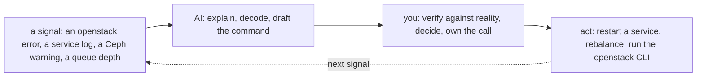

# OpenStack — Operating It (the day-2 reality)

> The [README](README.md) is *what OpenStack is*; [architecture](architecture.md) is
> *how it's structured*; this note is **what running it looks like** — and here the
> day-2 story has a twist no managed cloud has: **you operate the control plane, so
> its health is your health.** OpenStack is a 🧗 ramp; this is the operating discipline
> mapped onto its reality, with KVM underneath as the ✋ ground.

## The brief — what "operating OpenStack" means

You keep a cloud *you built* running — the control plane, the hypervisors, the storage
— while tenants consume it. The three day-2 questions gain a fourth, unique one:

- **Is it healthy?** — tenants' VMs up, *and is the control plane itself up?*
- **Is it safe?** — Keystone least-privilege, tenant isolation holding?
- **Is it affordable?** — capacity and quotas balanced across projects?
- **Is the platform alive?** — the question a managed cloud never makes you ask.

## Ops notes — what pages you on OpenStack

- **The wedged control-plane service — the signature OpenStack incident.** A full
  message queue (RabbitMQ) or a stuck database stops the **API** while every
  already-running VM keeps humming untouched. "The cloud is down but the VMs are up" is
  the failure mode to internalize *before* it teaches you — and it means monitoring the
  control plane itself, not just the tenants ([architecture](architecture.md)).
- **Neutron** — the component operators name first when asked what pages them. Tenant
  networking, overlays, routers, and floating IPs are powerful and intricate; the
  [debug ladder](../../the-stack/02-network.md) applies, with more rungs.
- **Ceph health** — the storage under Cinder/Glance/Swift is its own platform: health,
  rebalancing, and placement-group tuning are their own discipline
  ([`the-stack/04`](../../the-stack/04-storage.md)). A degraded Ceph is a slow-motion
  storage incident.
- **Quota exhaustion** — a project hits its cap and launches fail with a confusing
  error; capacity is carved per project and someone has to balance it.
- **Upgrades** — OpenStack's release cadence and the coordinated upgrade of many
  services is a genuine operational project, not a button.

## The ops work, broken down

By **cadence** — note the recurring theme: **you monitor the platform itself:**

| Cadence | Task | Surface | Why it matters |
| --- | --- | --- | --- |
| **Continuous (automated)** | Monitor the **control plane** (API, RabbitMQ, DB) + tenant health | observability | Its outage is your outage — a managed cloud never makes you watch this. |
| **Continuous (automated)** | Ceph health + rebalancing; Nova scheduler health | storage, compute | The storage and scheduler are yours to keep alive. |
| **Daily** | Triage control-plane + tenant alarms; check queue depth, DB, Ceph status | observability | Catch a wedging queue before it stops the API. |
| **Daily** | Answer "why won't this launch / connect" — Neutron, quotas, scheduler | networking, compute | The bread-and-butter incident, Neutron-heavy. |
| **Weekly** | Review Keystone roles/projects; per-project quota + capacity balance | identity, capacity | Isolation and fair-share both drift. |
| **Monthly** | Patch/refresh images (Glance); host + hypervisor patching | security | Closes CVEs across your own hardware. |
| **Quarterly** | Restore-test; Ceph capacity + failure-domain review | storage | An untested backup is a hope; Ceph needs headroom. |
| **Quarterly** | Plan a coordinated **OpenStack upgrade** across services | lifecycle | A real project — the control plane must survive it. |
| **On-incident** | Detect → mitigate → resolve → review — often a control-plane service | all | The [incident discipline](../../cross-cutting/incident-response.md), platform-deep. |

The truth this makes visible: **operating OpenStack is operating a platform, not
consuming one** — the human job is keeping the control plane, Ceph, and the scheduler
alive, on top of every tenant-facing duty. That's the cost side of "you build the
cloud" ([`the-stack/05`](../../the-stack/05-platform-services.md)'s build-vs-rent, lived).

## How AI assists the operating work

Distinct from the [learning ramp](ai-ramp.md) — AI in the daily loop:

- **Incident co-pilot / log decoding** — paste the `openstack` error, a Nova/Neutron
  service log, a Ceph `HEALTH_WARN`: *"what does this point at?"* A fast hypothesis you
  test.
- **Where AI helps and where it's quiet:** AI is genuinely useful for *using*
  OpenStack (CLI commands, tenant operations) — but it **stays quiet about the
  operational burden of *running* the control plane** (the queue, the DB, Ceph health),
  which is the actual hard part. It also **mixes OpenStack releases** confidently. The
  guardrail: **AI touches signals and drafts; you touch production.**

## Honest boundaries

🧗 **ramp, with the hypervisor as ✋ ground.** The ops *discipline* — triage, incident
method, capacity thinking, the control-plane-as-product instinct — is ✋, carried from
real platform work ([vSphere](../vsphere/), [fleet](../self-host/)), and **KVM**
underneath is hands-on. But **running a production OpenStack control plane** (Neutron
at scale, Ceph operations, coordinated upgrades, the 3 a.m. control-plane incident) is
the 🧗 ramp, understood architecturally and mapped, not claimed as production ops.
Production competence on this platform is precisely the part that only comes from
running it — and this note says so.
