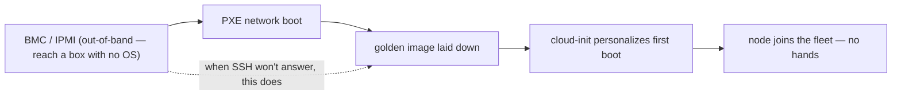

# Self-Hosted / Bare Metal — where the abstractions end

> Same four-part template as [AWS](../aws/): **what it is → the admin skill map → the
> AI-assisted ramp → labs.** The honesty marker is **✋ hands-on depth** — this is the
> ground floor of the whole stack, operated at fleet scale (100k+ devices
> provisioned), and the layer every cloud in this repo is an abstraction *over*.

## 1. What self-hosting is

Self-hosting is running services on hardware *you* own — no hypervisor pool, no
control plane, no provider. Just servers, disks, NICs, switches, power, and the
person who racks them and makes them boot. It's the oldest form of infrastructure and
it never left: it's still where cost-at-steady-scale, data sovereignty, air-gapped
compliance, and GPU supply push workloads back to
([`the-stack/01`](../../the-stack/01-physical.md)'s selection factors). Every other
platform in this repo — vSphere pooling it, OpenStack cloud-ifying it, AWS renting it
— is a layer built on top of what you do by hand here.

Mapped onto the [seven surfaces](../../00-the-operating-model.md) — note that here
*you are the implementation* of every one:

| Surface | Self-host's version | The one-liner |
| --- | --- | --- |
| **Identity & access** | AD / **OpenLDAP**, SSH keys, sudo, PAM | You run the directory; least privilege is Linux users, groups, and keys. |
| **Compute** | bare-metal servers, **KVM / Proxmox** | The physical box, or your own VMs on it — no scheduler unless you build one. |
| **Networking** | VLANs, **BIND** (DNS), DHCP, firewalls, switches | You own both underlay and overlay ([`the-stack/02`](../../the-stack/02-network.md)). |
| **Storage** | **SAN / NAS**, RAID, local disks, MinIO/Ceph | Block/file/object made of metal ([`the-stack/04`](../../the-stack/04-storage.md)). |
| **Provisioning & config** | **PXE + images + cloud-init**, Ansible | Network-boot a blank machine into a working one, hands-off, at scale. |
| **Observability** | Prometheus/Grafana, ELK, **IPMI/BMC** | You run the monitoring — and monitor it from outside itself. |
| **Security & compliance** | hardening/CIS, FDE, patching, physical access | Secure the box *and* the room it's in; the shared-responsibility line is all yours. |

The thing that makes self-hosting *engineering* rather than *carrying servers*: the
**provisioning pipeline**. A person with a USB stick doesn't scale; PXE → image →
cloud-init does. Build that and bare metal becomes cattle
([`the-stack/03`](../../the-stack/03-compute-and-images.md)).

## 2. The admin skill map

The concrete, checkable list in **[`skills-map.md`](skills-map.md)**. The headline
capabilities:

- **Reach a dead box** — BMC/IPMI/iLO/iDRAC out-of-band, and *why* out-of-band
  management is its own system to maintain.
- **The provisioning pipeline** — PXE boot, a golden image per hardware generation,
  cloud-init first boot, FDE enrolled at scale — hands-off from blank metal to fleet
  member.
- **The failure domains you designed** — racks, TOR switches, PDUs, power; placing
  replicas so one rack dying isn't one service dying
  ([`the-stack/01`](../../the-stack/01-physical.md)).
- **Core services you run** — DNS/BIND, DHCP, LDAP, NTP — the ones the whole network
  assumes and nobody notices until they break.
- **Storage that survives disks** — RAID, multipath, and the rebuild window; the
  truth that RAID is not backup ([`the-stack/04`](../../the-stack/04-storage.md)).
- **Everything as code** — Ansible for config, PXE/image pipelines versioned; the
  same idempotence discipline as any cloud ([`iac`](../../cross-cutting/iac-and-config.md)).
- **Capacity planning with lead time** — hardware has procurement latency; you see
  the wall before you hit it ([`cost`](../../cross-cutting/cost.md)).

## 3. The AI-assisted path — and where it doesn't reach

The method is in **[`ai-ramp.md`](ai-ramp.md)**. In one paragraph:

Self-hosting is the layer where AI helps with the *software* (draft the Ansible
playbook, the BIND zone file, the PXE/kickstart config, the udev rule — then verify
against the actual box) and cannot help with the *physical* (a flaky DIMM, a cable
in the wrong port, a BMC that won't answer). It's also the layer where AI's
confidently-wrong shell commands are most dangerous, because there's no undo on bare
metal and no provider to roll you back — every generated command gets read as if
you're about to run it as root, because you are ([`foundations/`](../../foundations/)).

## 4. Labs

A **three-lab CLI arc** (inventory the fleet → provision a node hands-off → failure-
domain + RAID drills) is in **[`labs/`](labs/)** with real `virsh`/`ipmitool`/`ansible`
commands, and it overlaps the
stack's most tangible drill: on one machine with nested virtualization (Proxmox or
Workstation/Fusion), build a small virtual "fleet" with a PXE server, network-boot
and image a node hands-off, define two "racks" and kill one to watch failure domains
in action — the [`the-stack/01` lab spec](../../the-stack/01-physical.md), which is
*this* platform's lab. The runnable [backup drill](../../the-stack/labs/04-backup-not-snapshot/)
is another pure-local piece of the self-host discipline.

## Honest boundaries

✋ **hands-on depth — the deepest root in the repo.** This is the ground the whole
project stands on: a multi-OS **PXE and image-based deployment platform** built from
scratch and run at fleet scale (100k+ devices cumulatively provisioned), **full-disk
encryption** at scale, **DNS/BIND/DHCP/LDAP** and core-services administration,
**RAID/SAN/NAS** storage, **KVM/Proxmox** (including GPU passthrough), and the
BMC/IPMI/out-of-band muscle that the cloud "serial console" is just a rental of. It
ties directly to [`foundations/`](../../foundations/), [`endpoint/`](../../endpoint/),
and the [`the-stack`](../../the-stack/) chapters — all of which draw on this
experience. There is no 🧗 here worth flagging: self-hosting is where the judgment the
rest of the repo applies to other platforms was *earned*. The claim is unqualified —
years running bare-metal fleets, and the instinct that makes every abstraction above
it legible.
