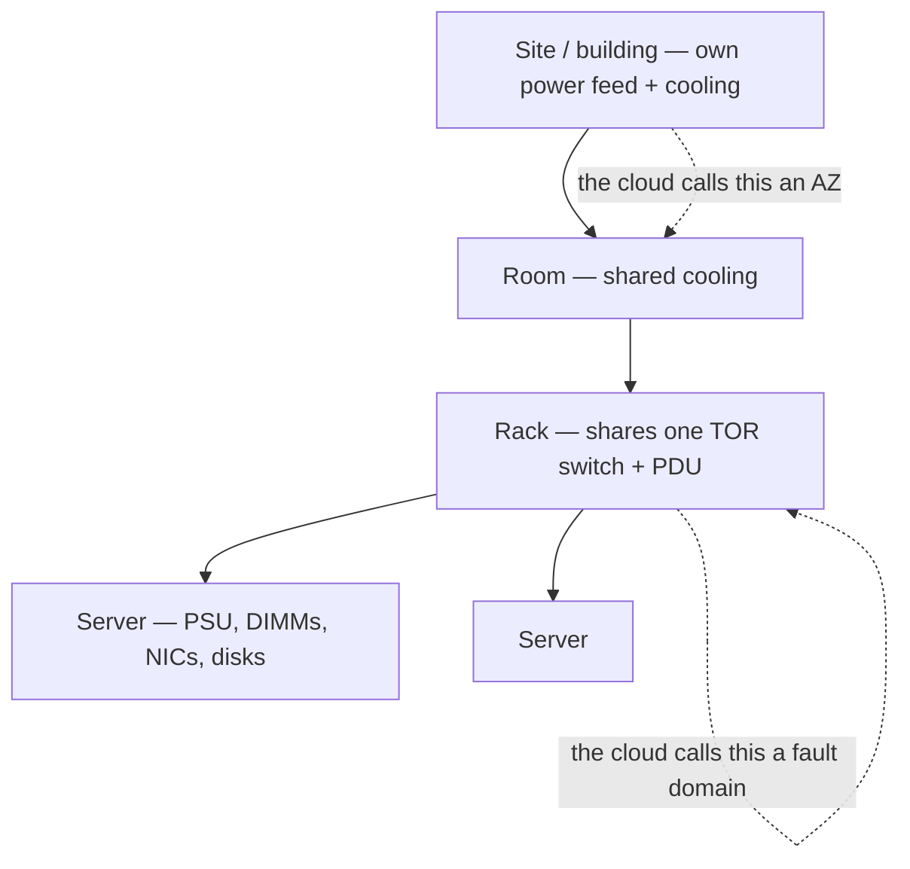
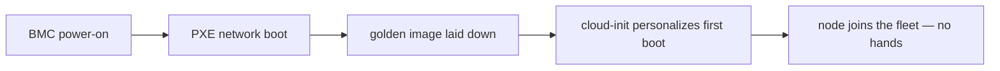

# Self-Hosted / Bare Metal — Understanding the Architecture

> The [README](README.md) mapped self-hosting onto the seven surfaces — *what you
> run.* This note is the layer up: *how a bare-metal estate is structured*, because
> here **you design the architecture the clouds hand everyone else** — the failure
> domains, the provisioning pipeline, the out-of-band plane. This is
> [`the-stack/01`](../../the-stack/01-physical.md) from the operator's chair, and it's
> written from having built it at fleet scale.

There is no provider drawing the boundaries for you; every structural decision below
is one you make. Four carry the weight.

## 1. The physical hierarchy — the failure domains you *design*

On a cloud you're handed AZs and fault domains ([`the-stack/01`](../../the-stack/01-physical.md)).
Here you build them out of metal, and getting the containment right is the whole game:

- A **rack** shares a top-of-rack switch and a PDU — so a rack is a **fault domain**:
  lose the TOR or the PDU and the whole rack goes with it. Placing both replicas of
  anything in one rack is the mistake the cloud's fault-domain concept exists to
  prevent — except here *you* are the one who must not make it.
- **Power and cooling are real constraints**, not line items: a rack has a power
  budget, and the GPU era made this physical again — you can buy the servers and still
  not have the watts to run them.
- The design instinct is the same as every cloud chapter, just with you as the
  implementation: **spread replicas across racks; treat the rack, the TOR, and the PDU
  as the blast radius.**

## 2. The out-of-band plane — reaching a box with no OS

The single most important thing self-hosting has that a laptop admin never learns:
**out-of-band management.**

- **BMC / IPMI / iLO / iDRAC** — a tiny always-on computer on the motherboard, on its
  own network, that can power-cycle the host, mount virtual media, and give you a
  console *when the main OS is dead or absent*. It's how you install, recover, and
  reboot a headless server you can't walk to.
- **The cloud "serial console" is a rental of this** ([`the-stack/03`](../../the-stack/03-compute-and-images.md))
  — same job, same moment of need. Knowing the BMC is knowing what the cloud console
  is standing in for.
- Out-of-band is itself a system to secure and maintain: a management network, its
  own credentials, and firmware that gets CVEs. A dead BMC on the box you most need to
  reach is its own incident.

## 3. The provisioning pipeline — the system that makes metal *cattle*

This is the architectural centerpiece, and the thing that turns "carrying servers"
into engineering ([`the-stack/03`](../../the-stack/03-compute-and-images.md)):

- A person with a USB stick doesn't scale; **PXE → image → cloud-init** does. Build
  this pipeline and a blank machine becomes a working, personalized fleet member with
  no human touching it — the difference between a pet you hand-install and cattle you
  reimage.
- The hard part the cloud hides: **hardware diversity** — the image must boot on every
  server generation you own, with the right drivers, every time. One image, twelve
  models, one that won't take the NIC driver.

## 4. The core services — the ones everything assumes

A self-hosted estate runs the services a cloud provides invisibly, and they're the
ones nobody notices until they break:

- **DNS (BIND)**, **DHCP**, **LDAP** (the [directory](../../cross-cutting/identity-iam.md)),
  and **NTP** — name resolution, addressing, identity, and time. When DNS or time
  drifts, *everything* misbehaves in confusing ways ([`the-stack/02`](../../the-stack/02-network.md)).
- **Storage** as SAN/NAS/RAID ([`the-stack/04`](../../the-stack/04-storage.md)) —
  block and file made of metal, with RAID for disk-failure survival and the truth that
  **RAID is not backup**.

## The shared-responsibility line — there is none

Every other platform in this repo shares the burden with someone: a provider, a
control plane. Here the line is drawn all the way at the bottom — **you secure the
box, the network, the hypervisor, the data, *and the room it sits in*.** The hardware
failure is your pager; physical access control is your job; the whole
[shared-responsibility diagram](../../the-stack/07-security.md) is one color. That
total ownership is exactly why this is the ground the rest of the repo's judgment was
earned on.

## Honest boundaries

✋ **hands-on depth — the deepest root in the repo, and this note is written entirely
from it.** A multi-OS **PXE + image-based deployment platform** built from scratch and
run at fleet scale (100k+ devices cumulatively provisioned); **full-disk encryption**
at scale; **DNS/BIND, DHCP, LDAP, NTP** core services; **RAID/SAN/NAS** storage;
**KVM/Proxmox** (incl. GPU passthrough); and the **BMC/IPMI out-of-band** muscle the
cloud console rents. The failure-domain design, the provisioning pipeline, the
out-of-band plane — all lived. There is essentially **no 🧗 to flag here**: bare metal
is where the judgment the rest of the repo applies to other platforms was *earned*,
and it ties directly to [`foundations/`](../../foundations/), [`endpoint/`](../../endpoint/),
and [`the-stack`](../../the-stack/).
