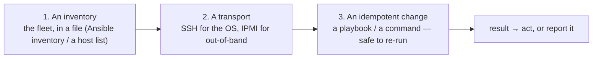
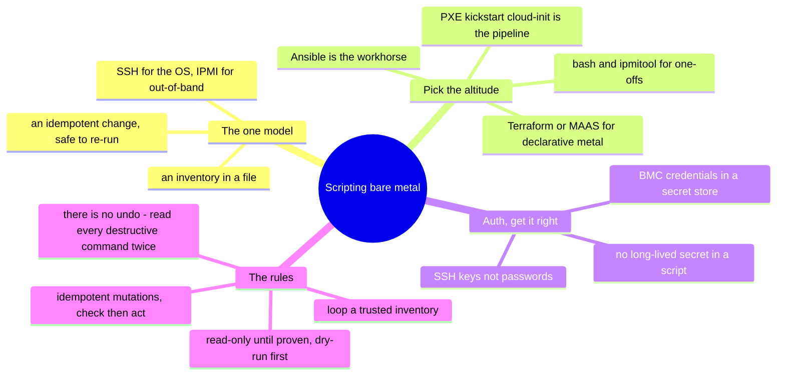

# Self-Hosted / Bare Metal — Scripting the Fleet

> [`architecture`](architecture.md) is how a bare-metal estate is structured;
> [`operations`](operations.md) is what running it looks like. This note is the *how*:
> **driving a fleet from code** — Ansible, SSH, `ipmitool`, `virsh`, and the
> PXE/kickstart pipeline. It's [operating-model](../../00-the-operating-model.md) move
> #3 on the platform where automation was never optional: at fleet scale, by hand
> doesn't exist.

There's no console API here — the "API" is SSH to a fleet, IPMI to the out-of-band
plane, and a boot pipeline that images machines with no hands. This is where a
[scripting](../../foundations/) background *is* the platform: everything is a script,
an inventory, or a boot recipe, and the discipline that keeps it safe is the same one
[foundations](../../foundations/) teaches — with one extra rule, because bare metal
has no undo.

## The one model: `(inventory) → (transport) → (idempotent change)`

Get those three right — a **current inventory**, the **right transport** (SSH to the
OS, IPMI when there's no OS), and an **idempotent change** — and you operate a fleet
from one terminal instead of a rack of KVMs.

## The tooling ladder — pick the altitude

| Tool | What it is | Reach for it when |
| --- | --- | --- |
| **bash + ssh / ipmitool** | ad-hoc across the fleet | one-offs, health sweeps, out-of-band power/console |
| **Ansible** | agentless config + orchestration over SSH | the workhorse — config, patch waves, rolling changes |
| **virsh / virt-install** | local KVM/libvirt VM lifecycle | VMs on your own hosts |
| **PXE + kickstart/preseed + cloud-init** | the provisioning pipeline as code | turning blank metal into fleet members hands-off |
| **Terraform / MAAS** | *declarative* bare-metal provisioning | metal managed like a cloud, reproducibly |

Same dividing line as everywhere: **bash/Ansible are imperative** (do this now — ops);
**the PXE pipeline and Terraform/MAAS are declarative-ish** (this is what a provisioned
host *is*). Ops is Ansible; the standing fleet is the pipeline
([`iac`](../../cross-cutting/iac-and-config.md)).

## Authentication — keys, not passwords

- **SSH keys** for the OS plane — an agent or a management key, never passwords
  sprayed across the fleet ([`identity`](../../cross-cutting/identity-iam.md)).
- **IPMI/BMC credentials** for the out-of-band plane — held in a secret store, never
  `-P hunter2` hardcoded in a script; the BMC can power-cycle and reinstall a host, so
  its credentials are as sensitive as root.
- The rule the whole repo repeats: **no long-lived secret sitting in a script or a
  repo.**

## The rules — the foundations discipline, plus one bare-metal rule

- **Loop the inventory deliberately** — a change applied to "all" must be an inventory
  you trust; a wrong or stale inventory is a fleet-wide mistake.
- **Idempotent for mutations** — the foundations lesson, productized by Ansible: a
  playbook says "the package is present," checks, and moves on. Re-running converges,
  never doubles.
- **Read-only until proven** — develop against gather-facts and `--check` (Ansible's
  dry run) before a real apply; a health sweep before a remediation.
- **THE bare-metal rule: there is no undo.** On a cloud a bad `terraform destroy` is
  recoverable-ish; here, `mkfs`/`dd`/`rm -rf` on the wrong target is *gone*, with no
  provider and no snapshot to save you. Every destructive command gets read as if it's
  running as root on the wrong host — because that's the failure mode
  ([`foundations/`](../../foundations/)).

## Two shapes of automation script

- **The inventory/audit script** — a fleet health sweep, a firmware-version report,
  an out-of-band power/sensor check. Read-only, safe, run often — the
  [inventory lab](labs/) is exactly this (`ansible ... -m setup`, `ipmitool ...`).
- **The remediation / provisioning script** — *acts*: a patch playbook, a rolling
  reboot, a `virt-install` that stands up a node, a PXE/kickstart that images bare
  metal. Mutating, so it carries the full discipline — trusted inventory, `--check`
  first, idempotent, logged, and read twice because there's no undo.

## How AI assists writing the automation

- **Great for config and glue** — a BIND zone, a `dhcpd.conf`, a kickstart, an Ansible
  playbook, a `udev` rule: AI drafts the boilerplate fast and, because you know the
  system, you catch the wrong directive.
- **Where AI burns you (verify hardest):** it **invents flags and mixes GNU-vs-BSD
  tool syntax**; it **assumes a distro/init that isn't yours**; and — most dangerous
  here — it **hands you a destructive command with no guardrail** for a platform with
  no undo. Run it read-only, `--check` every playbook, and never let a generated
  `mkfs`/`dd`/`rm` run until you've confirmed the target by hand.

## Honest boundaries

✋ **hands-on depth — the deepest root.** Ansible/bash/SSH fleet automation, `ipmitool`
out-of-band operations, `virsh`/KVM VM lifecycle, and the **PXE + kickstart +
cloud-init pipeline** operated at fleet scale (100k+ devices) — the automation instinct
this whole repo teaches, applied where it was earned. Built on the ✋
[foundations](../../foundations/) scripting discipline (idempotence, read-only-first,
no plaintext secrets) with the extra bare-metal rule baked in by experience: there is
no undo. The only 🧗 edge: newest **MAAS/Terraform bare-metal** provisioning at scale
— mapped and verified, not claimed as the primary tooling.

## The doc on one screen

