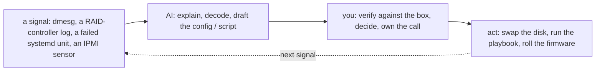

# Self-Hosted / Bare Metal — Operating It (the day-2 reality)

> The [README](README.md) is *what self-hosting is*; [architecture](architecture.md)
> is *how it's structured*; this note is **what running it actually looks like** —
> the brief, what pages you (hardware, at fleet scale, constantly), the ops work by
> cadence, and where AI helps and flatly cannot. Written from operating a bare-metal
> fleet, where the pager was real and the failures were physical.

## The brief — what "operating bare metal" means

You keep hardware alive, provisioned, and recoverable while the services on it stay
up — and you own every layer, because there's no provider under you. The three
day-2 questions:

- **Is it healthy?** — hosts up, disks and DIMMs not failing silently, core services
  (DNS/DHCP/LDAP/NTP) answering, and would you know before a user does?
- **Is it safe?** — hardened, patched, encrypted, and the room physically secured?
- **Is it efficient?** — capacity ahead of demand, given that hardware has a
  procurement lead time you can't wish away?

## Ops notes — what pages you (the failures are physical here)

- **Disk and DIMM failures — constant at fleet scale.** With enough machines,
  something is always failing; the discipline is treating spares as *consumables* with
  a stocked shelf and a swap procedure, not as surprise incidents. RAID buys you the
  time to swap ([`the-stack/04`](../../the-stack/04-storage.md)); a second failure
  *during* a rebuild is the nightmare RAID levels exist to bound.
- **A TOR switch takes out a whole rack** — that's why the rack is a
  [fault domain](architecture.md); the outage's blast radius is exactly the
  containment you designed (or didn't).
- **Capacity arriving later than demand** — the quiet killer. Hardware has weeks-to-
  months of procurement lead time; run out of headroom and there's no `terraform
  apply` to save you. Capacity planning with lead time is the job the cloud let people
  forget.
- **Firmware CVEs needing fleet reboots** — a BIOS/BMC vulnerability means rolling the
  fleet in waves, draining and rebooting hosts without taking the service down.
- **A dead BMC on the box you most need** — out-of-band is a system that itself fails;
  when it does, you're walking to the data center.
- **The provisioning pipeline breaking** — PXE, the image, or cloud-init failing means
  no new capacity comes online hands-off; the pipeline is production infrastructure,
  not a convenience.

## The ops work, broken down

The recurring work of a bare-metal admin, by **cadence**:

| Cadence | Task | Surface | Why it matters |
| --- | --- | --- | --- |
| **Continuous (automated)** | Hardware health monitoring (disks, DIMMs, PSU, temp via IPMI); service alarms | observability | At fleet scale something is always failing; you get paged, not surprised. |
| **Daily** | Triage hardware alerts; verify core services (DNS/DHCP/LDAP/NTP) answering | observability, networking | The services everything assumes fail confusingly when they drift. |
| **Daily** | Answer "why can't X reach Y" on hardware you own — the [debug ladder](../../the-stack/02-network.md) | networking | The bread-and-butter incident, with no provider to blame. |
| **Weekly** | Spares inventory: are the shelves stocked for the failure rate? | compute | Spares as consumables, not incidents. |
| **Weekly** | Patch/config drift via Ansible; review the provisioning pipeline health | provisioning, security | Drift and a broken pipeline both hide until they bite. |
| **Monthly** | Firmware/BIOS CVE waves — drain, update, reboot hosts in rolling batches | security | Closes hardware-level holes without a full-fleet outage. |
| **Monthly** | Capacity review with procurement lead time — order ahead of the wall | capacity | Hardware can't be conjured; see the wall months out. |
| **Quarterly** | Restore-test a backup; verify RPO/RTO for real | storage | An untested backup is a hope ([`the-stack/04`](../../the-stack/04-storage.md)). |
| **Quarterly** | Failure-domain drill; physical access + BMC credential review | security | Prove a rack loss is survivable; secure the out-of-band plane. |
| **On-incident** | Detect → mitigate → resolve → review, often with a physical swap | all | The [incident discipline](../../cross-cutting/incident-response.md), on metal. |

The truth this makes visible: **the human job is the physical and the planning** —
swaps, spares, firmware waves, and capacity with lead time — while the software (the
pipeline, config, monitoring) is automated. The review cadence (spares, restores,
capacity, failure-domain drills) is where the estate rots if skipped.

## How AI assists — and where it flatly cannot

Distinct from the [learning ramp](ai-ramp.md): AI in the daily loop, on the platform
you know deepest, so **AI drafts the software; you own the physical and the decision.**

- **Where AI earns its keep** — drafting config (BIND zone files, kickstart/preseed,
  Ansible playbooks, `udev` rules) and decoding errors (`dmesg` tails, RAID controller
  logs, a wedged unit): a fast hypothesis you test against the actual hardware.
- **Where AI cannot help** — the **physical layer**: a flaky DIMM, a cable in the
  wrong port, a backplane fault, a BMC that won't answer. None of it is a prompt away;
  this half of the job stays entirely human.
- **Where AI is dangerous** — **no undo on bare metal.** `mkfs` on the wrong device or
  `dd` to the wrong disk is *gone*, with no provider to roll you back. AI drafts
  destructive commands confidently and without the guardrail you'd add by instinct.
  Read every one as if you're running it as root, because you are
  ([`foundations/`](../../foundations/)).

## Honest boundaries

✋ **hands-on depth — the deepest root, and this note is the fleet work written down.**
Disk/DIMM-swap-at-scale, the spares-as-consumables discipline, firmware CVE waves,
capacity planning with procurement lead time, core-service operation (DNS/DHCP/LDAP/
NTP), the provisioning pipeline as production infrastructure, and BMC/IPMI out-of-band
recovery — all lived at fleet scale. This is not a ramp; it's the operations craft the
rest of the repo carries onto every other platform, where the pager was real and the
failures were something you could hold in your hand.
