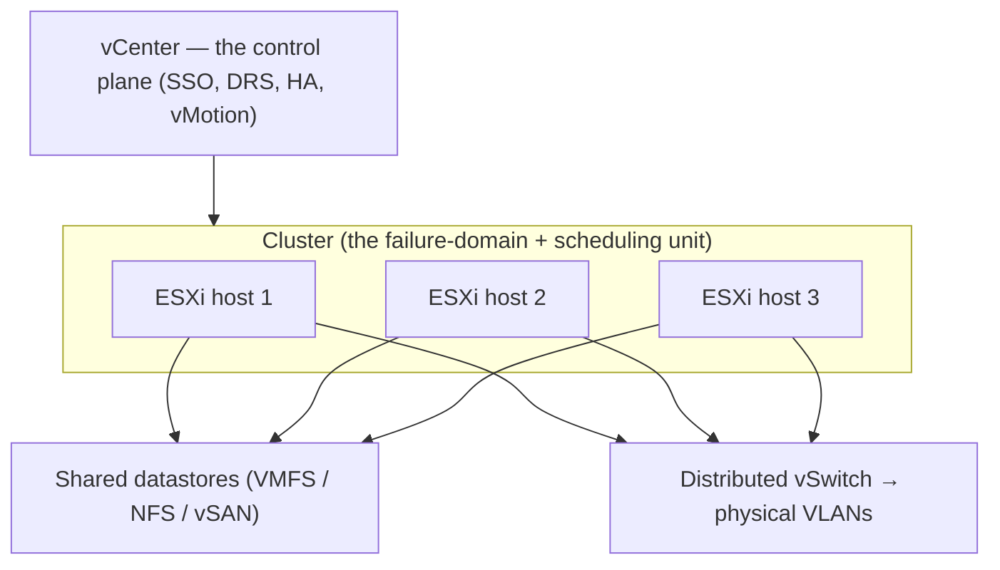

# VMware vSphere / vCenter — the private-cloud workhorse

> Same four-part template as [AWS](../aws/): **what it is → the admin skill map → the
> AI-assisted ramp → labs** — plus the deeper **[architecture](architecture.md) ·
> [operations](operations.md) · [automation](automation.md)** trio. But the honesty
> marker flips here: vSphere is **✋ hands-on depth**, not a ramp. This is the
> enterprise's private cloud, and it's the platform in this repo written from the most
> direct production experience — operated as an AMS-region vCenter administrator,
> VCP6-DCV / VCP6-NV certified.

## 1. What vSphere is

vSphere is how enterprises turned racks of servers into a pool of compute *before*
"cloud" was a product — and it still runs a vast share of the world's private
infrastructure. **ESXi** is the hypervisor on each physical host; **vCenter** is the
control plane that turns many hosts into one managed cluster. The administrator's job
is the same shape as any cloud — declare intent, keep it healthy, secure, and
efficient — except the hardware is *yours* ([`the-stack/01`](../../the-stack/01-physical.md)):
vSphere changes *how you schedule* it, not *who replaces the DIMM*.

Mapped onto the [seven surfaces](../../00-the-operating-model.md):

| Surface | vSphere's word(s) for it | The one-liner |
| --- | --- | --- |
| **Identity & access** | vCenter **SSO**, roles & permissions, AD/LDAP integration | Who can manage what in vCenter — roles scoped to objects, ideally via AD groups. |
| **Compute** | **ESXi** hosts, **VMs**, resource pools, **DRS** | Where VMs run; DRS balances them across hosts; a cluster is the unit. |
| **Networking** | standard & **distributed vSwitch** (DVS), port groups, **NSX** | VMs bridged onto physical VLANs; NSX adds a full SDN overlay. |
| **Storage** | **datastores** (VMFS / NFS / **vSAN**), VMDK | Where VM disks live; vSAN turns local disks into a distributed datastore. |
| **Provisioning & config** | **templates**, clones, content libraries, cloud-init, PowerCLI | Build VMs from golden images, not installers ([`the-stack/03`](../../the-stack/03-compute-and-images.md)). |
| **Observability** | vCenter alarms, performance charts, **vROps / Aria Operations** | Is the cluster healthy, and where's the contention? |
| **Security & compliance** | roles/permissions, **lockdown mode**, VM/vSAN encryption, hardening | Secure the cluster; least privilege applies here exactly as in a cloud. |

The signature capabilities that make vSphere *vSphere*: **vMotion** (move a running
VM between hosts with no downtime), **DRS** (automatically balance load), **HA**
(restart VMs from a failed host elsewhere), and **datastores** as the shared storage
pool underneath it all. Know those four and you understand what the platform buys you.

## 2. The admin skill map

The concrete, checkable list of what a vSphere administrator must be *able to do*.
Full checklist with tiers in **[`skills-map.md`](skills-map.md)**. The headline
capabilities:

- **A cluster you designed** — ESXi hosts joined to vCenter, a cluster with **DRS +
  HA** enabled, and the placement rules (anti-affinity) that keep replicas apart
  ([`the-stack/01`](../../the-stack/01-physical.md)).
- **vMotion and its prerequisites** — shared storage, compatible CPUs, the network
  for it — and *why a migration fails* when one is missing.
- **Datastores done right** — VMFS/NFS/vSAN, capacity headroom, and the outage a
  **full datastore** causes (it takes every VM on it down together).
- **Networking** — standard vs. distributed vSwitch, port groups and VLANs, and
  (where present) NSX segments and the distributed firewall.
- **Provisioning from templates** — a golden VM → template → clone/customization,
  content libraries across sites, cloud-init for first-boot personalization.
- **Lifecycle & patching** — vCenter/ESXi upgrades, host maintenance mode + evacuate,
  and rolling the fleet without downtime.
- **Secure and observable** — roles via AD groups, lockdown mode, encryption, and
  vCenter alarms / vROps for health and capacity.

## 3. The AI-assisted path — inverted, because this is a strength

On the public clouds AI collapses the *unknown-unknowns*. On vSphere the model
flips: **the judgment is already here, so AI's job is narrower** — see
[`ai-ramp.md`](ai-ramp.md). In one paragraph:

AI earns its keep on vSphere in three specific places: **PowerCLI** automation (it
drafts the script fast; you know when it's wrong), **what's changed** in newer
versions and under Broadcom's licensing shakeup (worth verifying against current
docs, since this is exactly the kind of moving detail AI mis-remembers), and
**cross-mapping** — *"I run vSphere DRS/HA/vMotion and datastores; what are the AWS /
Azure equivalents and where does the analogy break?"* That last one turns a deep
vSphere foundation into a fast ramp onto the clouds — the operating model running in
reverse.

## 4. Labs

Reading about vMotion and doing it are different skills — but the honest note is that
this platform's lab *already ran*, in production, for years. A **three-lab CLI arc**
(connect + inventory → provision from a template → watch HA restart a VM) is in
**[`labs/`](labs/)** with real **PowerCLI** — a nested-ESXi or lab-cluster walkthrough
that forces a host failure to watch HA restart it, the failure-domain lesson from
[`the-stack/01`](../../the-stack/01-physical.md), made tangible on the platform it
came from).

## 5. Going deeper — architecture, operations & automation

Three companion notes take vSphere past "what the pieces are", mirroring the AWS set —
written from production experience, not a ramp:

- **[`architecture.md`](architecture.md)** — the vCenter → cluster → host → VM
  hierarchy as the failure-domain unit (N+1), datastores as the shared substrate, and
  the **HA/DRS/vMotion distinctions** (what each does and does *not* do), plus a
  reference cluster architecture.
- **[`operations.md`](operations.md)** — day-2: the ops notes (full datastore = mass
  outage, HA events, contention read as CPU-ready / ballooning / datastore latency),
  the recurring work **by cadence**, and AI in the operating loop (PowerCLI drafting).
- **[`automation.md`](automation.md)** — **PowerCLI**: the connect → object →
  operation model, the altitude ladder (PowerCLI / govc / Terraform vsphere provider),
  credential handling, and `Get-*`-until-proven with `-WhatIf` on every mutation.

## Honest boundaries

✋ **hands-on depth — one of the deepest in the repo.** Operated as the **AMS-region
vCenter administrator** (maintained and upgraded VM infrastructure and services),
**VCP6-DCV** (Data Center Virtualization) and **VCP6-NV** (Network Virtualization)
certified, with adjacent hands-on **KVM** and **Proxmox VE** (including physical-GPU
passthrough) in lab and internal environments ([`the-stack/01`](../../the-stack/01-physical.md)
draws on this). This is not a ramp — it's the production-virtualization ground the
rest of the repo's failure-domain and hypervisor material stands on. Where it's a
ramp rather than depth, it's the *newest* vSphere/NSX features and the post-Broadcom
licensing landscape — labeled 🧗 and verified, not bluffed. The claim here is
genuine: **years running a production vSphere estate**, plus the transferable
instinct that makes every other platform in this repo faster to learn.
