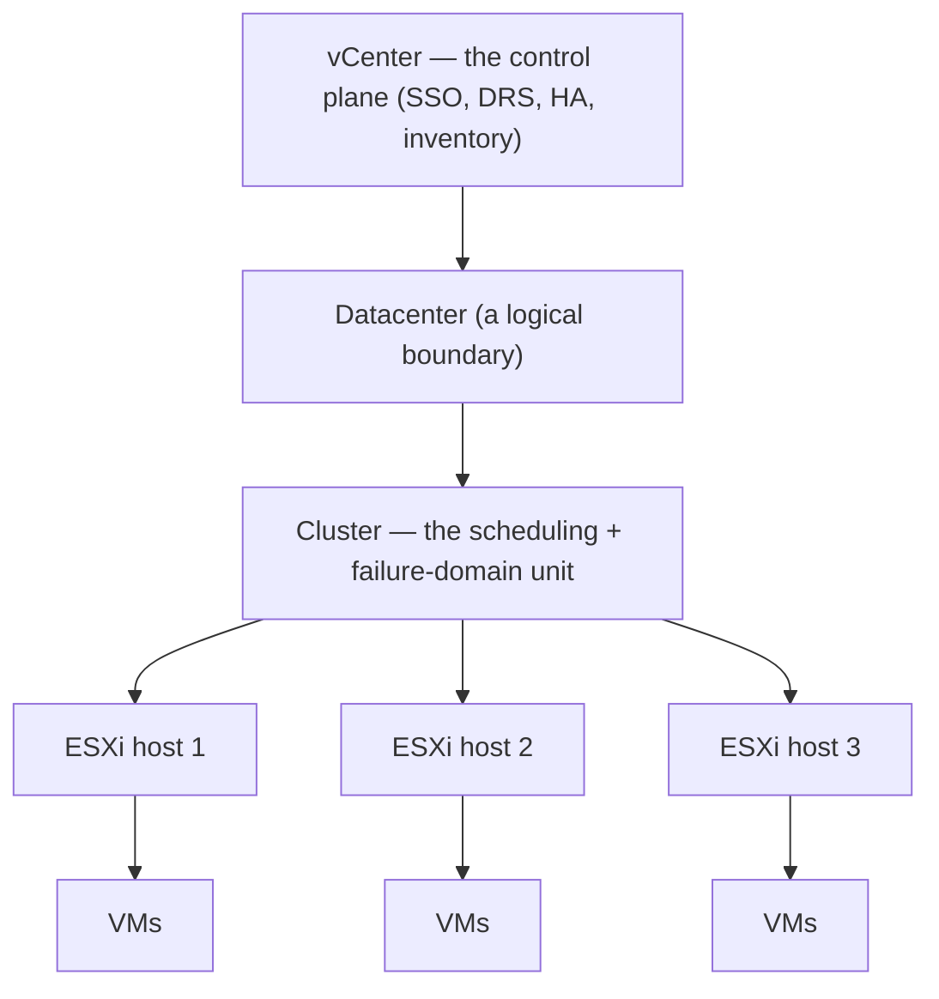
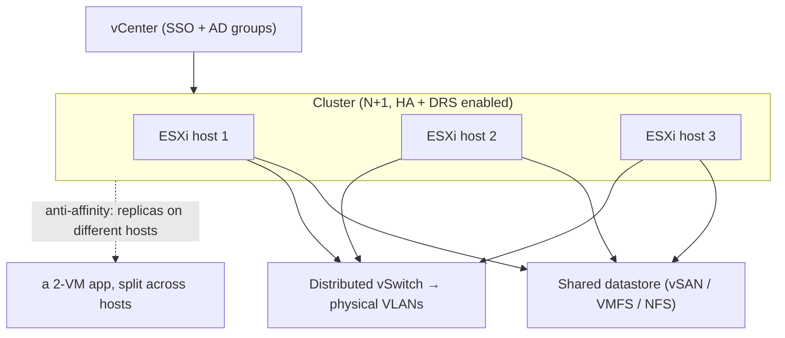

# vSphere — Understanding the Architecture

> The [README](README.md) mapped vSphere onto the seven surfaces — *what the pieces
> are.* This note is the layer up: *how vSphere is structured*, so you design a
> cluster that survives failure and schedules itself. And unlike the cloud modules,
> this is written from having run it: the structure below is production ground, not a
> ramp.

vSphere is a small set of organizing objects with everything hung off them. Four
carry the weight — and the first is where every good design starts.

## 1. The vCenter → cluster → host → VM hierarchy

vSphere's whole structure is a nesting doll, and the **cluster** is the unit that
matters:

- **ESXi** is the hypervisor on each physical host; **vCenter** is the brain that
  turns many hosts into one managed system. Lose vCenter and the VMs keep running —
  but you lose vMotion, DRS, and central management until it's back, so vCenter's own
  availability matters.
- **The cluster is the failure-domain unit** ([`the-stack/01`](../../the-stack/01-physical.md)):
  size it with **N+1** headroom so one host can die and its VMs restart on the
  survivors. A cluster with no spare capacity is a cluster that can't tolerate a
  failure — the exact anti-pattern the failure-domain model exists to prevent.
- **Anti-affinity rules** keep replicas on different hosts; two database replicas on
  the same ESXi host is a single point of failure hiding in plain sight.

## 2. Datastores — the shared storage substrate

Compute pools only work if every host can see the same disks, and **datastores** are
that shared pool ([`the-stack/04`](../../the-stack/04-storage.md)):

- **VMFS** (block, on SAN/iSCSI), **NFS** (file), or **vSAN** (local disks across
  hosts pooled into a distributed datastore — hyperconverged, no separate SAN).
- A VM's disk is a **VMDK** file on a datastore; because the datastore is shared,
  vMotion can move a running VM between hosts without moving its disk.
- **The failure mode to design against: a full datastore is a mass outage** — every
  VM on it stops at once. Free space is a first-class alarm, not a monthly check.

## 3. HA, DRS, vMotion — the availability primitives (know what each does *not* do)

The three capabilities that make vSphere more than "VMs on servers" — and the
distinctions that separate an admin who *configured* them from one who *understands*
them:

- **vMotion** — move a *running* VM between hosts with no downtime. Prereqs: shared
  storage, compatible CPUs, and a vMotion network. It's how you evacuate a host for
  maintenance without an outage.
- **DRS** (Distributed Resource Scheduler) — *balances* load by vMotioning VMs across
  hosts automatically. It does **not** scale you out of a capacity problem; it
  redistributes what you have. Undersized clusters don't get saved by DRS.
- **HA** (High Availability) — *restarts* VMs from a failed host on the surviving
  hosts. It does **not** prevent downtime — the VMs *do* go down and come back up
  (a reboot's worth of outage); HA bounds the blast radius, it doesn't eliminate it.
  For zero-downtime you need Fault Tolerance (a lockstep shadow VM) or app-level HA.

Getting these three straight is the interview differentiator and the 3 a.m.
differentiator: "HA restarted my VMs" is success; expecting HA to mean "no downtime"
is the misunderstanding that turns a handled failure into a surprise.

## 4. The permission model — vCenter SSO, roles on objects

Identity in vSphere is [least privilege](../../cross-cutting/identity-iam.md) applied
to an inventory tree:

- **vCenter Single Sign-On** integrates with Active Directory / LDAP; you grant
  **roles** (a set of privileges) to **AD groups** on **inventory objects** (a
  folder, a cluster, a resource pool).
- The discipline is the repo's everywhere-rule: grant via **groups**, not per-user;
  scope to the narrowest object that works; and never hand out the Administrator role
  as a shortcut. **Lockdown mode** on ESXi hosts and hardened SSO are the
  [security](../../the-stack/07-security.md) baseline.

## The shared-responsibility line — it's all yours

Unlike a cloud ([`the-stack/07`](../../the-stack/07-security.md)), there is no
provider here. You own the physical hosts, the storage, the network, the hypervisor,
*and* the VMs — the hardware failure is your pager, and the security of the room is
your job. vSphere changes how you *schedule* the hardware; it never changes who
*replaces the DIMM*. That's the [self-host](../self-host/) truth, one abstraction up.

## A reference architecture — how the surfaces compose

Every surface is present: **identity** (SSO + AD groups), **compute** (the cluster,
DRS-balanced), **networking** (DVS onto VLANs), **storage** (shared datastore),
**availability** (HA + anti-affinity) — the [skill map](skills-map.md) doing one job.

## Honest boundaries

✋ **hands-on depth — one of the deepest in the repo, and this whole note is written
from it.** Operated as the **AMS-region vCenter administrator** (maintained and
upgraded VM infrastructure and services), **VCP6-DCV** (Data Center Virtualization)
and **VCP6-NV** (Network Virtualization) certified, with adjacent hands-on **KVM** and
**Proxmox VE** (incl. physical-GPU passthrough). The cluster design, the HA/DRS/vMotion
distinctions, the datastore-full outage, the permission model — lived, not read. This
is not a ramp; it's the production-virtualization ground the repo's
[failure-domain](../../the-stack/01-physical.md) and hypervisor material stands on.
The only 🧗 worth flagging: the **newest vSphere 8 / NSX features** and the
**post-Broadcom licensing landscape** — fast-moving details verified against current
docs, not bluffed.
