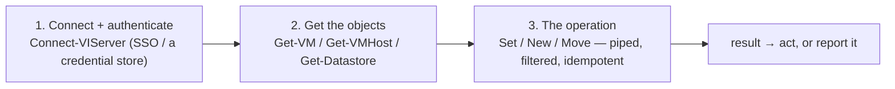
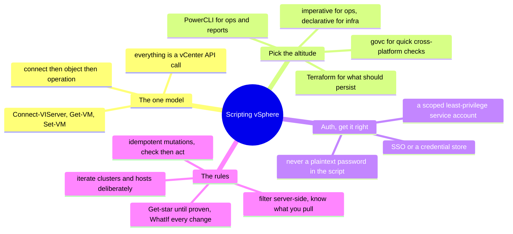

# vSphere — Scripting the API (PowerCLI & the vSphere API)

> [`architecture`](architecture.md) is how vSphere is structured; [`operations`](operations.md)
> is what running it looks like. This note is the *how*: **driving vSphere from code**
> — because at fleet scale you don't click through 200 VMs, you script them. This is
> [operating-model](../../00-the-operating-model.md) move #3 on the platform where the
> author's automation surface is real: PowerCLI.

Everything vCenter does is an API call, and **PowerCLI** — VMware's PowerShell module
— is the everyday way to drive it. The GUI is for one-offs and looking; PowerCLI is
for operating a fleet, and it's where a [scripting](../../foundations/) background
turns directly into vSphere operations. The same three moves as any platform, in
PowerShell.

## The one model: `connect → object → operation`

Get those three right — an **authenticated session**, the **objects you filtered
to**, and a **safe operation** — and you can automate anything vCenter exposes. Every
PowerCLI script is this shape.

## The tooling ladder — pick the altitude

| Tool | What it is | Reach for it when |
| --- | --- | --- |
| **PowerCLI** | the vSphere API as PowerShell cmdlets | one-offs, reports, fleet operations, maintenance scripts |
| **govc** (Go CLI) | a lightweight cross-platform CLI | quick checks from a non-Windows shell, glue in Bash |
| **pyVmomi / the SDK** | the API as a library | building tooling and integrations |
| **Terraform (vsphere provider)** | *declarative* desired state | VMs/networks that should be reproducible ([`iac`](../../cross-cutting/iac-and-config.md)) |

The dividing line, same as everywhere: **PowerCLI and govc are imperative** ("do this
now" — the operations lane); **Terraform is declarative** ("this should exist" — the
provisioning lane). Reports, remediation, and maintenance are PowerCLI; the standing
VM fleet is Terraform.

## Authentication — no plaintext password in a script

- **Interactive / SSO** — `Connect-VIServer -Server vcenter.lab` prompts, or uses your
  SSO session; fine for a human at a console.
- **Unattended** — a **PowerCLI credential store** (`New-VICredentialStoreItem`) or a
  secret manager, never `-Password 'hunter2'` hardcoded in the `.ps1`. A credential in
  a script that can reconfigure the whole estate is the [leaked-key](operations.md)
  incident, vSphere edition ([`identity`](../../cross-cutting/identity-iam.md)).
- **A scoped service account** — the automation account gets a least-privilege role on
  the objects it touches, not Administrator.

## The rules that separate a working script from a footgun

The [foundations](../../foundations/) idempotence-and-safety discipline, in PowerCLI:

- **Filter server-side, then act.** `Get-VM | Where-Object {...}` pulls every VM then
  filters locally on a big estate; prefer server-side filters where the cmdlet
  supports them. Know how much you're pulling.
- **Iterate the inventory deliberately** — across clusters, hosts, and datastores; a
  script that reports "everything" from one cluster silently sees a slice.
- **Be idempotent for mutations.** A remediation script must be safe to re-run:
  check-then-act ("is this VM already off?"), not blind-act — the same rule
  [Terraform](../../cross-cutting/iac-and-config.md) enforces structurally.
- **Read-only (`Get-*`) until proven.** Develop and test against `Get-*` cmdlets;
  add `Set-*`/`New-*`/`Remove-*` only once the logic is proven, and use `-WhatIf`
  (PowerShell's dry run) on anything destructive before the real run.
- **`-Confirm:$false` is a loaded gun** — it suppresses the "are you sure?" prompt;
  only use it once you've `-WhatIf`'d and trust the target set.

## Two shapes of automation script

- **The read/report script** — inventory, a snapshot-age report, an orphaned-VMDK
  finder, a capacity report. Read-only, safe, run often — the
  [inventory lab](labs/) is exactly this on vSphere.
- **The remediation / maintenance script** — *acts*: consolidate old snapshots, put a
  host in maintenance mode and evacuate it, roll a config across the fleet. Mutating,
  so it carries the full discipline — scoped account, `-WhatIf` first, idempotent,
  logged.

## How AI assists writing the automation

- **Great for the PowerCLI skeleton** — *"a PowerCLI script that reports every VM
  without VMware Tools running, by cluster"* — the shape in seconds, usually
  structurally right, and you (knowing vSphere) catch the wrong cmdlet.
- **Where AI burns you (verify hardest):** it **invents cmdlet names and parameters**
  (the module is large and it guesses); it **mis-remembers version-specific object
  properties**; and it will **hand you a destructive `Remove-*` with `-Confirm:$false`
  and no `-WhatIf`**. Run it read-only, `-WhatIf` every mutation, and read it as if
  it's about to run against production — because it is.

## Honest boundaries

✋ **hands-on depth.** PowerCLI as the real automation surface for a production
vCenter estate — reports, fleet operations, and maintenance scripting — on top of the
✋ [foundations](../../foundations/) scripting discipline (idempotence, read-only-first,
scoped credentials). This isn't a ramp; it's the platform where the automation instinct
was applied for real. The 🧗 edge: the **Terraform vsphere provider** and **pyVmomi**
tooling at scale, and newest-version cmdlet changes — mapped and verified, not claimed
as production tooling-engineering.

## The doc on one screen

