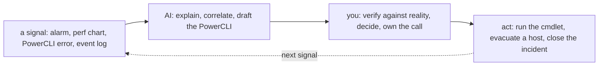

# vSphere — Operating It (the day-2 reality)

> The [README](README.md) is *what vSphere is*; [architecture](architecture.md) is
> *how it's structured*; this note is **what running it actually looks like** — the
> operations brief, what pages you, the real ops work by cadence, and AI in the
> operating loop. Written from having carried the pager for a production vCenter
> estate, not from a manual.

## The brief — what "operating vSphere" means

You operate by keeping a pool of hardware healthy, balanced, and recoverable while
the VMs on it stay up. The three day-2 questions:

- **Is it healthy?** — hosts connected, datastores with headroom, no resource
  contention, and would you know before a user notices?
- **Is it safe?** — least-privilege permissions, hosts hardened, VMs encrypted where
  they must be?
- **Is it efficient?** — right-sized VMs, DRS balancing, capacity ahead of demand?

## Ops notes — what pages you on vSphere

- **The full datastore** — every VM on it stops at once; the single most preventable
  vSphere outage ([`the-stack/04`](../../the-stack/04-storage.md)). Monitor free space
  as a first-class alarm, and watch snapshot growth — a forgotten snapshot silently
  fills a datastore.
- **The HA event** — a host died and HA restarted its VMs elsewhere (a reboot's worth
  of outage). That's HA *working* ([architecture](architecture.md)) — the incident is
  the dead host, and the response is replacing it before the cluster loses its N+1.
- **vMotion / maintenance-mode failures** — a host won't evacuate because a VM has a
  host-local device, incompatible CPU, or no shared storage for its disk. Maintenance
  windows depend on evacuation working; know the prereqs before the window.
- **Resource contention** — the "everything is slow" incident, read in the right
  metrics: **CPU ready** (VMs waiting for physical CPU = overcommit), **memory
  ballooning / swapping** (host memory pressure), **datastore latency** (storage
  contention). "Slow" is not a diagnosis; the counter is.
- **A dead host** — hardware failure is your pager here, not a provider's; spares and
  a rebuild path are the [self-host](../self-host/) discipline, one layer up.
- **The forgotten snapshot** — snapshots are not backups and they grow; a VM left on
  a snapshot for weeks is a performance and datastore-space incident waiting.

## The ops work, broken down

The recurring work of a vSphere admin, by **cadence** — because "what does this job
involve" is answered by what you do and how often:

| Cadence | Task | Surface | Why it matters |
| --- | --- | --- | --- |
| **Continuous (automated)** | vCenter alarms on host health, datastore usage, HA events | observability | The cluster tells you before a user does. |
| **Continuous (automated)** | DRS balances load; HA stands ready to restart | compute | Failure is handled, not attended. |
| **Daily** | Triage alarms; check cluster health, datastore headroom, snapshot growth | observability, storage | The full-datastore outage is caught here or not at all. |
| **Daily** | Answer "why is this VM slow" — CPU ready / ballooning / datastore latency | compute | The bread-and-butter contention incident. |
| **Weekly** | Review permissions (stale grants, over-broad roles); snapshot hygiene | identity, storage | Least privilege and datastore space both decay quietly. |
| **Monthly** | Right-size VMs from performance data; reclaim over-provisioned CPU/RAM | compute | Most VMs are oversized because nobody looked after build day. |
| **Monthly** | Patch ESXi hosts via Lifecycle Manager — rolling, maintenance-mode + evacuate | security | Closes host CVEs with no VM downtime, *if* evacuation works. |
| **Quarterly** | Test a VM restore from backup; verify RPO/RTO | storage | An untested backup is a hope ([`the-stack/04`](../../the-stack/04-storage.md)). |
| **Quarterly** | vCenter upgrade planning; capacity review (N+1 still holds?) | lifecycle, capacity | The cluster grew; prove it can still lose a host. |
| **On-incident** | Detect → mitigate (vMotion off / restart) → resolve → review | all | The [incident discipline](../../cross-cutting/incident-response.md), on hardware you own. |

Two truths this makes visible: **most routine work is automated (DRS/HA/alarms) — the
human job is triage, capacity, and judgment**; and **the review cadence (permissions,
snapshots, right-sizing, restore tests) is the part teams skip and regret** — it's
where drift, wasted capacity, and un-restorable backups hide.

## How AI assists the operating work

Distinct from the [learning ramp](ai-ramp.md) — this is AI in the *daily loop*, on a
platform you already know, so **AI drafts, your expertise verifies**:

- **PowerCLI drafting** — *"a PowerCLI one-liner to list every VM with a snapshot
  older than 7 days"* — AI writes it in seconds and, because you know vSphere, you
  catch the wrong cmdlet immediately.
- **Alarm / log triage** — summarize a noisy event stream, cluster similar alarms,
  surface the anomaly; a fast first pass you then confirm.
- **Where AI must not be trusted:** it **invents PowerCLI cmdlets and parameters**;
  it **mis-remembers version-specific behavior and licensing**; and it will confidently
  explain a contention symptom wrong. The guardrail is the repo's rule — **AI touches
  signals and drafts; you touch production** — and here "you" is someone who has run
  this before.

## Honest boundaries

✋ **hands-on depth.** The triage instincts, the contention-metric literacy (CPU
ready, ballooning, datastore latency), the maintenance-mode-and-evacuate rhythm, the
snapshot discipline, and the restore-test habit are production experience — AMS-region
vCenter administration, VCP6-DCV/NV. This is the operating discipline the rest of the
repo carries onto other platforms. The only 🧗: the **newest vSphere 8 tooling**
(Lifecycle Manager images, vROps/Aria specifics) and **post-Broadcom licensing** —
verified against current docs, not claimed as current-version production.
