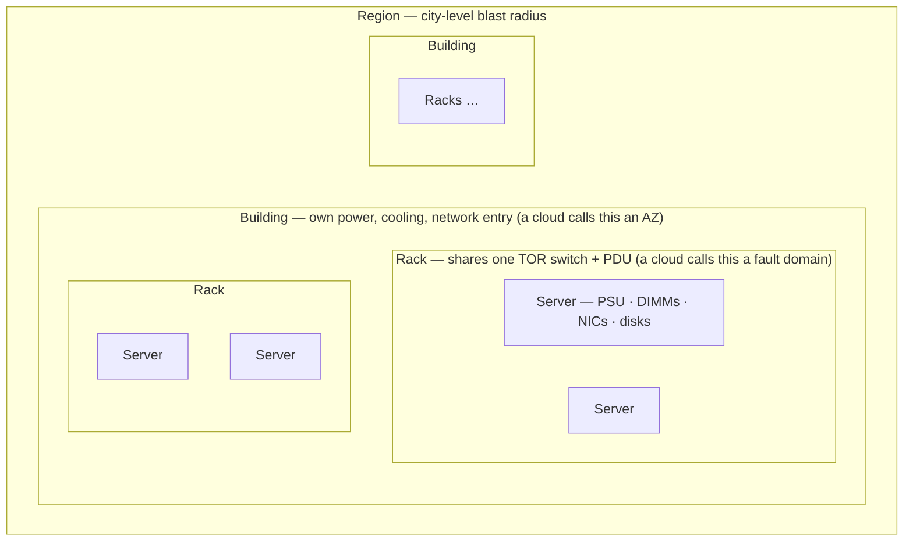
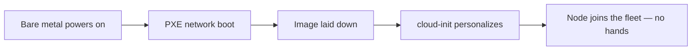
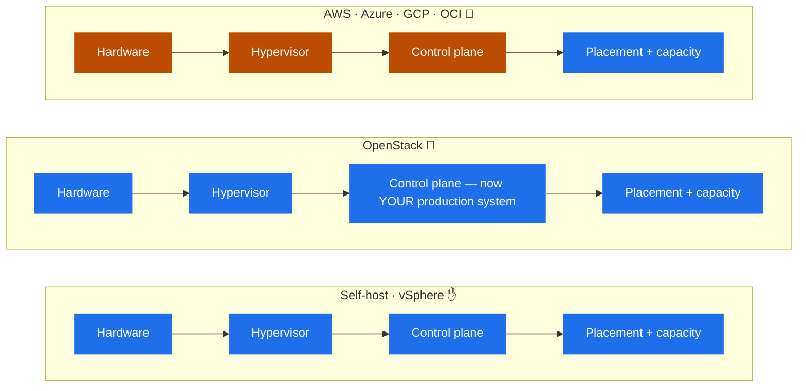
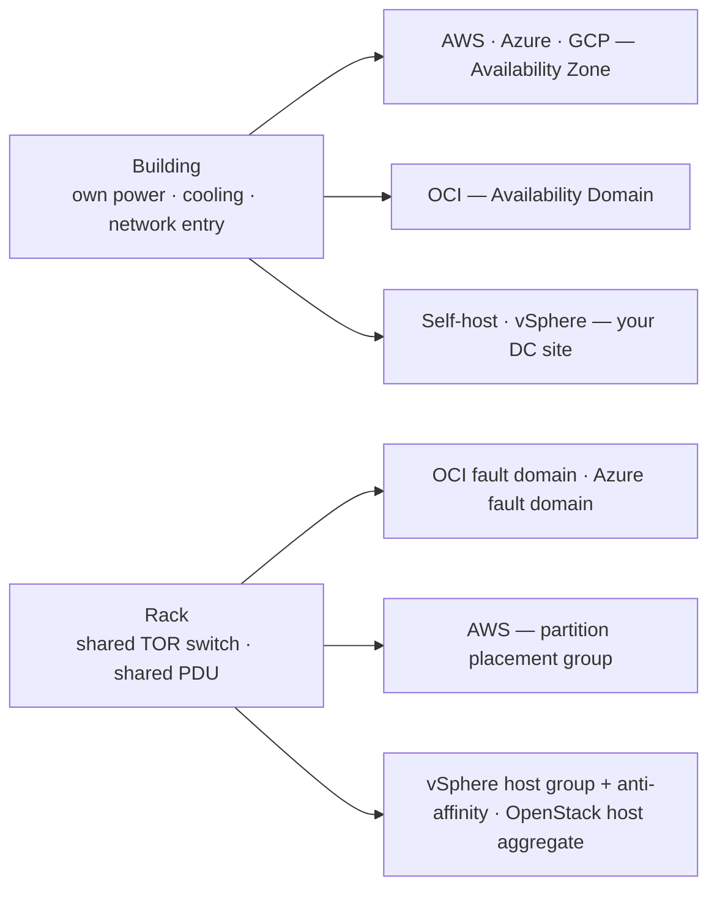
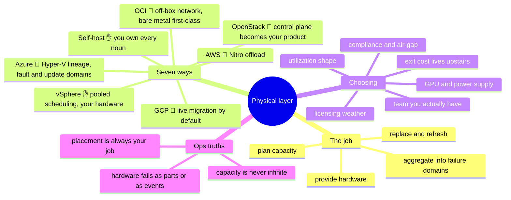

# 01 — The Physical Layer

> Every cloud is somebody's data center. The only question is whose pager goes off
> when a disk dies — and whether you can see it happen. Start here and the rest of
> the stack stops being magic.

Nobody teaches the physical layer anymore, because for four of our seven platforms
you can't touch it. That's exactly why it's worth one chapter: the physical layer is
where the **shared-responsibility line is drawn**, where **failure domains are
born**, and where every "weird" cloud behavior — instance retirement, capacity
errors, maintenance events, live migration — leaks from. If you've never owned this
layer, those are trivia to memorize. If you have, they're obvious.

## What this layer does (everywhere, always)

Strip the branding and the physical layer has one job description:

- **Provide** compute, storage, and network hardware — servers, disks, NICs,
  switches — with power and cooling to run them.
- **Aggregate** that hardware into **failure domains**: a disk fails alone, a server
  fails alone, a rack fails with its top-of-rack switch and PDU, a room fails with
  its cooling, a building fails with its utility feed.
- **Replace** what breaks, **refresh** what ages, and **plan capacity** ahead of
  demand — because hardware has lead times, and demand doesn't wait for them.
- **Expose** all of the above upward through a virtualization layer, so the layers
  above can pretend hardware is fungible. It isn't; this layer is where that
  pretense is maintained.

Failure domains are the concept the whole chapter (and half of cloud architecture)
hangs on, so here is the containment picture once, explicitly:

Everything inside one box shares that box's fate. Placing two replicas means
choosing which box they must *not* share — that's all "high availability" is, at
this layer.

Who does each of those jobs — you or the provider — is the whole difference between
the seven platforms.

## Seven ways to build it

**Self-hosted bare metal ✋** — you own every noun in the job description above.
Racks, top-of-rack switches, BMC/IPMI out-of-band management, PXE boot
infrastructure, firmware, spares inventory, power budgets. Provisioning at fleet
scale means an image-and-boot pipeline, not a person with a USB stick:

Total control, total responsibility, procurement lead times measured in
weeks-to-months. (Hold onto that pipeline diagram — it comes back as Packer and
golden images in chapter 03, and it's the same pipeline.)

**VMware vSphere ✋** — the enterprise standard for pretending your hardware is a
pool. ESXi is the hypervisor on each host; vCenter is the control plane; vMotion
moves running VMs between hosts; DRS balances load; HA restarts VMs from a dead
host. The hardware is still yours — vSphere changes *how you schedule* it, not *who
replaces the DIMM*. Clusters become your failure-domain unit, host anti-affinity
your placement tool.

**OpenStack 🧗** — you build an actual cloud on your hardware: Nova (compute),
Neutron (networking), Cinder (block), Glance (images), Keystone (identity), usually
over KVM, with Ironic if you want to serve bare metal like a cloud does. The
critical mental shift: **the control plane is now a production system you operate.**
Your cloud's API going down is an outage *you* own, on top of every hardware duty
from self-hosting. That staffing reality — you need a platform team, not an admin —
is the single most under-priced line in every OpenStack pitch.

**AWS 🧗** — the physical layer disappears behind **Regions** and **Availability
Zones** (each AZ = one or more discrete data centers with independent power,
cooling, and networking). Under the VMs sits the **Nitro system**: network,
storage, and security offloaded onto custom cards, leaving a minimal hypervisor —
plus Graviton (ARM) CPUs up the stack. You never see a server; you see instance
families, placement groups, and the occasional "instance scheduled for retirement"
email — which is a hardware failure you're reading about from the outside.

**Azure 🧗** — Hyper-V-lineage hypervisor with its own offload hardware (Azure
Boost); regions with (in most, not all, regions) Availability Zones, plus a
concept the others lack: **availability sets** with *fault domains* and *update
domains* inside a single DC — a visible fossil of "racks and maintenance windows"
that maps one-to-one onto what a self-hoster already knows.

**Google Cloud 🧗** — KVM-based hypervisor on top of Google's internal fabric
(Jupiter network, Borg scheduling heritage, Titan security silicon). Its signature
physical-layer behavior: **live migration by default** — instead of mailing you a
retirement notice, GCP moves your running VM off failing or maintenance-due
hardware. You mostly find out afterwards, in the logs.

**Oracle Cloud (OCI) 🧗** — the youngest design of the four, and it shows in two
ways: **off-box network virtualization** (network I/O handled outside the host, so
the hypervisor tax is low) and **bare-metal instances as a first-class product** —
the closest a public cloud gets to handing you the actual server. Regions contain
**Availability Domains** (some regions only one), each subdivided into three
**Fault Domains** — anti-affinity you're expected to use deliberately.

## Where the responsibility line sits

The three families, reduced to who runs what. Blue is yours to run; orange is the
provider's problem — and note the one thing that stays blue everywhere:

**Placement and capacity never stop being your job.** The cloud swaps the DIMMs;
nobody but you decides where your replicas live or notices you're about to outgrow
your quota.

## The comparison table

| Dimension | Self-host ✋ | vSphere ✋ | OpenStack 🧗 | AWS 🧗 | Azure 🧗 | GCP 🧗 | OCI 🧗 |
| --- | --- | --- | --- | --- | --- | --- | --- |
| **Hardware owner** | you | you | you | provider | provider | provider | provider |
| **Hypervisor** | KVM/Proxmox (typ.) | ESXi | KVM (typ.) | Nitro (KVM-derived, offloaded) | Hyper-V lineage + Boost | KVM-based | KVM-based + off-box net |
| **Failure-domain unit you place against** | rack / PDU / TOR (you design it) | cluster + host rules | host aggregate / AZ (you design it) | AZ; placement groups | AZ; availability set (fault/update domains) | zone; spread placement | AD + fault domains |
| **Hardware failure looks like** | BMC alert; you swap parts | HA restarts VM; you swap parts | HA-ish (you built it); you swap parts | retirement notice / degraded event | maintenance event / redeploy | (mostly) transparent live migration | maintenance / reboot migration |
| **Capacity model** | procurement (weeks–months) | procurement + cluster headroom | procurement + overcommit policy | quotas + AZ capacity | quotas + regional capacity | quotas + zone capacity | quotas + AD capacity |
| **Your visibility down the stack** | total (to the screw) | host-level | host-level | instance metadata + events | instance metadata + events | metadata + migration logs | metadata + events; bare metal = host |
| **Cost shape** | CapEx + power/space/people | CapEx + licensing | CapEx + platform team | OpEx, pay-as-you-go / commit | OpEx, PAYG / reservations | OpEx, PAYG / CUDs | OpEx, PAYG / flexible commit |

The renaming exercise that makes it transferable: **a rack is a fault domain is an
availability set is a placement constraint.** Once you see "AZ" and think "building
with its own power and cooling," and see "fault domain" and think "don't put both
replicas in the same rack" — you already know how to place workloads on all seven.

## Choosing — the factors that actually decide it

- **Utilization shape.** Steady, predictable, high-utilization loads are where
  owning hardware wins on raw cost over a 3–5 year horizon; bursty, spiky, or
  fast-changing loads are what the clouds' elasticity is *for*. Most real estates
  are a mix — which is why hybrid isn't a compromise, it's the honest answer.
- **Team, not just tech.** Self-host needs hands that can walk a data center.
  OpenStack needs a platform *team* that treats the control plane as a product.
  vSphere needs neither exotic skills nor a big team — which is why it conquered
  the enterprise. The clouds move the need from hardware hands to
  cost-and-architecture judgment. Pick the platform your actual team can operate.
- **Compliance, sovereignty, and air-gap.** Some data can't leave the building, and
  some buildings can't have an internet connection. That decision gets made for
  you.
- **Supply.** The GPU era made this physical again: cloud GPU queues and quota
  fights vs. buying your own and finding the *power* to run it. Capacity planning
  is back, whichever side you pick.
- **Licensing weather.** Platform economics can change under you — vSphere's
  post-acquisition licensing changes sent a wave of shops re-evaluating after years
  of stability. Owning the stack doesn't exempt you from someone else's pricing
  decisions unless it's open source top to bottom.
- **Exit cost.** At this layer it's mild (compute is compute) — the real lock-in
  lives up the stack in data gravity and egress, which is chapter
  [`02-network.md`](README.md#chapters)'s opening argument.

## Ops notes — what pages you, per family

- **Self-host / vSphere:** disk and DIMM failures (constant at fleet scale — plan
  spares as consumables, not incidents), a TOR switch taking out a whole rack
  (that's why it's a fault domain), a dead BMC on the machine you most need to
  reach (out-of-band access is itself a system to maintain), firmware CVEs that
  require rebooting the fleet in waves, and the quiet one that kills you slowly:
  **capacity arriving later than demand.**
- **OpenStack:** all of the above, *plus* control-plane outages — a full message
  queue or a wedged database stops the API while every already-running VM hums
  along untouched. Learn that failure mode before it teaches you.
- **The clouds:** hardware failures reach you as **events to respond to, not parts
  to swap** — retirement notices, maintenance events, degraded-instance warnings.
  The discipline is automation that drains and replaces nodes on notice.
  **Capacity errors are real** (a zone can genuinely run out of your instance
  type); multi-AZ/multi-family fallback is your spares inventory now. And placement
  is still your job: the cloud gives you fault domains, it doesn't stop you from
  putting both database replicas in the same one.

## The admin discipline (what to be able to do)

- Reach a server nobody can SSH to — **BMC/IPMI/iLO/iDRAC** — and explain why
  out-of-band management exists.
- Explain **PXE → image → cloud-init** as one pipeline, and why fleet provisioning
  is an image problem, not an installer problem.
- Draw the **failure domains** of any platform you're handed — self-host rack or
  cloud AZ — and place a two-replica workload correctly across them.
- Say what **Nitro, ESXi, and KVM** each are in one sentence, and what "offload to
  custom silicon" buys.
- Respond to an **instance-retirement / maintenance event** with automation, not a
  calendar reminder.
- Run a **capacity review**: utilization now, growth rate, lead time (procurement
  or quota increase), and when you'll hit the wall.

## The AI-assisted ramp (physical flavor)

The physical layer is old knowledge thinly documented and marketing-heavy — a
perfect place for AI to accelerate you *and* to burn you.

- **Translate from what you own:** *"I've run vSphere clusters and bare-metal Linux
  fleets. Map my failure-domain and capacity-planning instincts onto AWS AZs,
  placement groups, and quotas — and flag what genuinely differs."*
- **Interrogate the hardware story:** *"What does the Nitro system actually offload,
  and what problem was it solving? Compare with OCI's off-box network
  virtualization."* Follow the citations; the engineering blogs are better than the
  marketing pages.
- **Where AI burns you (verify hardest):** it confidently invents **AZ counts,
  region facts, and instance-family hardware specs** (these change monthly — check
  current docs, always); it repeats **marketing claims as engineering facts**; and
  it blurs **fault domain vs. update domain vs. AZ** distinctions across clouds.
  Anything you'd design a topology around gets verified against provider docs dated
  this year.

## Honest boundaries

The ✋ in this chapter is real: years of hands-on fleet work at a previous employer
— racking and cabling, BMC/IPMI, PXE-and-image provisioning pipelines at
tens-of-thousands-of-devices scale, regional vSphere administration, KVM and
Proxmox (including GPU passthrough) in lab and internal environments. The 🧗 is
equally real: the AWS/Azure/GCP/OCI physical layers are studied and AI-ramped from
public engineering material, not badged into — nobody outside those companies
operates that layer, **which is precisely the point of this chapter**: on the
hyperscalers you operate *above* the physical layer, but you operate *better* if
you know what it's doing underneath. OpenStack is labeled 🧗: evaluated and
understood architecturally, not run in production — the control-plane-as-product
warning comes from the platform-operations experience that *is* ✋, applied to
OpenStack's design.

## The chapter on one screen

## Lab (🚧 planned — spec)

**Build the physical layer in miniature.** On one machine with nested
virtualization (Proxmox or VMware Workstation/Fusion):

1. Stand up a 3-node virtual "fleet" with a PXE server; network-boot and image one
   node hands-off (the self-host provisioning pipeline, end to end).
2. Define two "racks" (host groups), place a 2-replica service with anti-affinity,
   then kill a "rack" and watch what survives — failure domains made tangible.
3. On any one cloud: read the **instance metadata service** and list **scheduled
   events** for a VM — the cloud's version of the BMC you just used.
