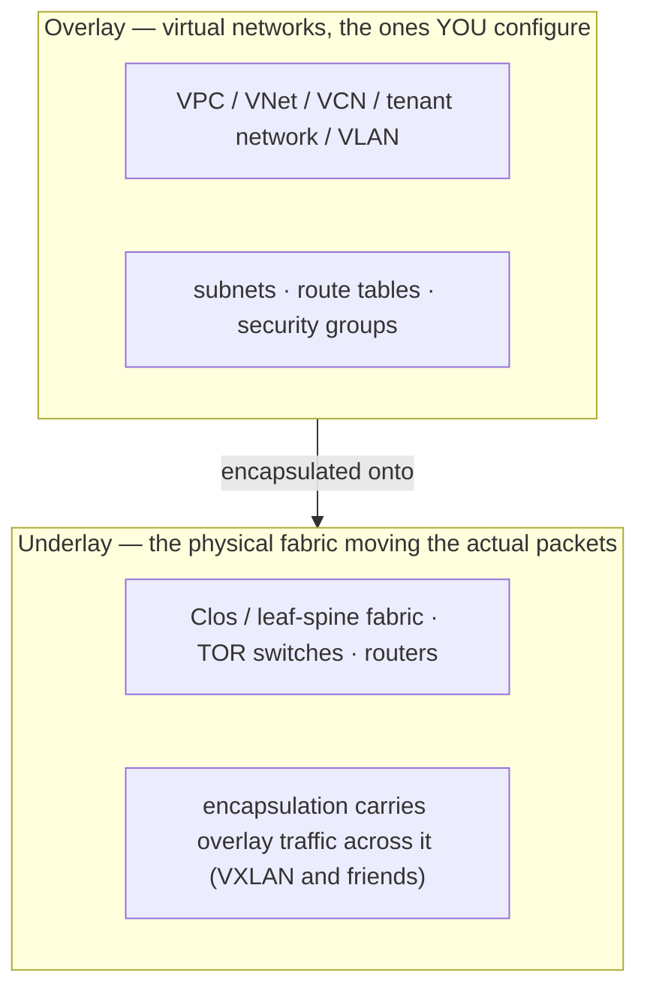
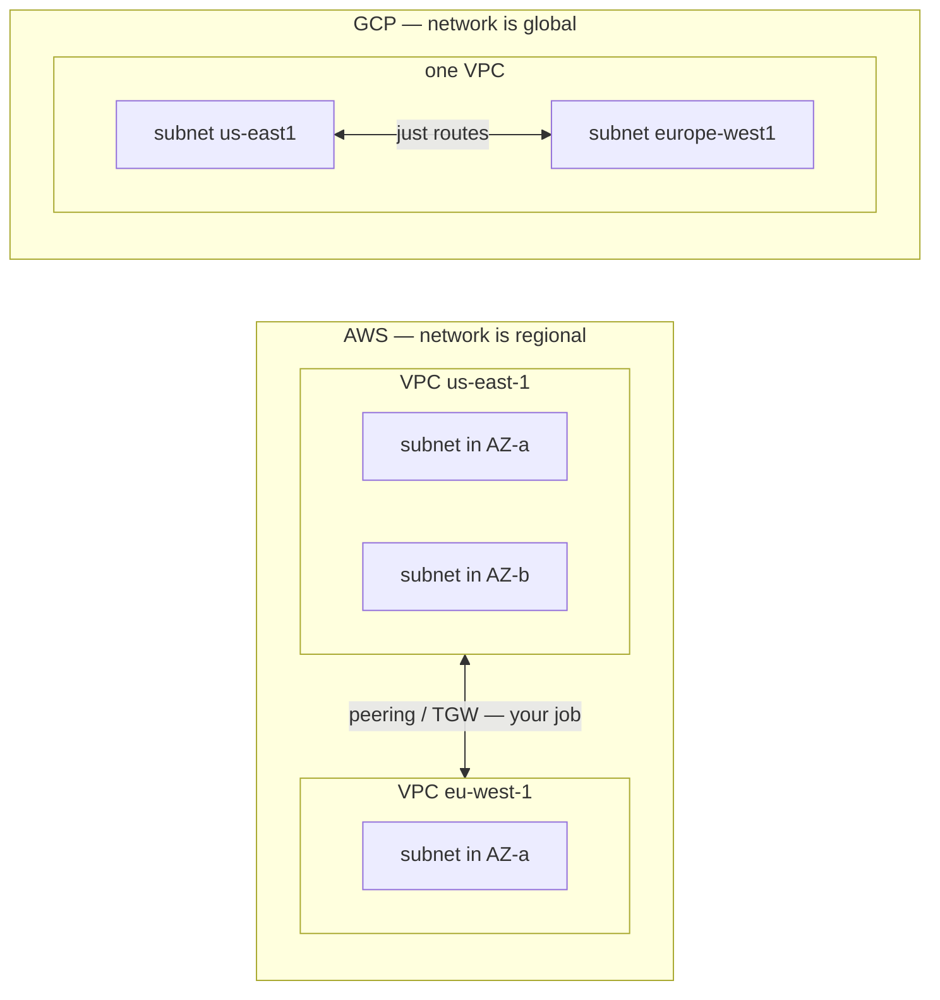
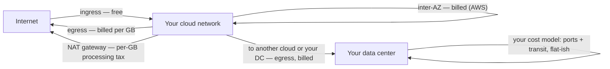
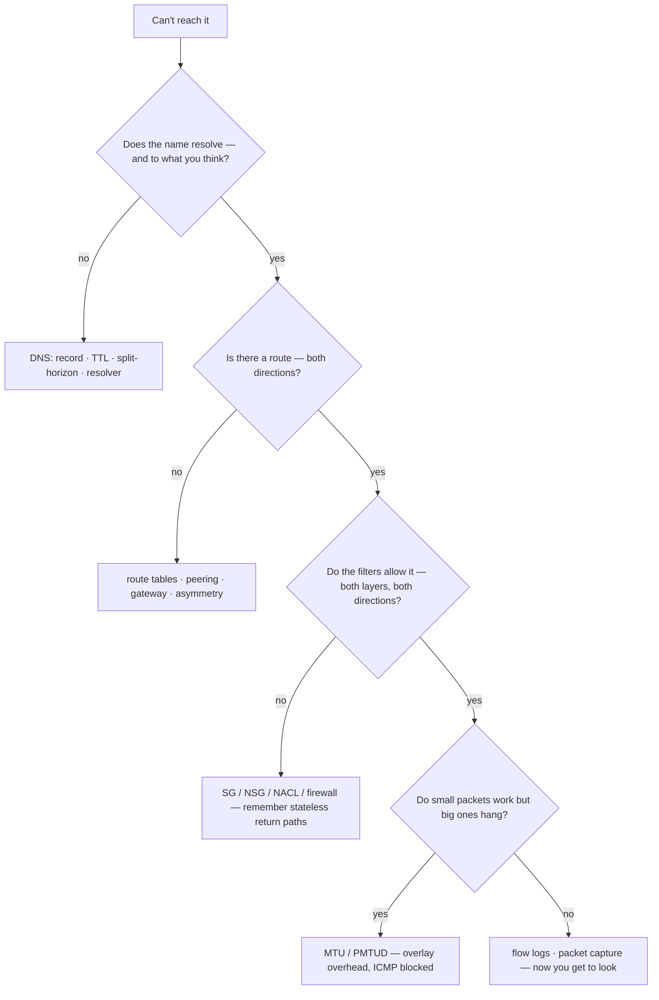
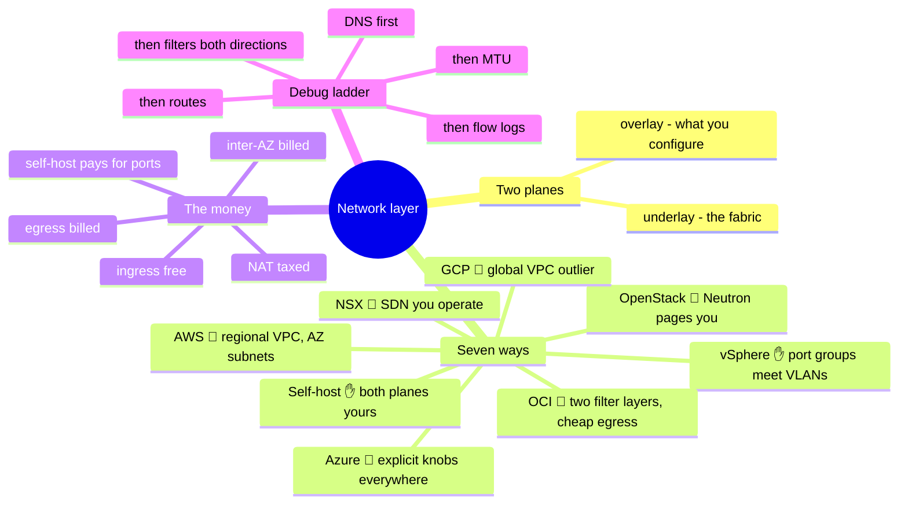

# 02 — The Network Layer

> Chapter 01 ended on a promise: the real lock-in lives up here. The network layer
> is where the seven platforms differ most, where the money quietly leaks, and
> where "it's always DNS" was coined by someone who had already checked DNS twice.

The physical layer gave us buildings full of hardware in failure domains. This
layer's job is to let all of it talk — safely, quickly, and (on the clouds) *as if*
the sharing weren't happening. Networking is also where a self-hosting background
pays off most on the way up the stack: every cloud construct below is a renamed
thing you've already crimped a cable for.

## What this layer does (everywhere, always)

- **Address** — give every workload a place: IP plans, subnets, DNS names.
- **Connect** — move packets between workloads, buildings, sites, and the internet:
  switching, routing, peering, tunnels.
- **Isolate** — keep tenants, tiers, and teams apart: VLANs, VRFs, virtual
  networks, segmentation.
- **Filter** — decide which packets are allowed: firewalls, security groups, ACLs.
- **Distribute** — spread load and survive failures: load balancers, anycast, DNS.
- **Observe** — see what actually happened: flow logs, packet captures, counters.

## One concept before the seven: underlay vs. overlay

Everything on this layer makes sense once you split it into two planes:

- **Self-host:** you build *both* planes. The overlay might just be VLANs on the
  underlay — or EVPN-VXLAN if the shop is modern.
- **The clouds:** the provider owns the underlay entirely; you live in the overlay
  and configure it through an API. That's what "software-defined networking" means
  operationally: **your network is now rows in a provider database**, materialized
  by their fabric.
- **OpenStack / NSX:** you run the SDN machinery yourself — the overlay is yours
  *and* the underlay is yours, which is both the appeal and the bill.

## Seven ways to build it

**Self-hosted ✋** — VLANs for segmentation, a firewall pair at the edge,
DNS/DHCP you run yourself (BIND and friends), HAProxy/keepalived or an appliance
for load balancing, site-to-site VPN or leased lines between locations. The
failure modes are physical (a looped cable can still ruin a floor) and the limits
are honest: what the boxes can do, you can do.

**vSphere ✋** — standard and distributed vSwitches bridge VMs onto the physical
VLANs; the network team's world and the VM team's world meet at a port group.
**NSX 🧗** adds a full overlay (segments, distributed firewall, virtual routers) on
top — vSphere shops adopt it exactly when VLAN sprawl and east-west filtering
outgrow the physical network.

**OpenStack 🧗** — Neutron provides tenant networks (typically VXLAN overlays),
routers, floating IPs, and security groups. Powerful and honest about its plumbing
— which means you *will* meet the plumbing: Neutron is consistently the component
operators name first when asked what pages them.

**AWS 🧗** — the **VPC**: a regional network you carve into **AZ-scoped subnets**.
Route tables per subnet, an Internet Gateway for north-south, NAT Gateways for
private egress, **security groups (stateful, instance-attached)** plus **NACLs
(stateless, subnet-level)**. The mental model is a classic three-tier DC diagram —
deliberately so.

**Azure 🧗** — the **VNet**: regional, with subnets that span zones. **NSGs**
attach at subnet *or* NIC; **User-Defined Routes** override system routing;
Private Endpoints thread SaaS into your address space. Azure networking loves
explicitness — more knobs than AWS at the same layer, which cuts both ways.

**GCP 🧗** — the structural outlier: the **VPC is global**, subnets are
**regional**, and firewall rules live at the VPC level targeting tags or service
accounts. One network can span the planet with no peering between regions —
elegant, and a genuinely different topology to plan for:

**OCI 🧗** — the **VCN**: regional, with (preferably) regional subnets; **security
lists** at the subnet *and* **NSGs** per resource — two overlapping filtering
mechanisms, pick a lane and standardize. Interconnect and egress pricing are
deliberately aggressive; OCI courts exactly the workloads the egress meter hurts.

## The comparison table

| Dimension | Self-host ✋ | vSphere (+NSX) | OpenStack 🧗 | AWS 🧗 | Azure 🧗 | GCP 🧗 | OCI 🧗 |
| --- | --- | --- | --- | --- | --- | --- | --- |
| **Virtual network** | VLANs / EVPN-VXLAN | port groups / NSX segments | Neutron tenant nets | VPC (regional) | VNet (regional) | **VPC (global)** | VCN (regional) |
| **Subnet scope** | per-VLAN, your design | per port group | per tenant net | **per AZ** | spans zones | **regional** | regional (pref.) |
| **Stateful filter** | firewall / iptables | NSX DFW | security groups | security groups | NSGs | firewall rules (VPC-level) | NSGs |
| **Second filter layer** | ACLs on switches | — | — | NACLs (stateless) | ASGs group NSGs | hierarchical policies | security lists (subnet) |
| **North-south** | edge firewall pair | edge / NSX gateway | Neutron router + floating IP | IGW / NAT GW | LB / NAT GW | Cloud NAT / global LB | IGW / NAT GW |
| **Cross-site** | VPN / leased line | same + NSX federation | VPN-as-a-service | Direct Connect | ExpressRoute | Interconnect | FastConnect |
| **LB signature** | HAProxy / keepalived / F5 | NSX LB | Octavia | ALB / NLB | Azure LB / App GW / Front Door | **global anycast LB** | LB / NLB |
| **DNS** | BIND you run ✋ | — (yours) | Designate | Route 53 | Azure DNS / private zones | Cloud DNS | OCI DNS |

## Choosing — and the egress meter

Most layer-2/3 capability differences between the four clouds are marginal. The
selection-grade differences are these:

- **Topology model.** GCP's global VPC vs. everyone else's regional networks
  changes multi-region design fundamentally — what needs peering and transit
  elsewhere is "just routes" there.
- **The egress meter — the actual lock-in.** Traffic *in* is free; traffic *out*
  is billed; on AWS, traffic **between AZs** is billed too, and NAT Gateways add a
  per-GB processing tax on top. Data gravity isn't a metaphor — it's a per-gigabyte
  exit fee on ever leaving:

  Self-host inverts the model: you pay for **ports and transit capacity**, roughly
  flat, however much you move. This single difference decides more hybrid
  architectures than any feature list — and it's OCI's chosen battleground
  (aggressively cheaper egress) and the reason repatriation stories are almost
  always bandwidth-heavy workloads.
- **Compliance topology.** Private connectivity to SaaS (private endpoints),
  forced tunneling through inspection, on-prem interconnect — if your traffic must
  be inspected or must never touch the internet, verify the pattern exists *before*
  choosing.
- **Team, again.** NSX and OpenStack Neutron are SDN systems you operate. Cloud
  VPCs are SDN systems you *consume*. The skills gap between those is real.

## Ops notes — what pages you

- **It's always DNS** — stale records, split-horizon confusion, a TTL somebody set
  to a day, a resolver that answers differently inside and outside the VPC. Check
  DNS *first*, then check it again after you've blamed something else.
- **When it isn't DNS, it's MTU** — overlays steal bytes (VXLAN takes ~50), clouds
  ship non-obvious defaults, and path-MTU discovery dies quietly behind security
  groups that drop ICMP. Symptoms: small requests work, big transfers hang.
- **Stateful vs. stateless bites in one direction** — security groups auto-allow
  return traffic; NACLs and switch ACLs don't. "Request arrives, response
  vanishes" means an ephemeral-port return path someone forgot.
- **Asymmetric routing** — two paths out, one firewall in the middle, conntrack
  drops the half-connection it never saw. Classic in dual-NIC and multi-route-table
  setups on every platform including self-host.
- **Conntrack / connection-table exhaustion** — NAT gateways, LBs, and Linux boxes
  all keep state; all of it has a ceiling; all ceilings are found in production.
- **VPN tunnels flap; BGP sessions don't lie** — monitor the routing session, not
  the ping.

The methodical version — the debug ladder worth internalizing until it's reflex:

## The admin discipline (what to be able to do)

- Stand up a **three-tier network from code** (public LB tier, private app tier,
  isolated data tier) on any platform handed to you.
- Explain **stateful vs. stateless** filtering and show where each platform hides
  the stateless layer.
- Run the **debug ladder** above without skipping rungs, and read a **flow log**
  to prove which rung it was.
- Write an **IP plan** that survives five years: non-overlapping RFC1918 across
  sites and clouds, room to grow, documented before the first subnet exists —
  merging two overlapping 10.0.0.0/16s later is a project with a name.
- Configure **split-horizon DNS** deliberately, not accidentally.
- Read an **egress bill** and say where the gigabytes crossed a billing boundary.

## The AI-assisted ramp (network flavor)

- **Translate from what you own:** *"I know VLANs, BIND, iptables, and enterprise
  firewalls. Map that onto AWS VPC constructs — and be explicit about which layer
  is stateful and which is stateless."*
- **Design review, not design:** have AI draft the three-tier Terraform, then walk
  every rule asking "why is this open?" AI defaults to permissive quick-start
  patterns (0.0.0.0/0 has no business in a security group it wrote for you).
- **Where AI burns you (verify hardest):** it **invents rule syntax and quota
  numbers**; it states **MTU defaults and egress prices from its training years**
  (both change — look up current values, always); it forgets **GCP's global VPC**
  and gives you regional-model advice there; it blurs **security list vs. NSG on
  OCI** and **NSG vs. ASG on Azure**. Anything that filters traffic or costs money
  gets checked against the provider's current docs.

## Honest boundaries

The ✋ here is the classic enterprise stack: years of hands-on DNS/DHCP/BIND,
VLANs, firewalls, VPNs, and TCP/IP debugging across offices and data centers, with
a CCNP-level routing-and-switching foundation and vSphere networking operated for
real. The 🧗 is the modern SDN layer: each cloud's VPC specifics, NSX, and
EVPN-VXLAN fabrics are ramped via exactly the method above — solid conceptual
mapping, verified against current docs, no claimed years of daily BGP peering or
NSX production ops. The debug ladder, though, is platform-independent and
scar-tissue-tested: it was learned on hardware, and it works identically on
overlays someone else runs.

## Lab (🚧 planned — spec)

**Same network, three ways.** One three-tier design (public LB / private app /
isolated data + NAT egress), built three times:

1. **Terraform on AWS**, then **Terraform on GCP** — same topology, and write down
   every place the global-VPC model changed your code.
2. **DevStack (OpenStack)** locally — build the same tenant network with Neutron
   and meet the plumbing the clouds hide.
3. **The drill:** break each one four ways (kill a route, block a return path,
   poison DNS, clamp MTU) and fix it using only the debug ladder — no guessing.

## The chapter on one screen

