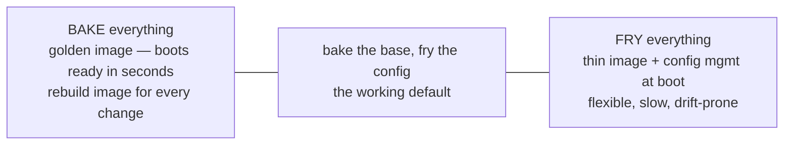
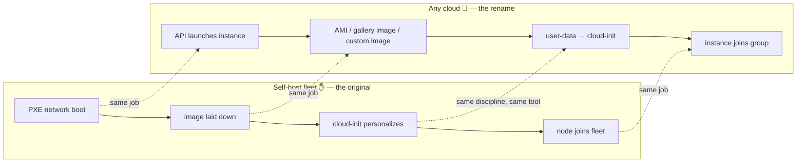
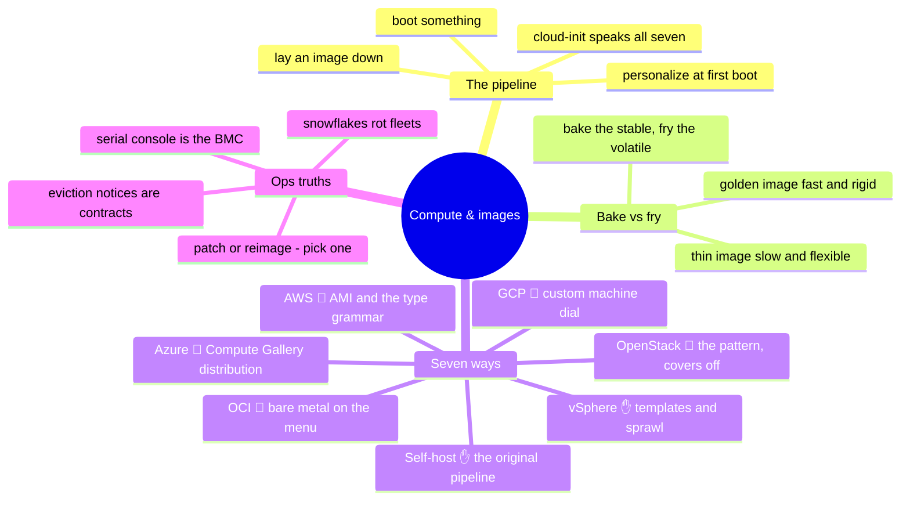

# 03 — Compute & Images

> A VM is just a rented server. The durable asset — the thing worth engineering —
> is the pipeline that turns a blank machine into a working one with no hands on
> it. Own that pipeline and the seven platforms become seven boot targets.

Chapter 01 built the hardware; chapter 02 let it talk. This chapter runs the
workloads — and it's where a fleet-provisioning background stops being "background"
and becomes the whole plot. Every platform's compute story reduces to the same
three-beat pipeline, and it's one this repo's author has run at
hundred-thousand-device scale: **boot something → lay an image down →
personalize it on first boot.**

(Containers and serverless are deliberately deferred to chapter 05 — they're
consumers of this layer, and they deserve their own teardown.)

## What this layer does (everywhere, always)

- **Shape** compute into rentable/allocatable units: bare metal, VMs, with a menu
  (or a dial) of CPU/memory/accelerator combinations.
- **Boot** those units from an **image** — the packaged, versioned answer to
  "what's on the disk when it first wakes up?"
- **Personalize** on first boot: hostname, keys, users, config, agents — the step
  that turns *an* instance into *your* instance.
- **Scale and replace**: groups of identical instances, health-based replacement,
  growth on demand.
- **Patch or reimage** over the lifetime — and which of those two verbs your org
  reaches for first says everything about its maturity.

## One concept before the seven: bake vs. fry

Every provisioning design sits somewhere on one axis — how much is **baked into
the image** vs. **fried at boot time**:

Fleet experience pushes you toward the middle: bake what's slow and stable (OS,
agents, hardening), fry what's per-instance and volatile (identity, endpoints,
secrets). Hold that axis; every platform below is just tooling for a point on it.

## The pipeline, old world and new

The signature diagram of this series — the same pipeline, twice:

**cloud-init is the seven-platform common denominator.** It personalizes first
boot on self-host fleets, it's native to OpenStack (it grew up there), and it's
the standard first-boot mechanism on AWS, Azure, GCP, and OCI Linux images alike.
(Windows plays the same game with different actors: cloudbase-init, unattend.xml,
provisioning agents.) If you already speak cloud-init, you already speak first-boot
on every platform in this series.

## Seven ways to build it

**Self-hosted ✋** — the pipeline above, plus everything the clouds hide: hardware
diversity (the image must boot on every generation you own), driver compatibility,
full-disk encryption enrollment, and the warehouse reality of imaging hundreds of
machines a day. The image *is* the product; the pipeline is its factory.

**vSphere ✋** — templates and clones instead of PXE: golden VM → template →
clone + customization spec (or cloud-init via VMware's support for it). Content
libraries distribute templates across sites. The classic failure mode is **VM
sprawl** — cloning is so cheap that inventory discipline, not provisioning, becomes
the hard problem.

**OpenStack 🧗** — the cloud pattern with the covers off: **Glance** stores
images, **Nova** schedules instances against **flavors** (the size menu),
cloud-init personalizes, **Ironic** does the same dance for bare metal — PXE
included, which makes it the closest cloud analog to a self-host fleet pipeline.

**AWS 🧗** — instance types as an alphabet soup with grammar (letter = family:
general/compute/memory/accelerated; number = generation), **AMIs** as the image
artifact (regional — copying them around is your job), **user data** feeding
cloud-init, **Auto Scaling Groups** replacing sick instances from a launch
template, and **Spot** renting spare capacity at a discount with eviction as a
designed-in event.

**Azure 🧗** — VM sizes in families like AWS's; images distributed through
**Azure Compute Gallery** (versioned, replicated, RBAC'd — the most built-out
image-distribution story of the four); cloud-init on Linux, provisioning agents
on Windows; **VM Scale Sets** for groups; availability sets from chapter 01
resurface at placement time.

**GCP 🧗** — the sizing outlier: predefined machine types *plus* **custom machine
types** — dial the exact vCPU/memory you want instead of picking from a menu.
Instance templates feed **Managed Instance Groups**; images are global (no
regional copying chore); live migration from chapter 01 means maintenance mostly
doesn't touch you.

**OCI 🧗** — **shapes**, including **flexible shapes** (dial OCPUs and memory —
and note: an OCPU is a full physical core, not a hyperthread; the same "vCPU"
word means half as much elsewhere), custom images, cloud-init standard, and the
chapter-01 signature carried up the stack: **bare-metal shapes as a first-class
menu item**, not an exotic.

## The comparison table

| Dimension | Self-host ✋ | vSphere ✋ | OpenStack 🧗 | AWS 🧗 | Azure 🧗 | GCP 🧗 | OCI 🧗 |
| --- | --- | --- | --- | --- | --- | --- | --- |
| **Compute unit** | the server | VM | instance (flavor) | instance (type) | VM (size) | instance (machine type) | instance (shape) |
| **Sizing model** | what you bought | what you allocate | flavor menu (yours) | fixed menu | fixed menu | menu + **custom dial** | menu + **flexible dial** |
| **Image artifact** | your image + PXE | template / content library | Glance image | AMI (regional) | Compute Gallery image | image (global) | custom image |
| **First-boot personalize** | cloud-init | customization spec / cloud-init | cloud-init (native) | user data → cloud-init | cloud-init / agents | cloud-init (via metadata) | cloud-init |
| **Scaling group** | your tooling | DRS cluster (placement, not scaling) | Heat / Senlin | Auto Scaling Group | VM Scale Set | Managed Instance Group | instance pool |
| **Cheap interruptible** | — | — | — | Spot | Spot | Spot (né preemptible) | preemptible |
| **Bare metal** | everything | everything | Ironic | metal instance types | limited | limited | **first-class shapes** |
| **Console of last resort** | BMC / IPMI ✋ | vSphere console | Nova console | EC2 serial console | serial console | serial console | serial console |

That last row is chapter 01 paying off: **the cloud serial console is the BMC you
already know** — same job, same moment of need, no badge required.

## Choosing — the factors that actually decide it

- **Rightsizing is the whole cost game.** The menu-vs-dial difference (GCP/OCI
  dials, AWS/Azure menus) matters less than the discipline of *measuring* and
  matching. Fleet truth: most instances are oversized because nobody looked after
  launch day.
- **Commitment spectrum, not price list:** on-demand → committed/reserved →
  spot/preemptible maps exactly onto how predictable the workload is — which is
  the chapter-01 utilization-shape question, asked again at instance granularity.
- **Pets need vSphere-style tooling; cattle need image pipelines.** An org that
  patches in place, logs into boxes, and fears reboots will fight every
  cattle-shaped platform. The *technical* choice is easy; the *organizational*
  readiness is the real gate.
- **Licensing follows the cores.** Per-core commercial licensing (databases are
  the classic) can make bare metal or dedicated hosts cheaper than shared VMs —
  and it's a major reason OCI leads with bare metal.
- **GPU reality check** (from chapter 01): the sizing menu means nothing if the
  capacity isn't there. Quota, availability, and interruption behavior for
  accelerated instances deserve verification *before* the architecture assumes
  them.

## Ops notes — what pages you

- **Patching is a fork in the road:** in-place (pets — fast, drift-prone,
  snowflakes accumulate) vs. reimage-and-replace (cattle — the golden image is
  always current, but you must actually rebuild and roll it). Choose deliberately;
  drifting into "both, inconsistently" is how fleets rot.
- **Image drift and the snowflake server** — the machine nobody can rebuild
  because its state exists nowhere but on it. The test worth running before it
  runs you: *could you delete any instance right now and recreate it from code?*
- **Boot failures debug from the serial console** — cloud or bare metal, the
  sequence is the same: console output → does the kernel start → does cloud-init
  run → what does `/var/log/cloud-init.log` say. That log file is the same on all
  seven platforms, which makes it the single most transferable debugging habit in
  this chapter.
- **Capacity returns at instance-family granularity** — a zone can be out of
  *your* instance type while full of others. Fallback families and multi-AZ
  spread are the spares shelf, again.
- **Interruption events are contracts:** spot eviction notices, maintenance
  events, retirement emails — each platform gives you a warning channel and a
  deadline. The discipline is automation subscribed to that channel, not a human
  reading email.
- **The agent zoo** — SSM agent, waagent, guest tools, monitoring agents — every
  one is software you now ship in your image and must patch like everything else.

## The admin discipline (what to be able to do)

- Build a **golden image from code** (Packer or equivalent) and boot it on two
  different platforms with the same cloud-init personalization.
- Argue the **bake-vs-fry** split for a given workload and defend where you drew
  the line.
- Debug a failed first boot **from the serial console and cloud-init logs**
  without SSH — because the box that won't boot doesn't have SSH.
- **Rightsize from data**: pull utilization, name the three most oversized
  instances, and say what they should be.
- Handle a **spot eviction / maintenance event** with automation you can
  demonstrate, not a runbook you'd follow by hand.
- Recreate **any instance you own from code** — and prove it by doing it.

## The AI-assisted ramp (compute flavor)

- **Translate the pipeline:** *"I run a PXE + image + cloud-init fleet pipeline.
  Map each stage onto AWS: what replaces PXE, where does my image live, how does
  cloud-init get its data?"* — then the same question for Azure/GCP/OCI, diffing
  the answers.
- **Decode the menus:** *"Explain AWS instance-type naming grammar and give me the
  decision path for a memory-heavy database"* — AI is genuinely good at the
  grammar; verify the specific type it lands on against current docs.
- **Where AI burns you (verify hardest):** it **invents instance types and
  specs** (menus change monthly; anything you'd purchase gets checked); it quotes
  **prices and spot behavior from its training years**; it assumes **cloud-init
  modules behave identically everywhere** (order and datasource quirks differ —
  test on the actual platform); and it will happily hand you a **deprecated image
  ID**. Boot the thing; the boot log doesn't hallucinate.

## Honest boundaries

The ✋ in this chapter is the deepest in the series: designing and running an
image-and-provisioning pipeline at hundred-thousand-device scale — PXE, custom
image builds, cloud-init personalization, full-disk encryption, hardware-diversity
handling — plus years of vSphere template-and-clone operations. That's the
discipline this chapter generalizes. The 🧗 is the per-cloud machinery: ASG/VMSS/MIG
production operations, Packer as a specific tool (the *discipline* it encodes is
✋; the tool itself is a ramp), and each platform's image-distribution specifics —
all mapped with the method above and verified by building, not by reading.

## Lab (🚧 planned — spec)

**One image, two clouds, no hands.**

1. **Packer** builds one Linux golden image (hardening + agents baked, config
   fried) targeting local KVM *and* one public cloud.
2. Boot both with the **same cloud-init user-data**; prove the personalization is
   identical.
3. **The drill:** sabotage the image (bad fstab entry), watch it fail to boot, and
   recover using only the serial console and rescue-mode — the BMC muscle, cloud
   edition.

## The chapter on one screen

