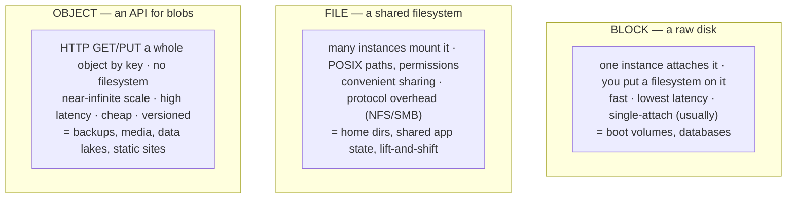
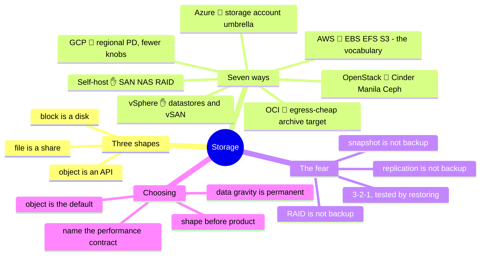

# 04 — Storage

> Compute is disposable; storage is where the fear lives. You can rebuild any
> instance from chapter 03 in minutes — but the data on it is the one thing no
> pipeline recreates. This is the layer where "delete and re-provision" stops
> being a shrug and starts being a résumé-generating event.

Chapter 03 made instances cattle. Storage is why the herd still needs a fence.
Everything here orbits one asymmetry: **state is precious and singular in a world
built for stateless and plural.** Get the three storage shapes and their failure
modes right and the rest — backup, durability, the egress meter's return
appearance — follows.

## What this layer does (everywhere, always)

- **Persist** state past the life of any single instance.
- **Present** that state in one of three shapes — block, file, or object — each a
  different bargain between performance, sharing, and scale.
- **Protect** it: replication for durability, snapshots for point-in-time, backups
  for "the building/account is gone."
- **Perform** to a contract: IOPS, throughput, and latency you can actually name.
- **Prove** it: encryption, access control, and the audit trail that says who
  touched what.

## One concept before the seven: the three shapes

Every storage product on every platform is one of exactly three shapes. Learn the
shapes; the products are renames.



The one-liner to hold: **block is a disk, file is a share, object is an API.**
Reach for the wrong shape and you'll fight the platform forever — object storage
mounted as a filesystem is the classic self-inflicted wound.

## Seven ways to build it

**Self-hosted ✋** — the shapes made of metal: block is **SAN** (Fibre Channel /
iSCSI LUNs) or local disks; file is a **NAS** (NFS/SMB filer); object is
**MinIO/Ceph** if you run it, or you simply don't have real object storage and
feel its absence. RAID for disk-failure survival, controllers and multipath for
availability. You own capacity planning, the rebuild window after a disk dies
(the scariest hours in storage — a second failure during rebuild is the nightmare
RAID levels exist to bound), and the truth that **RAID is not backup**.

**vSphere ✋** — **datastores** abstract the SAN/NAS beneath into a pool VMs draw
from; **VMDKs** are the block volumes; **vSAN** turns local disks across hosts into
a distributed datastore (hyperconverged, no separate SAN). The failure modes are
the physical ones above, one abstraction up — and datastore-full is the outage
that takes every VM on it down together.

**OpenStack 🧗** — the shapes with cloud names: **Cinder** (block), **Manila**
(file), **Swift** or Ceph-via-**RadosGW** (object), usually **Ceph** underneath
doing all three. Powerful, and Ceph is a genuine platform to operate — its health,
rebalancing, and placement-group tuning are their own discipline, another
control-plane-as-product line item.

**AWS 🧗** — the reference vocabulary everyone else is compared against: **EBS**
(block, AZ-locked — a volume lives in one AZ, a fact that shapes your whole HA
design), **EFS** (NFS file), **FSx** (managed file, several flavors), and **S3**
(object — effectively the industry's definition of object storage, with storage
classes from hot to glacial and lifecycle rules to move data down the tiers
automatically).

**Azure 🧗** — one **Storage Account** umbrella spanning **Blob** (object),
**Files** (SMB/NFS), and **Queues/Tables**, plus **Managed Disks** for block. The
storage-account-as-container model and its naming/limits are the Azure-specific
thing to learn; **access tiers** (hot/cool/cold/archive) mirror S3's classes.

**GCP 🧗** — **Persistent Disk** and **Hyperdisk** (block, and notably
**zonal or regional** — regional PD synchronously replicates across two zones, a
cleaner HA primitive than AZ-locked block), **Filestore** (file), and **Cloud
Storage** (object, with one global namespace and storage classes). Fewer, more
orthogonal products than AWS's sprawl.

**OCI 🧗** — **Block Volume**, **File Storage** (NFS), and **Object Storage**
(with an Archive tier), the expected trio — carrying the chapter-02 signature
forward: **egress on retrieval is cheap by design**, which is exactly what makes
OCI attractive as a backup and archive target for data born on another cloud.

## The comparison table

| Shape | Self-host ✋ | vSphere ✋ | OpenStack 🧗 | AWS 🧗 | Azure 🧗 | GCP 🧗 | OCI 🧗 |
| --- | --- | --- | --- | --- | --- | --- | --- |
| **Block** | SAN / iSCSI / local | VMDK on datastore / vSAN | Cinder | EBS (**AZ-locked**) | Managed Disks | PD / Hyperdisk (**zonal or regional**) | Block Volume |
| **File** | NAS (NFS/SMB) | (via guest) | Manila | EFS / FSx | Files | Filestore | File Storage |
| **Object** | MinIO / Ceph or none | — | Swift / RadosGW | **S3** | Blob | Cloud Storage | Object Storage |
| **HA primitive** | RAID + multipath | vSAN / SAN replication | Ceph replicas | multi-AZ (you design) | ZRS / GRS | **regional PD** | replicas + AD spread |
| **Tiering** | manual | manual | manual / pools | S3 classes + lifecycle | access tiers | storage classes | tiers + Archive |
| **Snapshot** | array / LVM | VM snapshot | Cinder snapshot | EBS snapshot → S3 | disk snapshot | PD snapshot | volume backup |
| **The gotcha** | RAID ≠ backup | datastore-full = mass outage | Ceph is a job | snapshot ≠ backup (same account) | storage-account limits | fewer knobs, learn them | egress-cheap = good archive target |

## Choosing — shape first, then platform

- **Pick the shape before the product.** Database → block. Shared POSIX state
  across N machines → file. Backups/media/logs/anything you GET by key → object.
  This decision is platform-independent and gets made *first*; the product is the
  lookup that follows.
- **Object storage is the default for new state** — cheapest, most durable, most
  scalable — *unless* something needs a filesystem or low-latency block. "Could
  this be an object?" is the right opening question, not an afterthought.
- **Performance is a contract you must name.** IOPS vs. throughput vs. latency are
  different axes; a volume tuned for one starves the others. "Fast storage" is not
  a spec — 3,000 IOPS at sub-millisecond latency is.
- **The egress meter returns** (chapter 02): reading data back out, cross-region
  replication, and restoring from a far-away tier all cross billing boundaries.
  Cheap-to-store, expensive-to-read (glacial tiers) is a bet on never needing it
  in a hurry — price the restore, not just the storage.
- **Data gravity decides architecture.** Compute moves to where the data already
  is, because moving the data costs money and time. Where you put state first is
  where your compute ends up living — plan the storage location like it's
  permanent, because economically it is.

## Ops notes — what pages you (and what ends careers)

- **RAID is not backup. Snapshot is not backup. Replication is not backup.** All
  three survive *hardware* failure; none survives `rm -rf`, ransomware, or a
  fat-fingered `DROP TABLE` — those replicate/snapshot the destruction faithfully.
  Backup means an **independent copy, in a separate failure domain / account,
  tested by restoring.** The 3-2-1 rule (three copies, two media, one off-site)
  predates the cloud and still governs it.
- **The backup you never restored is a hope, not a backup.** Untested backups fail
  exactly when needed — wrong scope, missed dependency, unreadable format, expired
  credential. Restore drills are the only proof; schedule them.
- **Snapshot sprawl and silent cost** — snapshots are cheap to make and easy to
  forget; they accrue cost and, worse, false confidence ("we have snapshots" ≠ "we
  can recover").
- **Filling the volume takes everything with it** — a full datastore, a full
  boot disk, a full `/var` from runaway logs. Monitor free space as a first-class
  alert, not a post-mortem finding.
- **Detach/attach and the AZ trap** — AZ-locked block (EBS) can't cross zones; a
  cross-AZ recovery means snapshot-and-restore, not detach-and-move. Know this
  *before* the failover, not during.
- **Encryption key custody is the real control** — losing the key is losing the
  data as surely as losing the disk. Who holds the key, who can rotate it, and
  what happens on rotation are storage questions, not security-team afterthoughts.

## The admin discipline (what to be able to do)

- Choose **block/file/object** for a workload and defend why the other two are
  wrong.
- Design a **backup that satisfies 3-2-1** on any platform, and name the separate
  failure domain the off-site copy lives in.
- **Restore from that backup** — actually do it, timed — and state your RPO
  (how much data you'd lose) and RTO (how long recovery takes).
- Explain why **RAID/snapshot/replication each aren't backup**, with the exact
  failure each does and doesn't cover.
- Size a volume to a **named performance contract** (IOPS + throughput + latency),
  not "fast."
- Read a **storage bill** and separate storage cost from **retrieval/egress**
  cost — the two that surprise people.

## The AI-assisted ramp (storage flavor)

- **Translate the shapes:** *"I run SAN block, NAS file, and I know RAID. Map that
  onto AWS EBS/EFS/S3 — and flag the AZ-locking and the fact that S3 isn't a
  filesystem."*
- **Design the backup, then attack it:** have AI propose a backup architecture,
  then ask *"what failure does this NOT survive?"* until it admits the same-account
  snapshot and the untested-restore gaps.
- **Where AI burns you (verify hardest):** it quotes **durability numbers, IOPS
  ceilings, and per-GB prices from its training years** (all drift — look up
  current); it **conflates snapshot with backup** in its default architectures
  (the single most dangerous storage hallucination — it will confidently hand you
  a "backup" that's just an in-account snapshot); it forgets **AZ/zonal locking**;
  and it under-prices **retrieval/egress** on archival tiers. Anything protecting
  data gets checked, and the restore gets tested — the durability claim you didn't
  verify is the one that fails.

## Honest boundaries

The ✋ here is the on-prem storage stack operated for real: SAN/NAS, iSCSI, RAID,
multipath, vSphere datastores and VMDK lifecycle, plus running relational
databases on top of it (PostgreSQL backing a production inventory system) — so the
block-storage-under-a-database story is lived, not read. The 🧗 is the cloud
object-and-managed-storage layer: S3 storage classes, EBS/EFS/FSx and their peers
across clouds, Ceph operations — mapped by the method above, with the *disciplines*
(3-2-1, restore-testing, shape-selection, performance-contracting) being the ✋ part
that transfers unchanged onto any platform's product names.

## Lab (✅ built — [`labs/04-backup-not-snapshot/`](labs/04-backup-not-snapshot/))

**Prove the backup, break the disk** — and this one actually runs, with zero cloud
and zero dependencies (Python 3.8+ only, so CI can run it too):

```bash
python3 the-stack/labs/04-backup-not-snapshot/backup_drill.py
```

The drill seeds a database, "replicates" it, takes one independent point-in-time
backup, writes **more** data, then `DROP`s the table — and checks three lessons:

1. The **replica is destroyed too** — replication faithfully copies a `DROP`
   (replication ≠ backup).
2. Only the **independent vault backup** recovers the data — independence is the
   property that saves you.
3. **RPO is a number:** the rows written after the backup are gone, counted
   exactly; the restore is timed (your RTO). Exit `0` means every lesson held.

See the [lab README](labs/04-backup-not-snapshot/README.md) for the three-command
manual verification (watch primary *and* replica both answer "no such table" while
the vault answers with a row count).

## The chapter on one screen


