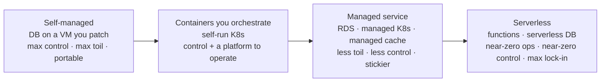
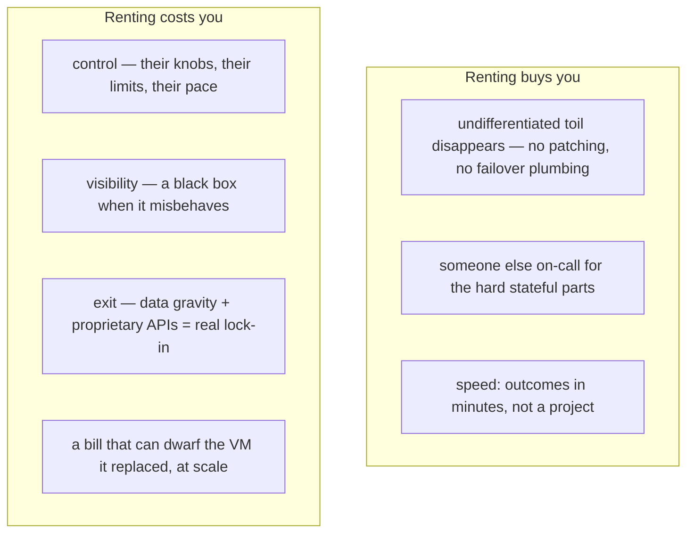
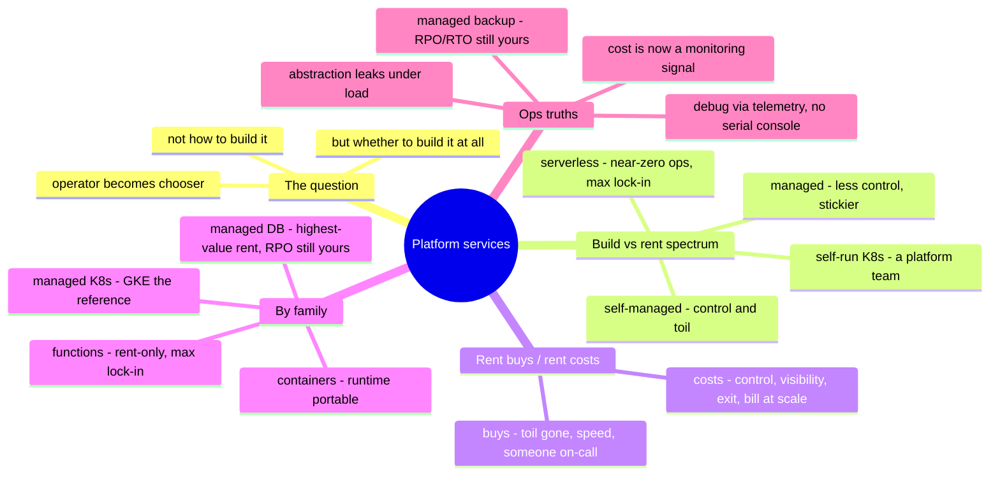

# 05 — Platform Services

> The layers below asked *how do I build it?* This one asks a sharper question:
> *should I build it at all?* Containers, serverless, and managed databases are
> where you stop administering infrastructure and start renting outcomes — and
> where the sysadmin's job quietly changes shape from *operator* to *chooser*.

This is the top of the stack and the honest end of the series. Everything under it
you can run yourself; everything here you increasingly *shouldn't*. The skill being
tested stops being "can you operate it" — AI and the managed service both assume
you can — and becomes "do you know **what you gave up** when you let someone else
operate it, and was the trade worth it?" That judgment is the part no model and no
managed service hands you.

## What this layer does (everywhere, always)

- **Orchestrate** containers: schedule, heal, scale, and connect many small
  workloads (Kubernetes and its managed forms).
- **Abstract the server away** entirely: run code or handle events with no instance
  to patch (serverless / functions / managed runtimes).
- **Rent stateful outcomes**: databases, queues, caches, search — the hard,
  stateful things, operated by someone else.
- **Trade control for leverage**: every service here is the same bargain in a
  different costume — less to run, less to tune, less to see, harder to leave.

## The one question this whole layer is about: build vs. rent

Every service here sits on a spectrum from *you run everything* to *you run
nothing*, and picking a point is the actual job:

Rightward: less toil, less control, deeper lock-in, and a bill that scales
differently. **There is no correct point — only a correct point *for this
workload and this team*.** The senior move is naming the trade out loud instead of
defaulting to whatever's trendy or whatever the last job used.

## The two forces you're trading between

Hold both columns. Most bad platform decisions come from seeing only one — the team
that self-hosts everything drowns in toil; the team that rents everything wakes up
locked in and over-billed. Naming both is the whole discipline.

## Seven ways — teardown by service family

This layer doesn't map to seven platforms as cleanly as the ones below — the
honest cut is **by service family, noting where each platform lands.** (And the
honesty marker earns its keep here: this is the most 🧗 chapter in the series.)

### Containers & orchestration

**Self-host / on-prem ✋🧗** — Docker on a host is ✋ (you've built and shipped
images, chapter 03); running **Kubernetes yourself** is 🧗 and is its own
control-plane-as-product commitment — etcd, the API server, upgrades, and the
networking/storage CNI/CSI plumbing all become yours. The lesson from OpenStack and
Ceph repeats: *self-run orchestration is a platform team, not a deployment target.*

**Managed Kubernetes 🧗** — **EKS / AKS / GKE / OKE**: the provider runs the
control plane, you run the workloads (and, depending, the nodes). **GKE is widely
treated as the reference** — Kubernetes is Google's own heritage. The managed form
removes the etcd-and-upgrades toil but not the need to actually understand
Kubernetes; the abstraction leaks the moment something breaks.

### Serverless & functions

**Functions 🧗** — **Lambda / Azure Functions / Cloud Functions / OCI
Functions**: event-driven code, no server to patch, scale-to-zero, pay-per-invoke.
The trade is starkest here — near-zero ops for near-total lock-in (the event
model, the triggers, and the surrounding services are proprietary) and a debugging
story that's all logs and traces because there's no box to log into. Self-host has
no real equivalent, which is itself the point: **this is a capability you can only
rent.**

### Managed databases

**Managed relational 🧗 (on ✋ foundations)** — **RDS / Aurora / Azure SQL / Cloud
SQL / Autonomous DB**: the engine you know (Postgres, MySQL) with backups,
failover, patching, and replication operated for you. This is often the *highest-
value rent on the whole layer* — databases are the hardest stateful thing to run
well, and the toil removed is real and dangerous toil. The chapter-04 disciplines
still apply: you must still know your RPO/RTO, still test restores, still
understand that *their* backup is only as good as your understanding of it.

**Managed everything-else 🧗** — queues (SQS/Service Bus/Pub-Sub), caches (managed
Redis), search, streaming. Same bargain, narrower scope: rent the stateful hard
part, accept the proprietary edges.

## The comparison table

| Service family | Self-host | AWS | Azure | GCP | OCI | The trade |
| --- | --- | --- | --- | --- | --- | --- |
| **Container runtime** | Docker ✋ | ECR + runtime | ACR + runtime | Artifact Registry | OCIR | portable — the least sticky thing here |
| **Managed Kubernetes** | self-run K8s 🧗 | EKS | AKS | **GKE** (reference) | OKE | control plane rented; workloads portable-ish |
| **Serverless containers** | — | Fargate / App Runner | Container Apps | Cloud Run | Container Instances | no nodes to manage; platform-shaped |
| **Functions** | — (rent-only) | Lambda | Functions | Cloud Functions | Functions | max convenience, max lock-in |
| **Managed relational** | DB on a VM ✋ | RDS / Aurora | Azure SQL | Cloud SQL | Autonomous DB | highest-value rent; RPO/RTO still yours |
| **Managed cache / queue** | Redis / Rabbit ✋ | ElastiCache / SQS | Cache / Service Bus | Memorystore / Pub-Sub | Cache / Streaming | rent the stateful hard part |
| **Lock-in gradient** | lowest | → | → | → | → | rises left-to-right within each row |

The pattern across the table: **the runtime is portable, the orchestration is
semi-portable, and the deeper you go into functions and proprietary managed
services, the higher the exit cost.** That gradient — not any single feature — is
what you're actually choosing.

## Choosing — the senior calculus

- **Rent the undifferentiated, own the differentiating.** If running it well is not
  your competitive edge (it almost never is for a database engine), rent it. Spend
  your scarce operator attention on what actually makes your service yours.
- **Managed databases are usually worth it.** The toil removed is the most
  dangerous toil on the stack (chapter 04's fear), and the engine stays standard
  enough that lock-in is moderate. This is the rent most teams should take.
- **Functions are a capability *and* a commitment.** Brilliant for event glue,
  spiky work, and small automations; a lock-in trap if you build the whole system
  in them. Use them for what they're uniquely good at, eyes open.
- **Self-run Kubernetes needs a platform team, full stop.** If you don't have one,
  managed Kubernetes or serverless containers is not a compromise — it's the
  correct answer. (Same shape as the OpenStack warning in chapter 01: the control
  plane is a product someone must own.)
- **Price at scale, not at demo.** Per-invoke and per-GB pricing that's free at
  demo can dwarf a reserved VM at production volume — and the crossover point is
  exactly where nobody re-checks. Model the bill at real load before committing.
- **Weigh exit cost up front.** Proprietary APIs plus data gravity (chapter 04)
  make some of these effectively permanent. That's fine if chosen deliberately;
  it's a trap if discovered later.

## Ops notes — what pages you (and what changes)

- **The abstraction leaks under load** — managed doesn't mean absent. Connection
  limits, throttling, cold starts, control-plane rate limits, and noisy-neighbor
  effects all surface exactly when you're busiest, and you can't log into the box
  to look.
- **Debugging moves from the box to the telemetry** — no SSH, no serial console
  (the chapter-03 muscle doesn't reach here). It's logs, traces, and the
  provider's metrics or nothing. Observability stops being nice-to-have and becomes
  the *only* way in — which is why it's the next thing this repo builds.
- **Your RPO/RTO is still yours** — a managed database backs up on a schedule *you*
  must understand and a restore *you* must have tested. "It's managed" has ended
  more data stories than it's saved; the chapter-04 discipline does not transfer to
  the vendor.
- **Cost is now an operational signal** — a runaway Lambda loop or a hot partition
  pages you as a *bill*, not a CPU graph. Cost anomaly alerting becomes real
  monitoring at this layer.
- **Version and deprecation are the provider's clock, not yours** — managed
  runtimes and engine versions reach end-of-life on the vendor's schedule; forced
  upgrades arrive as deadlines you don't set.
- **Quotas are the new capacity planning** — concurrency limits, throughput caps,
  and account quotas replace the disk-and-DIMM capacity of chapter 01. Same
  discipline (see the wall before you hit it), new units.

## The admin discipline (what to be able to do)

- Place a given workload on the **build-vs-rent spectrum** and defend the point —
  naming what you gained *and* gave up.
- Run a container on **managed Kubernetes**, and separately articulate what
  self-running K8s would add to your operational load.
- Choose **functions vs. a small always-on service** for a task and justify it on
  ops, cost-at-scale, *and* lock-in — all three.
- Take a **managed database** and still state its RPO/RTO and prove a restore —
  because "managed" didn't move that responsibility.
- Model a service's **cost at production scale**, find the crossover where rent
  beats own (or the reverse), and set a **cost anomaly alert**.
- Name the **exit cost** of any managed service before adopting it.

## The AI-assisted ramp (platform-services flavor)

This is the layer where the repo's whole thesis is most on display: AI makes you
*operationally* competent on any of these services in days — so the value you add
is precisely the judgment AI can't supply.

- **Use AI for the mechanics, keep the judgment:** *"Deploy this to Cloud Run and
  to Lambda"* — AI is excellent at the how. *"Now argue which one, given spiky
  traffic, a small team, and a five-year horizon"* — that's yours to lead, with AI
  as a sparring partner, not the decider.
- **Force the trade into the open:** make AI list, for any managed service it
  recommends, **what you give up** — control, visibility, exit. It defaults to
  recommending the convenient; you make it price the convenience.
- **Where AI burns you (verify hardest):** it **quotes limits, quotas, cold-start
  numbers, and per-invoke/per-GB prices from its training years** (all drift, and
  they're exactly the numbers your architecture leans on — verify every one); it
  **under-weights lock-in** because training text is written by the vendors selling
  it; and it will confidently present a **managed backup as if it discharges your
  RPO/RTO duty** — it doesn't. The higher the abstraction, the harder you verify,
  because you can't see inside to catch the mistake yourself.

## Honest boundaries

This is the most 🧗 chapter in the series, and saying so *is* the point. The ✋
underneath is real and it's the foundation the judgment rests on: Docker and image
building shipped at scale (chapter 03), production relational databases operated on
self-managed infrastructure (chapter 04), and the container/Kubernetes work that's
genuinely **test-environment scope** — labeled that way, not inflated to production
platform ownership. What this chapter claims is not "years running EKS in
production"; it's the **transferable judgment to choose well on this layer** — the
build-vs-rent calculus, the lock-in awareness, the RPO/RTO discipline that survives
the word "managed" — plus the verified-ramp method to get operational on any
specific service fast. On a layer defined by *renting outcomes*, knowing what you're
trading away is the durable skill, and it's the one this whole repo argues for.

## Lab (🚧 planned — spec)

**Same app, two points on the spectrum.**

1. Deploy one small stateless service to **managed Kubernetes** (any provider) and
   to **serverless containers** (Cloud Run / App Runner / Container Apps) — same
   image from chapter 03.
2. Put its state in a **managed database**; state and test its RPO/RTO (chapter 04
   discipline, managed edition).
3. **The drill:** model each deployment's cost at 10× and 100× traffic, find the
   crossover, and write the one-paragraph build-vs-rent recommendation you'd defend
   to an architect — the actual deliverable of this layer.

## The chapter on one screen

