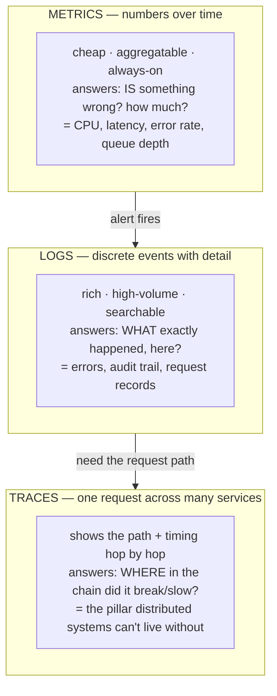
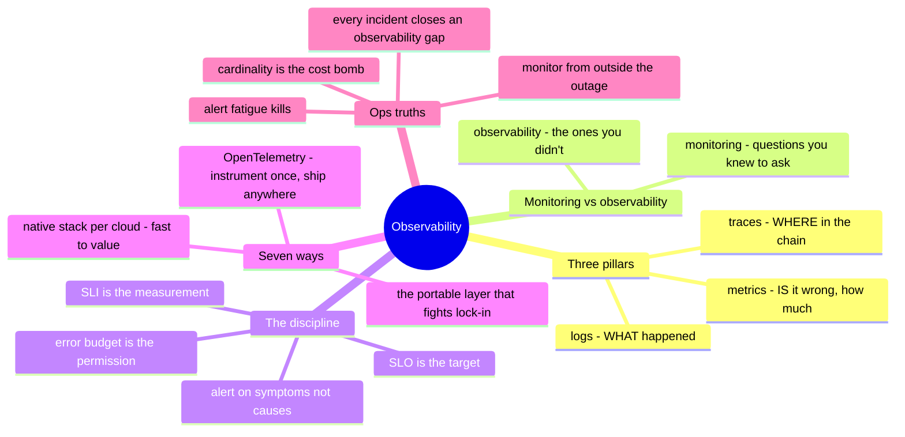

# 06 — Observability

> The bottom-up climb ended at platform services you can't SSH into. This chapter
> is how you see *any* of it — the layer that turns "it's slow and I don't know
> why" into a question with an answer. Chapters 01–05 built the stack;
> observability is how you find out what it's actually doing.

Every layer below pointed here. Chapter 02's debug ladder bottomed out at "flow
logs — now you get to look." Chapter 03's serial console was the last place you
could log into a box; chapter 05 took even that away. Chapter 01 warned that
capacity arrives later than demand — observability is how you see the wall coming.
This is the **"is it healthy, and how do I know?"** surface from the operating
model, and on a modern stack it's not optional instrumentation — it's the only way
in.

## What this layer does (everywhere, always)

- **Signal** — emit what the system is doing: metrics, logs, traces, events.
- **Collect** — ship those signals somewhere they outlive the instance that made
  them (the box is cattle; its telemetry must not die with it).
- **Store & query** — retain and let you ask questions across time and services.
- **Alert** — turn "something is wrong" into a page *before* a human notices, and
  ideally before a customer does.
- **Understand** — let you answer a question you didn't pre-plan, during an
  incident, fast. That last one — unknown-unknowns — is what separates
  *observability* from mere *monitoring*.

## One concept before the seven: the three pillars

Modern observability rests on three signal types. Know what each is *for*; the
tools are renames.

The workflow the arrows encode: **a metric tells you *that* it's broken, a log
tells you *what* broke, a trace tells you *where* in the call chain.** Most teams
have the first two and discover, mid-incident on a distributed system, that they
desperately needed the third.

## Monitoring vs. observability (the distinction interviewers test)

- **Monitoring** — watching *known* failure modes: dashboards and alerts for
  conditions you predicted (disk full, CPU high, service down). This is the ✋
  discipline — infrastructure signals watched for decades: UPS, PDU, environment,
  network gear, server logs.
- **Observability** — being able to ask *new* questions of a system *without
  shipping new code*, to explain behavior you didn't anticipate. It's monitoring
  plus enough signal richness (high-cardinality metrics, structured logs,
  distributed traces) to debug the unknown-unknown.

One-liner: **monitoring answers the questions you knew to ask; observability lets
you ask the ones you didn't.** You need both — the first keeps the lights on, the
second gets you through the 3 a.m. incident nobody predicted.

## The discipline that makes it matter: SLI / SLO / error budget

Signal without a target is just noise you pay to store. The framing that turns
telemetry into decisions:

- **SLI** (indicator) — the *measurement*: "99.7% of requests succeeded under
  200 ms this week."
- **SLO** (objective) — the *target*: "99.9% succeed under 200 ms." The line
  between fine and paging.
- **Error budget** — the *permission*: 0.1% is allowed to fail. Spend it on ship
  velocity; blow through it and the rule changes (freeze features, fix
  reliability). It converts "how reliable?" from an argument into a number.

This is where observability stops being a tooling question and becomes an
*operating* one — and it's the honest edge of this chapter (see boundaries below):
the SLO/error-budget discipline is modern SRE practice, distinct from the
infrastructure-signal monitoring that's hands-on depth.

## Seven ways — native stack vs. bring-your-own

Like chapter 05, this layer cuts by **pattern, not one-per-platform**: every
platform gives you a native telemetry stack, and the open-source stack
(Prometheus/Grafana/OpenTelemetry) rides on top of all of them.

**Self-hosted ✋🧗** — you run the whole pipeline: agents/exporters →
**Prometheus** (metrics) → **Grafana** (dashboards) → **Alertmanager**, plus an
**ELK/Loki** stack for logs, and increasingly **OpenTelemetry** collectors feeding
a tracing backend (Jaeger/Tempo). The ✋ part is real — infra signal monitoring and
server-side monitoring operated for years; the modern OTel/Prometheus/tracing
assembly is the 🧗 ramp. You own retention, cardinality cost, and the truth that
**your monitoring going down during an incident is its own incident** (monitor the
monitoring, from somewhere else).

**vSphere ✋** — **vCenter** metrics and alarms, **vROps** (Aria Operations) for
capacity and health. Mature, infrastructure-focused, and exactly the monitoring
(not observability) shape — great at "is this host/datastore/VM healthy," not built
for tracing a request across services.

**OpenStack 🧗** — **Ceilometer/Gnocchi/Aodh** (the Telemetry project), usually
paired with the same Prometheus/Grafana stack everyone converges on. Another
component set you operate — the recurring OpenStack theme.

**AWS 🧗** — **CloudWatch** (metrics/logs/alarms) as the native spine,
**X-Ray** for tracing, CloudWatch Logs Insights for queries. Native, deeply
integrated, and it bills per metric/log/query in ways that surprise people at
scale — the chapter-04 storage-cost lesson, applied to telemetry.

**Azure 🧗** — **Azure Monitor** umbrella: **Application Insights** (APM/traces),
**Log Analytics** with **KQL** (a genuinely strong query language worth learning),
metrics and alerts unified. The most integrated APM story of the native stacks.

**GCP 🧗** — **Cloud Operations** (formerly Stackdriver): Monitoring, Logging,
and **Cloud Trace** — and Google's SRE-heritage shows, with SLO tooling built into
the product rather than bolted on. The native stack most opinionated about the
discipline above.

**OCI 🧗** — **Monitoring**, **Logging**, and **APM** — the expected trio,
younger and less deep than the big three's, and (chapter-02 signature) without the
egress penalty on shipping telemetry around.

## The comparison table

| Concern | Self-host ✋🧗 | vSphere ✋ | OpenStack 🧗 | AWS 🧗 | Azure 🧗 | GCP 🧗 | OCI 🧗 |
| --- | --- | --- | --- | --- | --- | --- | --- |
| **Metrics** | Prometheus | vCenter / vROps | Gnocchi / Prom | CloudWatch | Azure Monitor | Cloud Monitoring | Monitoring |
| **Logs** | ELK / Loki | vRLI | ELK / Prom | CloudWatch Logs | Log Analytics (**KQL**) | Cloud Logging | Logging |
| **Traces** | Jaeger / Tempo (OTel) | — | Jaeger (OTel) | X-Ray | App Insights | Cloud Trace | APM |
| **Dashboards** | Grafana | vROps | Grafana | CloudWatch | Azure Monitor / Grafana | Cloud Monitoring | dashboards |
| **Alerting** | Alertmanager | vCenter alarms | Aodh | CloudWatch Alarms | Monitor alerts | alerting policies | alarms |
| **SLO tooling** | build it | — | build it | build/CloudWatch | build/Monitor | **native SLOs** | build it |
| **Portable layer** | **OpenTelemetry rides on all of these** → | → | → | → | → | → | → |

The bottom row is the strategic move: **OpenTelemetry is the vendor-neutral way to
instrument once and ship anywhere.** Instrument with OTel and the backend becomes a
swappable choice instead of a lock-in — the one lever that keeps this layer from
being as sticky as chapter 05's managed services.

## Choosing — native vs. neutral, and the cost trap

- **Native is fastest to value, OTel is cheapest to leave.** The provider's stack
  is integrated and zero-assembly; OpenTelemetry instrumentation is portable across
  all of them. The senior pattern: **instrument with OTel, visualize with whatever's
  native** — value now, exit later.
- **Cardinality is the cost bomb.** Every unique label combination is a stored
  series; a user-ID or request-ID label can explode metric volume into a bill
  bigger than the thing it watches. This is the observability-specific trap AI and
  juniors both walk into — high cardinality goes in *logs/traces*, not *metrics*.
- **Retention is a deliberate tier, not a default.** Hot-queryable-and-expensive
  vs. cold-archived-and-cheap is the chapter-04 storage-tiering decision again,
  wearing a telemetry hat. Decide it; don't inherit it.
- **Alert on symptoms, not causes.** Page on "users see errors / latency past SLO"
  (symptom), not on every CPU spike (cause) — cause-alerts are the source of alert
  fatigue, and alert fatigue is how the real page gets missed.
- **Don't monitor from inside the thing you're monitoring.** Your observability
  stack needs to survive the outage it's supposed to explain — external vantage,
  independent failure domain (chapter 01, one last time).

## Ops notes — what pages you (and what should)

- **Alert fatigue is the silent killer** — too many alerts train the team to ignore
  them, and the one that mattered scrolls past. Every alert should be actionable and
  urgent; if it's neither, it's a dashboard, not a page.
- **The dashboard nobody reads** — dashboards built once and never opened during an
  incident are decoration. The test: did it answer the question when it was on fire?
- **Cardinality explosion** — the metric bill that quietly overtakes the
  infrastructure bill; the Prometheus that OOMs because someone labeled by request
  ID. Watch series count like you watch disk in chapter 04.
- **Clock skew wrecks correlation** — traces and logs across machines only line up
  if the clocks do; NTP discipline is an observability prerequisite people discover
  the hard way.
- **The gap you find at 3 a.m.** — the missing log line, the un-instrumented
  service, the metric you didn't emit. Every incident's real deliverable is closing
  the observability gap it exposed, so the *next* one is faster.
- **Sampling hides the rare failure** — trace/log sampling saves money and can drop
  exactly the 0.1% you needed. Know your sampling strategy before it eats your
  evidence.

## The admin discipline (what to be able to do)

- Instrument a service with the **three pillars** and say what question each answers.
- Write a **symptom-based alert** tied to an **SLO**, and defend why it pages while
  a CPU spike doesn't.
- Define an **SLI/SLO/error budget** for a real service and explain what happens
  when the budget is spent.
- Debug a **distributed latency problem with a trace** — find the slow hop, not the
  slow guess.
- Keep **cardinality and retention** under control, and read a telemetry bill for
  where the volume came from.
- Instrument with **OpenTelemetry** so the backend stays a choice, not a cage.
- Ensure the **monitoring survives the outage** — external, independent, tested.

## The AI-assisted ramp (observability flavor)

- **Translate from monitoring to observability:** *"I've run infrastructure
  monitoring — UPS, network, server logs, dashboards, alerts. Map that onto the
  three pillars and show me what distributed tracing adds that I didn't have."*
- **Let AI write the query, you own the SLO:** AI is excellent at PromQL / KQL /
  CloudWatch Insights syntax — genuinely accelerating. But *what* to measure and
  *what target* to hold is judgment: *"here's the service and its users — help me
  choose SLIs that reflect what they actually feel."*
- **Where AI burns you (verify hardest):** it **writes plausible PromQL/KQL that's
  subtly wrong** (a rate() window off, a percentile computed across the wrong
  dimension — test the query against known data before trusting the graph); it
  **ignores cardinality cost** and cheerfully suggests high-cardinality metric
  labels that will bankrupt you; it **quotes retention defaults and per-metric
  prices from its training years**; and it **over-alerts** (defaults to paging on
  causes). The query that looks right and lies is worse than no query — verify
  against data you already understand.

## Honest boundaries

The ✋ here is genuine and specific: years of **infrastructure monitoring**
operated for real — UPS, PDU, environmental, network equipment, server logs, and
data-center signals watched for reliability at Varian, plus **server-side
monitoring** of the deployment platform at ByteDance and **log/audit-data
reconciliation scripting**. That's monitoring depth — the "known failure modes"
half of this chapter — and it's hands-on. The 🧗 is the **modern observability
stack and SRE practice**: Prometheus/Grafana/OpenTelemetry assembly, distributed
tracing, and especially **SLI/SLO/error-budget engineering** — mapped by the method
above, ramped and verified, not claimed as years of production SRE. The personal
harness has a real telemetry contract (structured stdout-JSON, event logs) but is
explicitly **single-operator, not company-grade SLOs, not on-call** — labeled that
way wherever it appears. The transferable claim: a deep monitoring foundation plus
a fast, honest ramp onto modern observability — not "ten years of SLO engineering."

## Lab (🚧 planned — spec)

**See the request, not just the box.**

1. Stand up **Prometheus + Grafana** against the small service from chapter 05;
   dashboard its golden signals (latency, traffic, errors, saturation).
2. Instrument it with **OpenTelemetry** and view a **trace** across at least two
   hops — find an injected slow dependency by looking, not guessing.
3. Define one **SLO** and a **symptom-based alert** on it; then blow the error
   budget on purpose and watch the alert fire — and prove your monitoring is
   reporting from *outside* the thing it watches.

## The chapter on one screen

