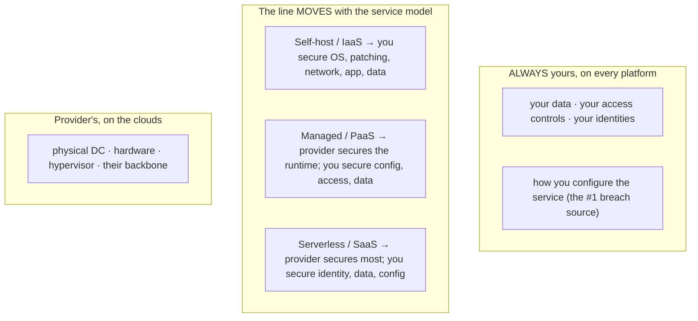
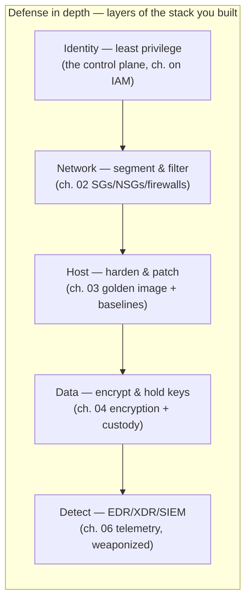
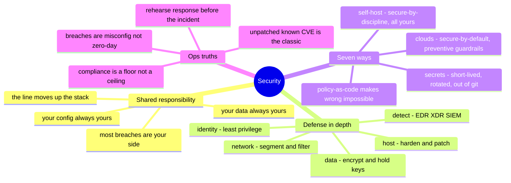

# 07 — Security

> Observability was the layer that *sees* the whole stack; security is the layer
> that *guards* it. Both are cross-cutting — they ride over chapters 01–05 rather
> than sitting inside one. And security has a property none of the others do:
> **it's the only layer where an intelligent adversary is actively working against
> your design.** Everywhere else, failure is entropy; here, failure has intent.

Security isn't a component you bolt on at the end — it's a property of every layer
below, and the sysadmin's job is to make each one defensible. This chapter maps the
security surface across the same seven platforms, organized (like observability) by
**domain, not one-per-platform**, because a good security posture is the same
handful of disciplines applied at every layer of the stack you've already built.

## What this layer does (everywhere, always)

- **Draw the responsibility line** — know exactly what the platform secures and
  what you secure. Getting this wrong is the single most common cloud breach cause.
- **Minimize the attack surface** — fewer open ports, fewer privileges, fewer
  secrets, fewer things running. Every one you remove is one you never have to
  defend.
- **Layer the defenses** — no single control is trusted to hold; defense in depth
  means a failure anywhere isn't a breach everywhere.
- **Protect the data** — encryption in transit and at rest, and custody of the keys
  that make it meaningful.
- **Detect and respond** — assume prevention eventually fails, and be able to see
  it and act when it does.
- **Prove it** — audit trails and compliance evidence: security you can't
  demonstrate is security a regulator (and an incident review) won't credit.

## One concept before the seven: the shared responsibility line

Every platform draws a line between what *it* secures and what *you* secure, and it
moves as you go up the stack. Misreading this line is how "the cloud is secure"
becomes a breach:

The line shifts right (more on the provider) as you climb chapters 01→05 — but
**your data, your access control, and your configuration are yours on every
platform, at every layer.** The overwhelming majority of cloud breaches aren't the
provider failing; they're a misconfigured bucket, an over-broad role, or a leaked
key on the customer's side of that line. Chapter 04's storage and chapter 01's
identity discipline are security controls; this chapter is where that becomes
explicit.

## The disciplines (the same handful, applied at every layer)

Security across all seven platforms reduces to a small set of moves, each one
mapping onto a layer you've already built:

Read that chain and the whole repo clicks together: **security isn't a new
skill set — it's the layers you already know, each made defensible, with detection
laid over the top.** Break one link and the others still stand; that's the point of
depth.

- **Least privilege** — the identity chapter's whole game, now framed as a security
  control: the tightest grant, narrowest scope, shortest time. Most breaches
  escalate through privilege someone didn't need.
- **Segment and filter** — chapter 02's security groups and firewalls, used to
  contain blast radius: a compromised web tier shouldn't reach the database
  directly.
- **Harden and patch** — chapter 03's golden image is where baselines (CIS
  benchmarks) get baked in, and patch compliance is the unglamorous discipline that
  closes known holes before they're used. Unpatched-known-CVE is still the most
  common real-world compromise.
- **Encrypt and hold the keys** — chapter 04's encryption, with the emphasis on
  *key custody*: encryption is only as strong as who controls the key and how it
  rotates.
- **Detect and respond** — chapter 06's telemetry pointed at adversaries: EDR/XDR
  on endpoints, a SIEM correlating signals, and a response plan for when (not if)
  prevention fails.

## Seven ways — by security domain

**Cloud posture & guardrails 🧗** — each cloud has a native security spine:
**AWS** (Security Hub, GuardDuty, IAM Access Analyzer, Config), **Azure**
(Defender for Cloud, Sentinel as SIEM), **GCP** (Security Command Center), **OCI**
(Cloud Guard, Security Zones). Same shape everywhere: a posture scanner flagging
misconfigurations, a threat-detection service, and policy guardrails that *prevent*
bad config rather than just alerting on it. Policy-as-code (SCPs, Azure Policy, Org
Policy, OPA) is the mature form — the guardrail that makes the wrong thing
impossible, not merely visible.

**Self-host / vSphere ✋🧗** — you build the posture yourself: hardening baselines
(CIS), a patching pipeline, network segmentation at the firewall, and an EDR/SIEM
you deploy and operate. The ✋ is real here — endpoint protection deployed and
migrated across a fleet, full-disk encryption enrolled at scale, device
security-configuration and network-admission compliance checks run as daily ops.
No provider guardrail catches your mistakes; the discipline is entirely yours.

**Secrets management 🧗 (on ✋ instincts)** — the "no secret on the box" rule from
the identity chapter, made concrete: **HashiCorp Vault** self-hosted, or the native
managers (AWS Secrets Manager / Parameter Store, Azure Key Vault, GCP Secret
Manager, OCI Vault). The discipline is platform-independent — short-lived,
rotated, never-in-git, injected-at-runtime — and it's the same instinct behind
using platform-managed workload identities instead of static keys.

**Endpoint & EDR ✋🧗** — the fleet-security domain: EDR/XDR agents (Defender for
Endpoint, SentinelOne, CrowdStrike) deployed, migrated, and operated from their
consoles; disk encryption; compliance baselines enforced by MDM. This is the
security domain with the deepest hands-on backing in this series.

**Compliance frameworks 🧗** — SOC 2, ISO 27001, FedRAMP, PCI-DSS, HIPAA: the same
technical controls (encryption, access review, audit logging, change management)
mapped onto a named framework's evidence requirements. The technical work is
familiar operational discipline; the framework is the vocabulary and the auditor's
checklist laid over it.

## The comparison table

| Domain | Self-host ✋ | vSphere ✋ | AWS 🧗 | Azure 🧗 | GCP 🧗 | OCI 🧗 |
| --- | --- | --- | --- | --- | --- | --- |
| **Posture / CSPM** | you build it (CIS scans) | you build it | Security Hub / Config | Defender for Cloud | Security Command Center | Cloud Guard |
| **Threat detection** | IDS + SIEM you run | you run | GuardDuty | Defender | SCC threat | Cloud Guard |
| **SIEM** | ELK/Splunk you run | you run | Security Lake + partners | **Sentinel** | Chronicle | partners |
| **Policy-as-code guardrail** | OPA / your pipeline | — | SCPs | Azure Policy | Org Policy | Security Zones |
| **Secrets** | Vault ✋🧗 | Vault | Secrets Manager | Key Vault | Secret Manager | Vault (OCI) |
| **Key management** | your KMS / HSM | your KMS | KMS | Key Vault | Cloud KMS | KMS |
| **Endpoint EDR** | Defender/SentinelOne ✋ | same | (agent) | Defender | (agent) | (agent) |
| **Encryption default** | you enable it | you enable it | often default-on | often default-on | **default-on** | default-on |

The pattern: **the clouds increasingly make the secure choice the default and the
guardrail preventive** (encryption on by default, policy-as-code that blocks bad
config), while self-host makes every one of those an explicit thing you must
choose, build, and maintain. That difference — secure-by-default vs.
secure-by-discipline — is the real security story of cloud vs. on-prem.

## Choosing — where the security effort goes

- **Fix configuration before buying tools.** The breaches are misconfigurations,
  not exotic zero-days. A CSPM scanner and the discipline to act on it beats another
  detection product. Spend on getting the basics right first.
- **Prevention > detection > response, but budget for all three.** A guardrail that
  makes the wrong thing impossible (policy-as-code) is worth more than an alert that
  tells you it already happened — but assume prevention fails and fund detection and
  a response plan anyway.
- **Managed shifts the line, doesn't erase your job.** Every step up chapter 05's
  build-vs-rent spectrum hands more security to the provider — *and leaves your
  data, identity, and config squarely yours.* "It's managed" secures the runtime,
  not your bucket policy.
- **Compliance is a floor, not a ceiling.** A framework certification proves a
  baseline was met on audit day; it is not the same as being secure. Treat SOC 2 /
  FedRAMP as the minimum bar and structured evidence, not the goal.
- **Encryption key custody is the real decision.** Provider-managed keys are easy;
  customer-managed keys (CMK/BYOK) are control and burden. Who can decrypt, who can
  rotate, and what breaks on rotation is the question that outlives the checkbox.

## Ops notes — what pages you (and what breaches you)

- **The misconfigured storage bucket** — public when it should be private, the
  canonical cloud breach. Chapter 04's storage plus this chapter's access
  discipline; a CSPM scan catches it, *if* someone reads the finding.
- **The leaked credential in git** — a key committed to a repo, found by scanners
  (theirs and the attackers'). This is why "no secret on the box / in the code" is
  a rule, not a preference. Secret scanning in CI is table stakes.
- **The unpatched known CVE** — not a sophisticated attack; a public exploit against
  a patch you hadn't rolled. Patch compliance is boring and it is the job.
- **Over-broad IAM the day it's abused** — the standing admin role, the wildcard
  policy, the service account that can do everything. Least privilege is a security
  control precisely because privilege is what an attacker escalates through.
- **Alert fatigue, security edition** — chapter 06's killer, with higher stakes: a
  SIEM screaming so much that the real intrusion scrolls past. Tuned, actionable
  detections or the SOC drowns.
- **The response plan nobody rehearsed** — an incident-response runbook first
  executed *during* the incident is a hope. Tabletop it before you need it.

## The admin discipline (what to be able to do)

- State the **shared-responsibility line** for a given service and name what's
  yours.
- Run a **posture scan** (CSPM or CIS baseline), read the findings, and remediate
  the top risks — not just generate the report.
- Design **defense in depth** for a workload: identity + network + host + data +
  detection, and explain what each layer contains if the one before it fails.
- Manage a **secret correctly**: short-lived, rotated, out of code, injected at
  runtime — and explain why a static key in an env file isn't that.
- Enforce a **baseline** (CIS) via the golden image and prove a host complies.
- Map a set of technical controls onto a **named compliance framework's** evidence
  requirements.
- Walk an **incident-response** flow: detect → contain → eradicate → recover →
  learn.

## The AI-assisted ramp (security flavor)

Security is the highest-stakes place to use AI, because the artifacts are
adversarial and a plausible-but-wrong answer is a vulnerability, not a bug.

- **Translate from what you enforce:** *"I run FDE, patch compliance, EDR, and
  device compliance checks. Map that onto AWS's security services and show me what
  a CSPM guardrail adds over my manual baseline."*
- **Generate tight, then verify tighter:** *"the least-privilege policy that does
  exactly this"* — then check every permission by hand, because AI drafts
  permissive and a wildcard it slipped in is an attack surface.
- **Use AI to attack your own design:** *"here's my architecture — where would you
  attack it, and what defense-in-depth layer is missing?"* AI is a useful red-team
  sparring partner precisely because it's read the attack patterns.
- **Where AI burns you (verify hardest):** it **invents IAM actions, policy syntax,
  and security-service features** that don't exist; it **defaults to permissive**
  (0.0.0.0/0, wildcard actions) in anything it scaffolds; it **states compliance
  requirements from its training years** (frameworks update — verify against the
  current control set); and it will **confidently declare a config "secure" when
  it's merely functional.** In security the cost of a hallucination is a breach —
  every generated control gets checked against current docs and, ideally, tested
  against a denied-access probe.

## Honest boundaries

The ✋ in this chapter is operational security done at fleet scale, and it's
specific: **full-disk encryption** enrolled across a large endpoint fleet,
**patch-compliance** as daily operations, **device security-configuration and
network-admission compliance checks** run routinely (with a wide view of real-world
failure modes), **endpoint protection** deployed and migrated across the fleet
(Defender for Endpoint → SentinelOne, both consoles operated), and **access
governance** inside a strict multi-approver, least-privilege model. That's genuine
enforce-and-operate security depth. The 🧗 is the modern cloud-security and
program layer: **CSPM, SIEM operation, policy-as-code guardrails, secrets platforms
like Vault, zero-trust architecture, and named-framework compliance
(SOC 2 / FedRAMP / ISO 27001)** — mapped by the method above, ramped and verified,
not claimed as a security-engineering or GRC-auditor career. The transferable
claim: a hands-on operational-security foundation (endpoint, encryption, patch,
compliance-checks, least-privilege) plus a fast, honest ramp onto cloud-security
posture and program work — not "ten years as a security engineer."

## Lab (🚧 planned — spec)

**Break the secure default, then catch yourself.**

1. On one cloud, deliberately misconfigure a chapter-04 storage bucket to public,
   then run the native **posture scanner** (Security Hub / Defender / SCC / Cloud
   Guard) and find your own mistake in the findings.
2. Write a **policy-as-code guardrail** (SCP / Azure Policy / Org Policy) that makes
   that misconfiguration *impossible*, and prove it blocks the bad change.
3. **The drill:** commit a fake secret to a repo, watch secret-scanning catch it,
   then do it right — the secret in a manager, injected at runtime, out of git —
   and rotate it to prove custody.

## Going deeper — beyond the sysadmin's defensive baseline

This chapter is security from the **operator's** seat: the shared-responsibility line,
defense in depth, hardening, EDR/CSPM/SIEM, secrets, and the disciplines a sysadmin
runs day to day. That's the honest scope of this repo — the defensive baseline every
infrastructure engineer owns, not a security-*specialist* track.

If you want to specialize *into* security — threat hunting, malware analysis, digital
forensics, red teaming, detection engineering mapped to **MITRE ATT&CK / D3FEND** and
**NIST CSF** — that's a different, deeper craft than this chapter claims. A large
external library worth knowing:

- **[Anthropic-Cybersecurity-Skills](https://github.com/mukul975/Anthropic-Cybersecurity-Skills)**
  (by Mahipal Jangra, Apache-2.0) — ~800 practitioner-workflow security skills across
  ~29 domains, in the same [agent-skill](../.claude/skills/) format, mapped to MITRE
  ATT&CK / D3FEND / ATLAS and NIST frameworks.
  > ⚠️ *Community project — **not affiliated with or endorsed by Anthropic** despite
  > the name. Much of it is offensive / dual-use tradecraft: **authorized, lawful use
  > only.***

The honest framing for the ✋/🧗 discipline: that library is a **specialist's** toolset,
not the sysadmin baseline — if you cite or use it, own the boundary. What *this* repo
covers is the security an infrastructure operator is genuinely on the hook for, and can
speak to from experience.

## The chapter on one screen

