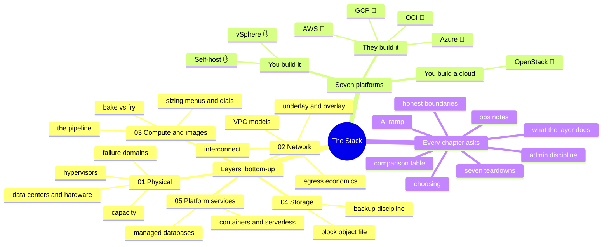

# The Stack — One Stack, Seven Ways

> The third axis of this repo. `platforms/` reads the clouds one at a time;
> `cross-cutting/` reads one theme across them. This series reads the **stack
> itself, layer by layer** — and at every layer compares **seven ways of building
> the same thing**: AWS, Azure, Google Cloud, Oracle Cloud, VMware vSphere,
> OpenStack, and self-hosted bare metal.

## Why layer-first

Most cloud material is written **from the console down** — here's a service, here's
a button, here's a pricing page. This series is written **from the machine room
up**, because that's the direction the author actually learned it: racking servers,
PXE-booting fleets, running vSphere and bare-metal Linux long before touching a
cloud console.

Reading the stack bottom-up buys you two things the console can't:

1. **You know what the abstraction is hiding.** An AZ stops being a dropdown option
   and becomes what it is — somebody's building, with somebody's failure domains,
   power, and spare parts behind it. Every "weird" cloud behavior (instance
   retirement, capacity errors, maintenance events) is obvious once you've owned
   the layer it leaks from.
2. **Comparison becomes possible.** Platforms differ most *within* a layer, and
   marketing hides exactly those differences. Put seven implementations of the same
   layer side by side and the trade-offs — and the selection logic — fall out.

## The seven, in three families

| Family | Platforms | Who owns the hardware | Honesty marker |
| --- | --- | --- | --- |
| **You build it** | self-hosted bare metal · VMware vSphere | you | ✋ hands-on depth |
| **You build a cloud** | OpenStack | you (plus a control plane you now operate) | 🧗 honest ramp |
| **They build it** | AWS · Azure · GCP · OCI | the provider | AWS/Azure 🧗 ramping (see [`platforms/`](../platforms/)) · GCP/OCI 🧗 ramp |

The ✋/🧗 markers follow the repo's rule ([`WHY.md`](../WHY.md)): hands-on depth is
claimed only where it exists; everything else is labeled as a ramp — done with AI
as a co-pilot and verified, which is itself the method this repo teaches.

## The series on one screen

## The fixed skeleton (every chapter, same order)

1. **What this layer does** — the platform-agnostic model, one page.
2. **Seven ways to build it** — short per-platform teardowns.
3. **The comparison table** — the chapter's core artifact.
4. **Choosing** — the real selection factors: scale economics, team, compliance,
   exit cost.
5. **Ops notes** — what actually pages you at 3 a.m., per family.
6. **The admin discipline** — what you should be able to *do*, checkable.
7. **The AI-assisted ramp** — how to learn this layer fast, and where AI burns you.
8. **Honest boundaries** — what's ✋ depth vs 🧗 ramp in this chapter.

## Chapters

| Chapter | Status |
| --- | --- |
| [`01-physical.md`](01-physical.md) — the physical layer: data centers, hardware, hypervisors, failure domains | ✅ |
| [`02-network.md`](02-network.md) — underlay/overlay, VPC models, the egress meter, the debug ladder | ✅ |
| [`03-compute-and-images.md`](03-compute-and-images.md) — compute shapes, the image pipeline, bake vs. fry, cloud-init everywhere | ✅ |
| [`04-storage.md`](04-storage.md) — block/file/object, SAN/NAS reality vs. cloud volumes, the backup fear | ✅ |
| `05-platform-services.md` — containers, serverless, managed databases, the build-vs-rent line | 🚧 next |

Chinese mirrors land in [`docs/zh/`](../docs/zh/) after each chapter stabilizes.
