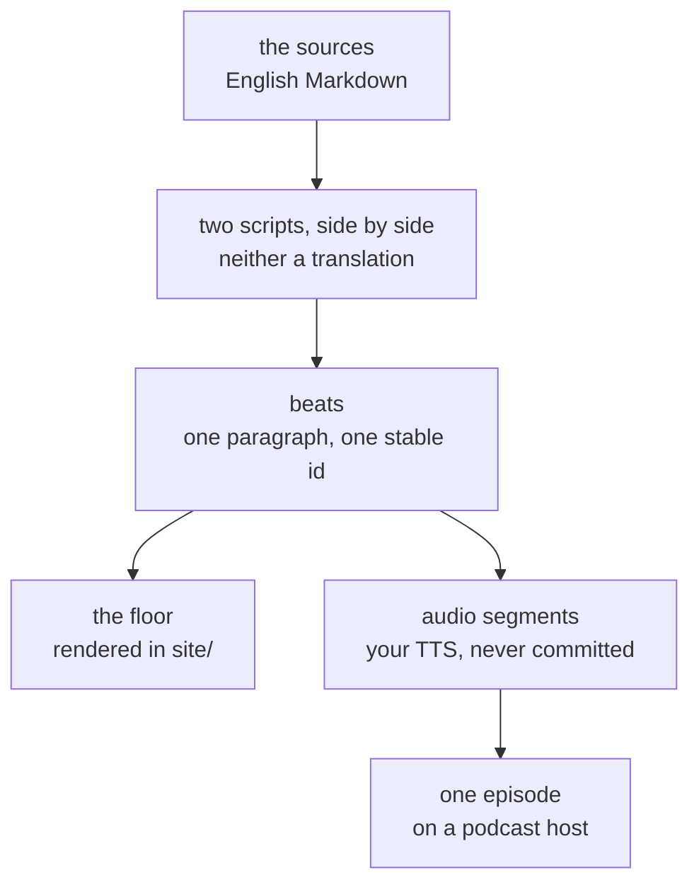

# The Walkthrough — the reference office, told out loud

> A **route through** the other axes, like [`build-out/`](../build-out/README.md) and for
> the same reason: it teaches no page this repo does not already hold. What it adds is an
> **order** and a **register** — one hundred-person office, walked through slowly, in a
> voice the rest of this repo deliberately does not use.
> Decision: [`docs/adr/0009`](../docs/adr/0009-the-walkthrough-ships-its-script-not-its-audio.md)

**Written to be spoken by a text-to-speech engine and heard — never read.** That is not a
style note. It decides the whole format: no tables, no inline links, no *as the table
above shows*, no parenthetical asides, and numbers written the way a person says them.
A `walkthrough/*.md` contains the words that get spoken and nothing else.

## What comes out of one script



**No audio is committed here.** You generate it with your own credentials, or you listen
to the published episode. A recording in the tree would serve one voice, one language and
one speaking rate, and would be wrong for everyone else.

## Three artifacts, and each one has to stand alone

Because three audiences each lack a different thing, and the third is the one that decides
the most:

| Audience | Has | Lacks |
|---|---|---|
| A reader on GitHub | the script | the picture, the sound |
| A reader in [`site/`](../site/README.md) | the script, the floor | the sound, unless they wire up TTS |
| A listener on a podcast | the sound | **any screen at all** |

The last row is why the honesty markers are **spoken**. A 🔨 or 🧭 badge drawn on the floor
does not exist for a listener, so the narrator says the boundary out loud, in the story's
own voice, at the moment the footing changes. In the first walkthrough it changes once —
from the segmentation and addressing material the author has run, to the wireless
arithmetic [`the-reference-office.md`](../the-reference-office.md) already flags as drawn
from published vendor guidance rather than from having lived with a deployment.

## Beats

One beat is **one paragraph, one TTS call, one audio segment, one floor state.** It is
delimited by an HTML comment carrying a stable id, which GitHub, the viewer and the speech
engine all ignore:

```markdown
<!-- beat: coverage-not-capacity -->
```

**The id is a name, never a number.** Insert a paragraph into a hundred-and-forty-beat
script and every ordinal after it shifts — silently, because a floor pointing at the wrong
beat looks exactly like a floor pointing at the right one. Alignment is by beat and never
by timestamp, so any engine, any voice and any language works without configuring
anything: see [`docs/adr/0012`](../docs/adr/0012-alignment-is-by-beat-not-by-timestamp.md).

## Two languages, and neither is a translation

`<walkthrough>.en.md` and `<walkthrough>.zh.md` sit side by side here, **not** under
[`docs/zh/`](../docs/zh/README.md). That directory means *mirror*, and these are not
mirrors: translation preserves facts and destroys cadence, which is the one thing a spoken
script is made of.

Each script is canonical for its own cadence. Both declare the same `sources:`, and a
disagreement between them is settled by reading the source both are accountable to — never
by preferring one script over the other. The repo-wide rule that English is the source of
truth is unchanged everywhere else; here it has been narrowed to the job it was always
doing, which is arbitrating **facts**. The reasoning is in
[`docs/adr/0010`](../docs/adr/0010-a-spoken-script-has-no-translation.md).

## The floor

The viewer renders an interactive 2D office the walkthrough plays over — pan, zoom,
clickable props, and a cast of figures who **are the wireless load** rather than
decoration. Zoom is semantic in three registers: occupancy and coverage far out, placement
in the middle, and the path from access port to uplink close in.

The buttons name their subject as well as their scale: **Floor** frames the whole plate,
**Rack** frames the IDF, and **Room** keeps the enclosure already in view (or the enclosure
holding the prop you just clicked). With no current enclosure, **Room** opens the large
meeting room. Choosing a register or occupancy day keeps that browsing choice through a
window resize; **Back**, **Next** and **Play** return control to the walkthrough beat.

It is a **view**. It renders numbers the Markdown states and computes none of its own, and
a prop's panel shows the judgement and the criteria — never a device configuration, which
this repo does not hold. The line, and what it costs to hold it, is
[`docs/adr/0011`](../docs/adr/0011-the-floor-renders-the-reference-office-and-may-not-compute-it.md).

The scene data lives beside the scripts, not under `site/`, because a fact the viewer
holds alone is a fact lost the moment the viewer is deleted. It comes in two halves:

| | |
| --- | --- |
| **The plate** — `reference-office.plate.json` | What this floor **is**: the spaces, what each is next to, and how you walk between them. Shared by every walkthrough, because walkthrough two is the same office. |
| **The walkthrough** — `<walkthrough>.floor.json` | What this walkthrough **says about it**: the prop panels and the beat cues. In walkthrough one those panels are five times the size of the geometry, and every word of them is about networking. |

**The plate stops at topology** — no corridor widths, no egress distances, no sanitary
provision, no claim it would pass anything
([ADR-0014](../docs/adr/0014-the-plate-stops-at-topology.md)). What it does claim is
checked: a headless Godot project walks the floor from the lift lobby along circulation
and reports anything it cannot reach. It caught two doors opening onto nothing the first
time it ran.

## Generating the audio yourself

Each beat is one call. Split on the beat comments, send each paragraph to whatever engine
you have, and play the segments in order — the floor advances on each segment ending and
needs no timing data. Nothing in this repo depends on which engine you pick.

## Adding a walkthrough

1. **Pick what it is about, not which step it is.** The sequence here is its own: the
   first walkthrough spans three documents across two axes plus the root. This is not
   `build-out/` with a voice on top and the numbers do not correspond.
2. **List the `sources:` first.** Every fact spoken must be traceable to one of them. If a
   sentence needs a fact no source holds, the fact gets written into the material first —
   the walkthrough is never where something first appears.
3. **Write beats, name them, and keep the file speakable.** Read it aloud once before
   generating anything; the places you run out of breath are the places to split.
4. **Write the second language as its own script**, not as a translation of the first.
5. **Freeze on publication.** Record `published:` and the source fingerprints. After that
   the script is not edited — an error becomes an erratum in the document, because the
   recording cannot be amended and a silent fix would leave it lying.

## Status

| # | Walkthrough | EN | 中文 | Floor | Published |
|---|---|---|---|---|---|
| 01 | [The network](01-the-network.en.md) — one floor, four segments, and the radios in the ceiling | ✅ | [✅](01-the-network.zh.md) | ✅ 20 props | ⏳ |
| 02 | [The first Monday](02-the-first-monday.en.md) — one joiner, and the two things nothing ever triggers | ✅ | [✅](02-the-first-monday.zh.md) | ✅ 10 props | ⏳ |
| 03 | [The day it breaks](03-the-day-it-breaks.en.md) — the first ten minutes, and why the order matters | ✅ | [✅](03-the-day-it-breaks.zh.md) | ✅ 10 props | ⏳ |

**106 beats, about twenty minutes spoken.** It draws on
[`the-reference-office.md`](../the-reference-office.md),
[`site-network-design.md`](../cross-cutting/site-network-design.md) and
[`build-out/05-network.md`](../build-out/05-network.md) — three documents across two axes
plus the root, which is why the numbering does not follow `build-out/`. The footing
changes once, out loud, where the 🔨 segmentation and addressing material gives way to the
🧭 wireless arithmetic.

**Walkthrough 02 is 93 beats**, and it draws on
[`the-reference-office.md`](../the-reference-office.md),
[`build-out/03-identity.md`](../build-out/03-identity.md),
[`build-out/04-devices-and-images.md`](../build-out/04-devices-and-images.md) and
[`build-out/15-joiner-mover-leaver.md`](../build-out/15-joiner-mover-leaver.md). It plays
over the **same plate** — episode two is the same office — and everything that differs is
in its panels, which are about identity and lifecycle where 01's were about the network.
Its footing changes once, out loud, at the turnover band.

**Walkthrough 03 is 102 beats**, and it draws on
[`the-reference-office.md`](../the-reference-office.md),
[`build-out/01-uplink.md`](../build-out/01-uplink.md),
[`debug-ladder.md`](../cross-cutting/debug-ladder.md),
[`incident-response.md`](../cross-cutting/incident-response.md),
[`the-stack/06-observability.md`](../the-stack/06-observability.md) and the READMEs of the
[four-causes](../cross-cutting/labs/remote-access-four-causes/) and
[mitigate-before-diagnose](../cross-cutting/labs/mitigate-before-diagnose/) labs — seven
sources, the most of any so far, because an incident is where the axes meet. Same plate
again. Three of its ten props are **plans rather than places**: the decision, the ladder
and the record are what this walkthrough is about and none of them has a location on a
floor. Its footing changes once, out loud, where the 🔨 ladder gives way to the 🧭
incident-command process.

**One floor, three ways to see it.** 01 reads the plate, 02 reads the estate standing on
it, and 03 reads the clock. That is why the two things 03 spends longest on are the two
this office cannot buy its way out of: what a check eliminates, and where the inventory
ends — the monitoring limit and the recovery limit turn out to be the same limit
approached from either side.

Further walkthroughs are written when there is something worth saying out loud, one at a
time, the way [`toolbox/`](../toolbox/README.md) grows. There is no target count.

## Checking one

```bash
python3 walkthrough/build-walkthrough.py            # beats, anchors, format, freeze
python3 tools/floor/build-tiles.py --check          # the floor's sprite sheet
python3 tools/floor/prove-topology.py --check       # is the plate still proved?
```

Nothing here is generated — the script *is* the TTS input, so there is no derived artifact
to fall behind. What the checker guards is that the two languages carry the same beats in
the same order, that the floor cues only beats that exist, that every prop anchor is a real
heading in a real file, and that the spoken text holds nothing a speech engine would read
as noise or drop in silence.

`--freeze <walkthrough>` stamps `published:` and a fingerprint of each source. After that a
changed source is reported as *the recording now describes a document that moved*, which
is the signal to re-record — and the script itself is no longer edited.
